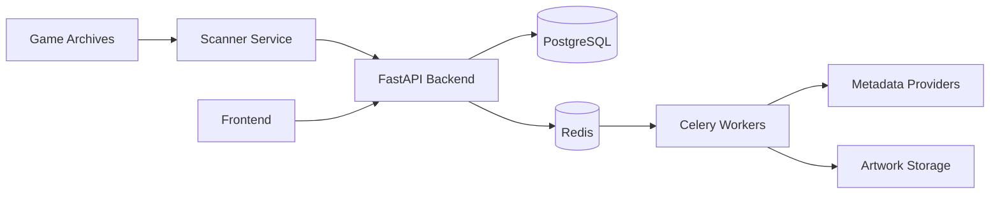
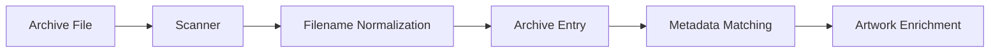
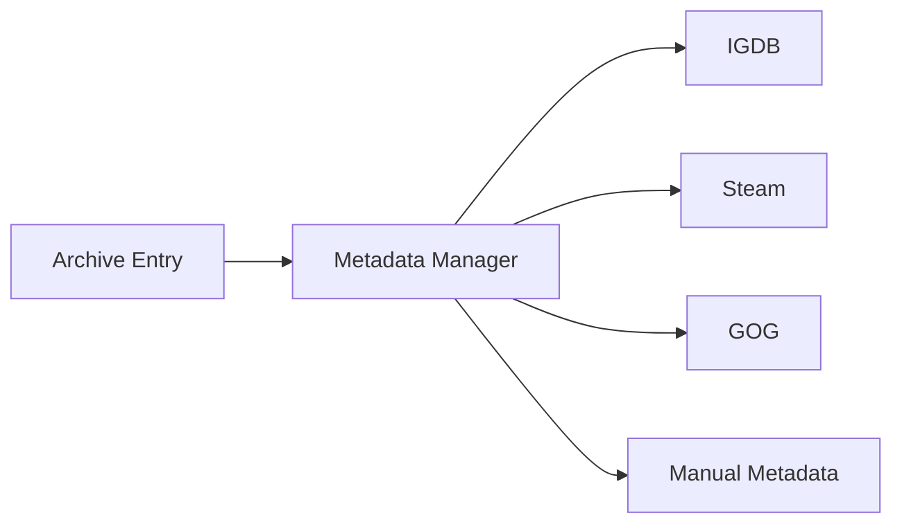

# Ludexis - Your Personal Game Archive

<p align="center">


</p>

Ludexis is a self-hosted game library and metadata server that transforms folders of installers, archives, and visual novels into a searchable, artwork-rich catalog with collections, tags, notes, and administrative tools.

---

## Overview

Modern game collections are often scattered across multiple drives, backup disks, NAS systems, cloud archives, and installer repositories. Over time it becomes increasingly difficult to remember what titles are owned, where they are stored, which versions are archived, and how different releases relate to one another. Ludexis provides a centralized platform for cataloging and managing these archives by automatically discovering game files, storing structured metadata, and organizing everything into a searchable database. Rather than acting as a launcher, Ludexis focuses on preservation, organization, and long-term archive management.

---

## Features

### Archive Discovery

Ludexis continuously scans configured library locations and identifies supported archives, installers, and game folders. Newly discovered files are normalized, cataloged, and stored as structured entries inside the database. Duplicate detection and incremental scanning workflows ensure that large archives can be maintained efficiently without repeatedly processing the entire library.

### Metadata Management

Every archive entry maintains structured information including titles, descriptions, release dates, engines, versions, archive formats, storage locations, and verification status. Metadata can be automatically matched through providers, manually curated by administrators, or maintained as local-only records for preservation-focused collections.

### Artwork & Media

The platform supports cover art, banners, logos, screenshots, and additional artwork assets linked directly to archive entries. Artwork is stored locally, allowing libraries to remain fully self-contained and independent of external services. Future provider integrations can automatically enrich entries with media assets.

### Collections, Tags & Organization

Games can be grouped using collections, franchises, developers, publishers, and custom tags. This enables flexible organization strategies ranging from simple favorites lists to large preservation archives containing thousands of entries across multiple genres, studios, and release groups.

### Notes, Ratings & Catalog Curation

Ludexis includes support for personal notes, ratings, and manual catalog management. Archivists can record compatibility information, patch requirements, installation instructions, restoration details, or preservation notes directly alongside an archive entry.

### Search & Discovery

The search system allows users to quickly locate entries using titles, metadata, developers, publishers, tags, and other catalog attributes. Search results provide direct access to related metadata and organizational structures, making large archives significantly easier to navigate.

### Background Processing

Long-running operations such as library scans, metadata refreshes, artwork validation, and future enrichment workflows are executed asynchronously through a distributed task queue. This keeps the API responsive even while processing large collections.

---

## Architecture

Ludexis follows a service-oriented architecture built around asynchronous processing and persistent metadata storage.



The FastAPI backend serves as the central coordination layer, managing authentication, catalog operations, search functionality, and administrative workflows. PostgreSQL stores all persistent metadata while Redis and Celery provide background processing for scans and enrichment jobs. Metadata providers and artwork services are integrated through a modular provider architecture, allowing new sources to be added without affecting the core system.

---

## Scan Pipeline

The scanning subsystem converts raw archive files into searchable catalog entries.



For example, an archive such as:

```text
Total_War_Rome_2-v1.0.2.3-Emperor-Edition.rar
```

is discovered, normalized, classified as a RAR archive, and automatically added to the catalog as:

```text
Total War: Rome 2
```

where it becomes immediately searchable through the API and user interface.

---

## Metadata Providers

Metadata enrichment is implemented through a provider-based architecture that allows multiple sources to contribute information to archive entries. Providers can supply descriptions, release information, genres, developers, publishers, artwork, and other metadata. The current architecture includes support for manual metadata and placeholder integrations for IGDB, Steam, and GOG, with additional providers planned for future releases.



---

## API Documentation

Ludexis exposes a fully documented REST API powered by OpenAPI.

Interactive API documentation:

```text
http://localhost:8000/docs
```

OpenAPI schema:

```text
http://localhost:8000/openapi.json
```

The API provides endpoints for authentication, archive management, search, collections, tags, metadata operations, administrative workflows, and background job management.

---

## Self Hosting

Ludexis is designed to run entirely within a self-hosted environment and can be deployed on personal servers, homelabs, NAS systems, virtual machines, or containerized infrastructure. The platform has been designed around common open-source technologies and keeps all metadata, artwork, and archival information under the owner's control.

Recommended deployment targets include:

- Home Lab Servers
- Docker Hosts
- NAS Appliances
- Dedicated Archive Servers
- Virtual Private Servers
- Self-Hosted Infrastructure Clusters

---

## Project Status

| Component                      | Status            |
| ------------------------------ | ----------------- |
| Authentication & Authorization | ✅ Implemented    |
| Archive Catalog Management     | ✅ Implemented    |
| Library Scanning               | ✅ Implemented    |
| Search System                  | ✅ Implemented    |
| Collections & Tags             | ✅ Implemented    |
| Developers & Publishers        | ✅ Implemented    |
| Background Job Processing      | ✅ Implemented    |
| Redis & Celery Integration     | ✅ Implemented    |
| Artwork Framework              | ✅ Implemented    |
| Metadata Provider Framework    | ✅ Implemented    |
| IGDB Integration               | 🚧 In Progress    |
| Steam Integration              | 📋 Planned        |
| GOG Integration                | 📋 Planned        |
| Automatic Artwork Downloads    | 📋 Planned        |
| Frontend Interface             | 🚧 In Development |

---

## Philosophy

> Your archive should outlive launchers, storefronts, operating systems, and online services.

Ludexis is built around the idea that a digital collection should remain accessible and understandable regardless of where individual games originate. Storefronts may disappear, launchers may change, and platforms may become obsolete, but a well-maintained archive should remain searchable, documented, and preserved for years to come. Ludexis focuses on providing the tools necessary to catalog, organize, and preserve those collections while remaining fully self-hosted and under the user's control.
