<p align="center">
  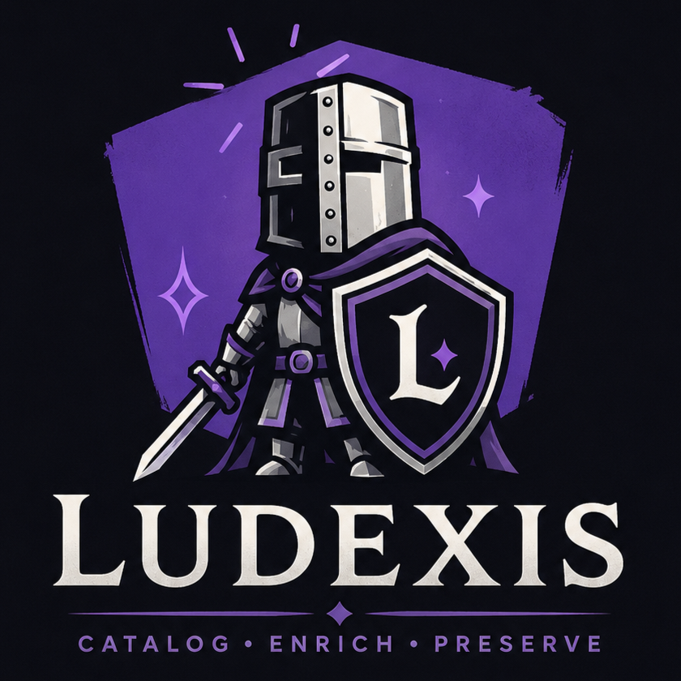
</p>

<!--
<p align="center" style="font-size: 40px;""><strong>Ludexis</strong></p>
-->

<p align="center">
  <strong>Self-Hosted Game Archive & Metadata Management Platform</strong>
</p>

<p align="center">
  <a href="#quick-start">Quick Start</a> •
  <a href="#features">Features</a> •
  <a href="#developer-setup">Developer Setup</a> •
  <a href="#documentation">Documentation</a>
</p>

<p align="center">
  Ludexis is a self-hosted platform for cataloging and preserving game archives. Unlike traditional game launchers, Ludexis focuses on metadata management, artwork acquisition, organization, and long-term archival workflows for collections consisting of ZIP archives, installer packages, visual novels, ROM collections, and preservation projects.
</p>

<p align="center">
  
  
  
  
  
  
  
</p>

---

## Why Ludexis?

Ludexis began as a response to a problem that many digital preservation enthusiasts, visual novel collectors, retro gaming archivists, and self-hosting users eventually encounter: there are plenty of game launchers, but very few tools designed specifically for managing large game archives.

Most existing platforms focus on launching installed games. Their catalogs are typically built around executable discovery, launcher integration, storefront synchronization, or installation management. This works well for modern Steam libraries but becomes increasingly limiting when dealing with preservation-oriented collections.

Many archives consist of compressed releases, installer packages, visual novels, portable games, ROM collections, abandonware archives, backup media, and other content that may never be installed or directly executable. In these scenarios, the archive itself is often the asset being managed rather than a runnable game installation.

Ludexis approaches the problem from a different perspective. Instead of asking "How do I launch this game?", it asks "How do I catalog, organize, enrich, preserve, and manage this archive?"

A single Ludexis deployment can catalog content such as:

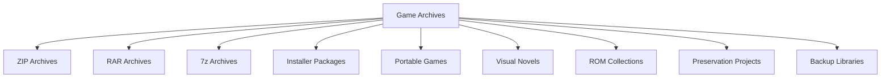
```mermaid
flowchart TB

    A[Game Archives]

    A --> B[ZIP Archives]
    A --> C[RAR Archives]
    A --> D[7z Archives]
    A --> E[Installer Packages]
    A --> F[Portable Games]
    A --> G[Visual Novels]
    A --> H[ROM Collections]
    A --> I[Preservation Projects]
    A --> J[Backup Libraries]
```

Rather than depending on launchers, executables, storefront APIs, or installed applications, Ludexis focuses on metadata management, artwork acquisition, catalog organization, archive preservation, and long-term collection maintenance.

The result is a platform designed specifically for users who maintain game archives rather than game installations.

---

## Overview

Ludexis is a self-hosted game archive management platform designed for users who maintain collections of installers, archived game releases, visual novels, preservation projects, backups, and multi-drive game libraries.

As collections grow across hard drives, NAS systems, external storage devices, and backup archives, maintaining accurate records becomes increasingly difficult. Information such as release versions, publishers, developers, storage locations, screenshots, artwork, and related titles often becomes fragmented or lost entirely.

Ludexis solves this problem by transforming raw archive files into a searchable and enriched catalog. Through automated scanning, metadata matching, artwork acquisition, collections, tagging, and background processing, Ludexis provides a centralized platform for managing and preserving game archives.

Unlike traditional game launchers, Ludexis focuses on cataloging, organization, metadata enrichment, and long-term archival management rather than game launching.

---

## Key Features

### Automated Library Discovery & Scanning

Ludexis continuously catalogs game archives stored across local drives, external storage devices, NAS systems, and archival repositories. Libraries can be configured as scan targets, allowing the platform to automatically discover supported archives and game folders without requiring manual entry.

Both full and incremental scanning modes are supported. Full scans rebuild catalog information across an entire library, while incremental scans process only newly added or modified content, significantly reducing maintenance overhead for large collections.

Discovered entries are normalized and stored in a structured catalog, enabling consistent metadata enrichment and organization regardless of the original archive source.

### Metadata Aggregation & Enrichment

Ludexis automatically enriches archive entries using external metadata providers and is designed around a provider-agnostic architecture that allows additional metadata sources to be integrated over time. The current implementation utilizes IGDB and can be extended to support platforms such as Steam, MobyGames, RAWG, GOG, PCGamingWiki, and other preservation-oriented metadata sources.

Metadata enrichment transforms raw archive files into richly cataloged entries by retrieving official game information and associating it with discovered archives.

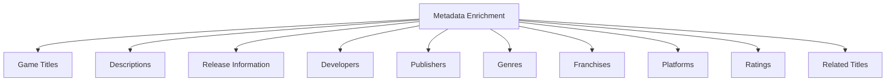
```mermaid
flowchart TB

    A[Metadata Enrichment]

    A --> B[Game Titles]
    A --> C[Descriptions]
    A --> D[Release Information]
    A --> E[Developers]
    A --> F[Publishers]
    A --> G[Genres]
    A --> H[Franchises]
    A --> I[Platforms]
    A --> J[Ratings]
    A --> K[Related Titles]
```

This allows raw archive files to be transformed into rich, searchable catalog entries without extensive manual curation.

### Artwork Acquisition & Management

Ludexis supports comprehensive artwork management for archive entries. Artwork assets are stored locally to ensure long-term availability independent of third-party services.

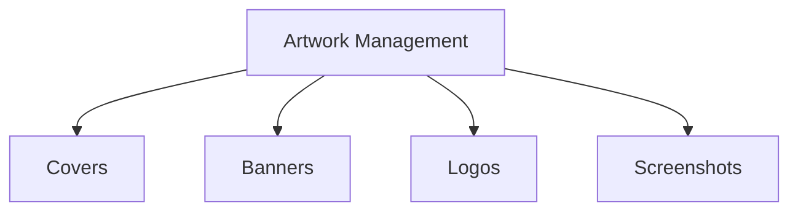
```mermaid
flowchart TB

    A[Artwork Management]

    A --> B[Covers]
    A --> C[Banners]
    A --> D[Logos]
    A --> E[Screenshots]
```

Artwork may be uploaded manually or automatically acquired through the metadata enrichment pipeline. Validation and maintenance operations ensure artwork remains synchronized with associated archive entries while avoiding duplicate assets and broken references.

### Advanced Catalog Organization

Beyond simple file storage, Ludexis provides multiple organizational layers for managing large collections.

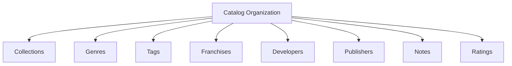
```mermaid
flowchart TB

    A[Catalog Organization]

    A --> B[Collections]
    A --> C[Genres]
    A --> D[Tags]
    A --> E[Franchises]
    A --> F[Developers]
    A --> G[Publishers]
    A --> H[Notes]
    A --> I[Ratings]
```

These relationships allow users to build curated collections and navigate large archives through meaningful metadata rather than filesystem structure alone.

### Archive Preservation & Verification

Ludexis is designed with preservation-oriented workflows in mind. Archive records maintain filesystem metadata, verification status, storage information, and catalog history to support long-term archival management.

Planned integrity workflows include archive verification, corruption detection, duplicate identification, and preservation auditing to assist users maintaining large game collections over extended periods.

### User Management & Role-Based Access Control

The platform includes a complete authentication and authorization system built around Role-Based Access Control (RBAC).

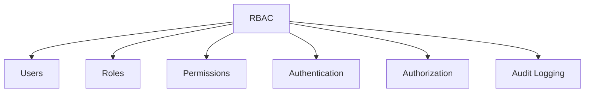
```mermaid
flowchart TB

    A[RBAC]

    A --> B[Users]
    A --> C[Roles]
    A --> D[Permissions]
    A --> E[Authentication]
    A --> F[Authorization]
    A --> G[Audit Logging]
```

This enables Ludexis to scale from single-user deployments to shared archival environments.

### Background Processing & Job Management

Long-running operations execute asynchronously through Celery workers, ensuring the API remains responsive regardless of collection size.

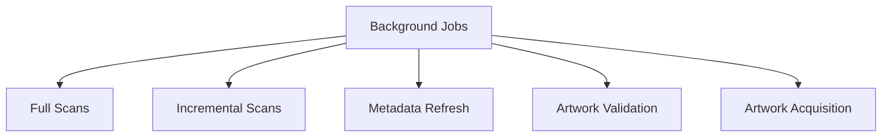
```mermaid
flowchart TB

    A[Background Jobs]

    A --> B[Full Scans]
    A --> C[Incremental Scans]
    A --> D[Metadata Refresh]
    A --> E[Artwork Validation]
    A --> F[Artwork Acquisition]
```

A centralized job system provides visibility into task progress, execution history, completion status, and failure reporting.

### Monitoring & Observability

Ludexis includes built-in operational monitoring through Prometheus and Grafana.

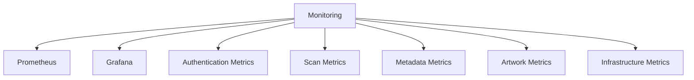
```mermaid
flowchart TB

    A[Monitoring]

    A --> B[Prometheus]
    A --> C[Grafana]
    A --> D[Authentication Metrics]
    A --> E[Scan Metrics]
    A --> F[Metadata Metrics]
    A --> G[Artwork Metrics]
    A --> H[Infrastructure Metrics]
```

Infrastructure monitoring is provided through Node Exporter by default, with optional Windows Exporter support available for native Windows host telemetry.

These capabilities allow administrators to monitor system health, workload activity, and resource utilization without requiring additional monitoring infrastructure.

---

## Architecture Overview

Ludexis follows a service-oriented architecture designed around clear separation of responsibilities, asynchronous processing, and persistent metadata storage.

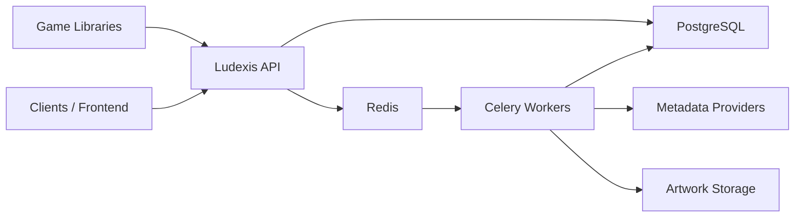
```mermaid
flowchart LR

    Libraries["Game Libraries"]

    Backend["Ludexis API"]

    PostgreSQL["PostgreSQL"]

    Redis["Redis"]

    Workers["Celery Workers"]

    Metadata["Metadata Providers"]

    Artwork["Artwork Storage"]

    UI["Clients / Frontend"]

    Libraries --> Backend

    Backend --> PostgreSQL
    Backend --> Redis

    Redis --> Workers

    Workers --> Metadata
    Workers --> Artwork
    Workers --> PostgreSQL

    UI --> Backend
```

The FastAPI backend serves as the central orchestration layer, coordinating authentication, catalog management, metadata operations, search functionality, and administrative workflows. PostgreSQL stores all persistent data, Redis provides task queue infrastructure, and Celery workers execute long-running background operations independently from user-facing requests.

---

## How Ludexis Works

The processing pipeline transforms raw archive files into fully cataloged archive entries.

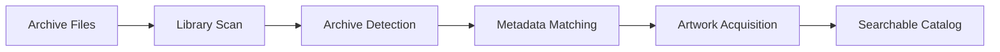
```mermaid
flowchart LR

    A[Archive Files]
    --> B[Library Scan]

    B --> C[Archive Detection]

    C --> D[Metadata Matching]

    D --> E[Artwork Acquisition]

    E --> F[Searchable Catalog]
```

When a library scan is initiated, Ludexis discovers archive files and folders, extracts filesystem metadata, creates catalog entries, enriches them using metadata providers, downloads available artwork, and stores the resulting information in a searchable database.

This workflow allows large collections to be cataloged with minimal manual effort while still supporting manual curation when required.

## Screenshots

Frontend development is currently in progress.

Screenshots and usage demonstrations will be added as the user interface matures.

<!-- > Screenshots will be added as the frontend matures.

### Dashboard


### Archive Entry


### Metadata Search


-->

---

## Quick Start

Ludexis is designed as a self-hosted service and can be deployed using Docker Compose. A standard deployment includes the FastAPI backend, Celery workers, PostgreSQL, Redis, Prometheus, Grafana, and system monitoring exporters.

### Requirements

Before deployment, ensure the host system has:

- Docker
- Docker Engine 24+ (Windows)
- Docker Compose
- 4 GB RAM recommended

### Obtain the Source

```bash
git clone https://github.com/InvictusRex/Ludexis.git

cd Ludexis/backend
```

### Configure the Environment

Create a deployment configuration using `.env.docker` as a template and review all environment variables before starting the platform.

At minimum, the following values should be configured:

```env
JWT_SECRET_KEY=<your-secret-key>

TWITCH_CLIENT_ID=<your-client-id>
TWITCH_CLIENT_SECRET=<your-client-secret>
```

The Twitch credentials are used for metadata retrieval through IGDB. Without valid credentials, metadata enrichment capabilities will be unavailable.

### Start the Platform

```bash
docker compose up -d
```

The deployment automatically provisions and configures all required services, including the application backend, background workers, database services, monitoring stack, and observability tooling.

### Verify Deployment

Once all containers have started successfully, the following services should be available:

| Service    | URL                        |
| ---------- | -------------------------- |
| API        | http://localhost:8000      |
| Swagger UI | http://localhost:8000/docs |
| Prometheus | http://localhost:9090      |
| Grafana    | http://localhost:3000      |

Grafana ships with the default credentials:

```text
Username: admin
Password: admin
```

These credentials should be changed before exposing the deployment outside a trusted environment.

### Initial Configuration

After deployment, create the initial administrator account and configure the archive libraries that Ludexis should manage.

A typical setup workflow consists of:

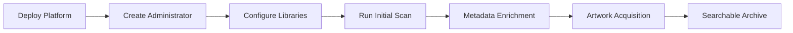
```mermaid
flowchart LR

    A[Deploy Platform]
    --> B[Create Administrator]

    B --> C[Configure Libraries]

    C --> D[Run Initial Scan]

    D --> E[Metadata Enrichment]

    E --> F[Artwork Acquisition]

    F --> G[Searchable Archive]
```

Once the first scan completes, archive entries become available for metadata enrichment, artwork acquisition, search, categorization, and collection management.

---

## Monitoring & Observability

Ludexis includes a built-in observability stack for monitoring application health, infrastructure performance, and background processing activity.

### Prometheus Metrics

The backend exposes Prometheus-compatible metrics through:

```text
/api/metrics
```

Metrics currently include:

- Authentication activity
- Library scans
- Incremental scans
- Metadata searches
- Artwork operations
- Background job execution

### Grafana Dashboards

Grafana dashboards can be used to visualize:

- User activity
- Scan throughput
- Metadata operations
- Artwork processing
- API metrics
- Infrastructure performance

### Infrastructure Monitoring

By default, Ludexis deploys Node Exporter to provide host-level metrics including:

- CPU utilization
- Memory usage
- Disk consumption
- Network statistics

---

## Optional Windows Exporter

Node Exporter provides cross-platform metrics and is enabled by default.

Users requiring native Windows performance counters may additionally enable Windows Exporter:

```bash
docker compose --profile windows_exporter up -d
```

This exposes Windows-specific metrics while preserving the default monitoring stack.

---

## First-Time Setup

After deployment:

1. Open Swagger UI.

```text
http://localhost:8000/docs
```

2. Run the initial setup endpoint.

3. Create the administrator account.

4. Login and obtain an access token.

5. Configure one or more game libraries.

6. Start the first library scan.

7. Begin metadata enrichment and artwork acquisition.

---

## Developer Setup

Ludexis supports a contributor-focused development workflow that separates application execution from infrastructure services. During development, PostgreSQL, Redis, Prometheus, Grafana, and exporter services run through Docker while the FastAPI backend and Celery workers execute directly on the host machine for improved debugging, hot reload support, and IDE integration.

### Clone the Repository

```bash
git clone https://github.com/InvictusRex/Ludexis.git

cd Ludexis/backend
```

### Create a Virtual Environment

```bash
python -m venv .venv
```

### Activate the Environment

Windows:

```bash
.venv\Scripts\activate
```

Linux/macOS:

```bash
source .venv/bin/activate
```

### Install Dependencies

```bash
pip install -r requirements.txt
```

### Configure Environment Variables

Linux: Create a local environment file and configure the required values.

```bash
cp .env.docker .env
```

Windows: Create a local `.env` file using `.env.docker` as a template and update any required credentials before starting development.

At minimum, the following values should be reviewed before development:

```env
DATABASE_URL=
REDIS_URL=
CELERY_BROKER_URL=
CELERY_RESULT_BACKEND=

JWT_SECRET_KEY=

TWITCH_CLIENT_ID=
TWITCH_CLIENT_SECRET=
```

### Start Development Infrastructure

```bash
docker compose -f dev/docker-compose.infra.yml up -d
```

Optional Windows host metrics can be enabled using:

```bash
docker compose -f dev/docker-compose.infra.yml --profile windows_exporter up -d
```

This command launches PostgreSQL, Redis, Prometheus, Grafana, and Node Exporter, providing all supporting infrastructure required for local development.

### Start the Backend

```bash
uvicorn main:app --reload
```

The API will be available at:

```text
http://localhost:8000
```

Swagger documentation:

```text
http://localhost:8000/docs
```

### Start Celery Worker

Open a second terminal and run:

```bash
celery -A app.tasks.celery_app worker --loglevel=info
```

### Run Tests

```bash
pytest
```

### Development Monitoring

The observability stack remains available during development.

| Service    | URL                   |
| ---------- | --------------------- |
| Prometheus | http://localhost:9090 |
| Grafana    | http://localhost:3000 |

This setup mirrors the workflow used during active Ludexis development and provides full access to monitoring, debugging, and testing capabilities while maintaining a lightweight local development environment.

---

## Documentation

Detailed documentation is organized within the `docs/` directory.

| Directory            | Description                                                                                       |
| -------------------- | ------------------------------------------------------------------------------------------------- |
| `docs/architecture/` | System architecture, backend architecture, data model, ERD, and processing pipeline documentation |
| `docs/api/`          | REST API reference and integration guidance                                                       |
| `docs/deployment/`   | Deployment, infrastructure, and operational documentation                                         |
| `docs/integrations/` | cURL, Python, and JavaScript integration examples                                                 |
| `docs/backlog/`      | Project backlogs, development milestones, and future planning                                     |

The README focuses on installation, configuration, and day-to-day usage. Detailed technical documentation, architectural decisions, deployment guidance, and implementation references are maintained separately within the documentation directory.

---

## Development Roadmap

Ludexis is under active development. Current development status, completed milestones, planned features, and future objectives are maintained in:

```text
docs/backlog/Frontend_Backlog.md
docs/backlog/Backend_Backlog.md
```

For architectural and implementation details, refer to the documentation contained within the `docs/architecture/`, `docs/api/`, and `docs/deployment/` directories.

## License

This project is licensed under the MIT License.

See the LICENSE file for additional details.

---

## Acknowledgements

Ludexis relies on several open-source technologies and metadata ecosystems, including FastAPI, PostgreSQL, Redis, Celery, Prometheus, Grafana, IGDB, Docker.
Their contributions make modern self-hosted software ecosystems possible.
