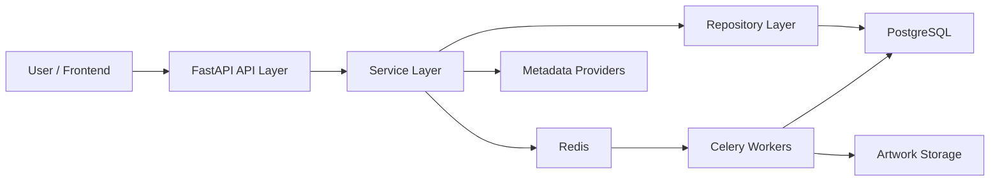
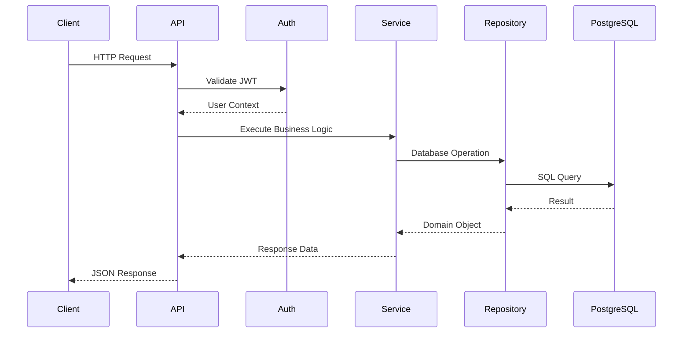
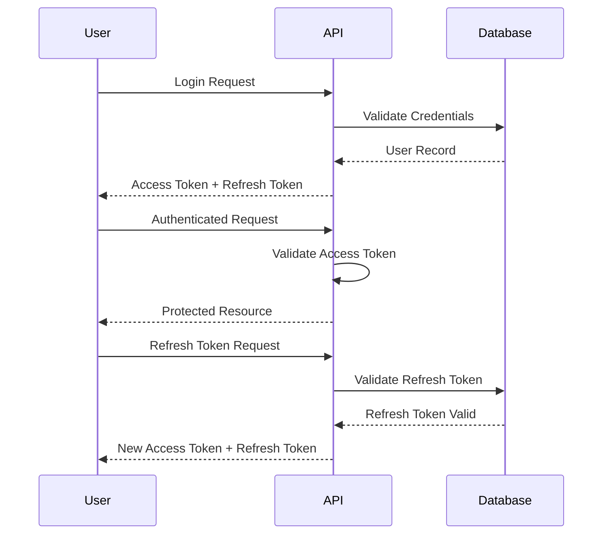
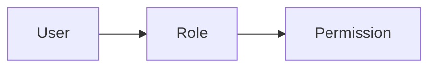
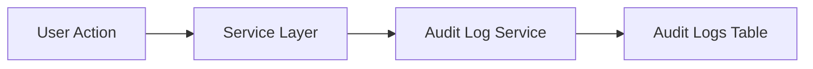

# Ludexis Architecture Overview

## Introduction

Ludexis is a self-hosted game archive and metadata management platform designed to catalog, organize, enrich, and manage large collections of digital game archives. The system provides a centralized backend for storing game metadata, artwork, collection information, user accounts, permissions, and scanning jobs while exposing a RESTful API for administrative and frontend interactions.

The primary objective of Ludexis is to allow users to maintain large game libraries without relying on external launchers or proprietary platforms. Rather than functioning as a game launcher itself, Ludexis acts as a metadata management and archival platform capable of indexing local game collections, enriching entries using external metadata providers, and exposing the resulting information through a secure and extensible API.

The backend is implemented using FastAPI and SQLAlchemy, with PostgreSQL serving as the primary persistent datastore. Redis and Celery are utilized for asynchronous job execution, enabling long-running operations such as library scanning, metadata synchronization, artwork processing, and future batch-processing workloads.

The architecture emphasizes maintainability, security, scalability, and modularity. Each subsystem is intentionally separated into clearly defined layers to ensure future development can occur without introducing excessive coupling between components.

---

## Architectural Goals

The system architecture was designed around several core engineering objectives.

### Maintainability

The project follows a layered architecture that separates API endpoints, business logic, data access logic, and database models into distinct components. This approach reduces coupling between subsystems and allows developers to modify implementation details without impacting unrelated parts of the application.

Business rules are implemented within dedicated service classes while repositories handle persistence concerns. API routers remain lightweight and primarily focus on request validation and response generation.

### Scalability

While Ludexis is primarily intended for self-hosted deployments, the architecture is designed to support significantly larger libraries than those used during initial development.

Several design decisions support future scalability:

- PostgreSQL provides robust indexing and query optimization capabilities.
- Redis enables distributed task coordination.
- Celery allows asynchronous execution of long-running jobs.
- Stateless API services permit horizontal scaling if required.
- Metadata providers are abstracted behind service interfaces.

These choices allow the platform to grow without requiring major architectural redesign.

### Security

Security considerations are incorporated throughout the system.

Authentication relies on JWT access tokens combined with refresh tokens. Role-Based Access Control (RBAC) enforces authorization decisions throughout the API surface.

Administrative operations require explicit permissions and all sensitive actions are recorded within audit logs.

The architecture also supports deployment behind reverse proxies and containerized environments, allowing operators to implement additional network-level security controls.

### Extensibility

Future functionality should be implementable without requiring large-scale modifications to existing components.

Examples include:

- Additional metadata providers
- Alternative artwork storage backends
- Additional authentication mechanisms
- Frontend applications
- Public API integrations
- Scheduled automation jobs

Subsystem boundaries are intentionally defined to make future expansion predictable and manageable.

### Reliability

The platform is designed to tolerate operational failures while preserving data integrity.

Background tasks are tracked using job records and support retry mechanisms. Database transactions are used where appropriate to prevent partial updates. Long-running operations are isolated from request-response cycles to avoid blocking API responsiveness.

These mechanisms improve overall system stability during both normal operation and failure scenarios.

---

## High-Level System Architecture

Ludexis follows a layered service-oriented architecture.

The architecture can be viewed as four primary tiers:

1. Presentation Layer
2. Business Logic Layer
3. Persistence Layer
4. Infrastructure Layer

Each tier is responsible for a specific set of concerns and communicates through well-defined interfaces.

---

## Core Components

### FastAPI Application

The FastAPI application serves as the primary entry point into the system.

Responsibilities include:

- Request routing
- Authentication
- Authorization
- Request validation
- Response serialization
- OpenAPI generation
- Dependency injection

The API layer intentionally avoids implementing business logic directly. Instead, requests are delegated to service classes responsible for enforcing application behavior.

---

### Service Layer

The service layer contains the majority of business logic.

Examples include:

- Authentication workflows
- Metadata synchronization
- Artwork management
- Library scanning
- Collection management
- User administration

Services coordinate interactions between repositories, background workers, storage providers, and external integrations.

This layer represents the operational core of the platform.

---

### Repository Layer

Repositories abstract direct database access.

Rather than allowing API routes or services to execute arbitrary SQLAlchemy operations, repositories provide a consistent interface for retrieving and modifying data.

Benefits include:

- Improved testability
- Reduced duplication
- Centralized query logic
- Easier future database migrations

Repositories act as the boundary between business logic and persistence logic.

---

### PostgreSQL Database

PostgreSQL serves as the authoritative datastore for all platform information.

Stored data includes:

- User accounts
- Roles and permissions
- Libraries
- Archive entries
- Metadata records
- Artwork references
- Collections
- Audit logs
- Job history
- Refresh tokens

All persistent platform state ultimately resides within PostgreSQL.

---

### Redis

Redis functions as a lightweight infrastructure component supporting asynchronous processing.

Primary responsibilities include:

- Celery message brokering
- Task coordination
- Background job dispatching
- Future caching support

Redis is intentionally isolated from permanent data storage responsibilities.

---

### Celery Workers

Celery workers execute long-running tasks outside the API request lifecycle.

Examples include:

- Full library scans
- Incremental scans
- Metadata enrichment
- Artwork processing
- Batch maintenance operations

By moving these operations into background workers, API responsiveness remains unaffected during resource-intensive processing.

---

### Artwork Storage

Artwork assets are stored separately from metadata records.

The database stores references and metadata describing artwork while the actual image files reside within persistent storage volumes.

This separation improves database efficiency and simplifies backup strategies.

---

### Metadata Provider Integration

Metadata services provide enrichment information for archive entries.

Examples of metadata sources include:

- IGDB
- TheGamesDB
- Custom metadata providers

The architecture treats providers as interchangeable components, allowing additional sources to be integrated without major modifications to existing code.

---

## Request Lifecycle

Understanding the request lifecycle is important for understanding how data moves through Ludexis.

Every request follows a predictable sequence through the system.

The API layer is responsible for receiving requests and validating input data using Pydantic schemas. Authentication and authorization checks are performed before business logic execution begins.

Once validation succeeds, the request is delegated to a service class. Services coordinate application behavior and interact with repositories to retrieve or modify data.

Repositories perform the actual database operations and return results back to the service layer. After processing completes, the API layer serializes the response into JSON and returns it to the client.

This flow ensures that each layer maintains a clear and focused responsibility.

---

## Authentication Architecture

Ludexis uses a token-based authentication model built on JSON Web Tokens (JWT).

The authentication system consists of two token types:

- Access Tokens
- Refresh Tokens

Access tokens are short-lived credentials used to authorize API requests. Refresh tokens are longer-lived credentials used to obtain new access tokens without requiring users to repeatedly enter their credentials.

### Authentication Flow

The authentication subsystem is implemented using signed JWT tokens generated with a server-side secret key.

Each access token contains:

- Subject identifier
- Token type
- Expiration timestamp
- Unique token identifier

Refresh tokens additionally support server-side revocation through database-backed tracking.

This approach combines the scalability advantages of JWT authentication with the security benefits of revocable sessions.

### Refresh Token Rotation

Ludexis implements refresh token rotation.

Whenever a refresh token is used:

1. The existing refresh token is revoked.
2. A new refresh token is generated.
3. A new access token is generated.
4. The old refresh token becomes invalid.

This mechanism reduces the impact of token theft and improves overall session security.

---

## Authorization Architecture (RBAC)

Authorization within Ludexis is implemented using Role-Based Access Control (RBAC).

Rather than assigning permissions directly to individual users, permissions are assigned to roles and roles are assigned to users.

This design significantly simplifies permission management as the number of users grows.

### RBAC Hierarchy

A user may possess multiple roles.

A role may contain multiple permissions.

Permissions define the specific operations that users are allowed to perform within the platform.

Examples include:

- Run library scans
- Manage users
- Manage roles
- Edit metadata
- Access administrative functions
- View audit logs
- Manage collections

Authorization checks occur before protected operations are executed.

If a user lacks the required permission, the request is rejected with an appropriate authorization error.

### Administrative Roles

The default administrative role receives all available permissions and acts as the primary management account within the system.

Administrative users are capable of:

- Managing users
- Managing roles
- Assigning permissions
- Running scans
- Viewing system statistics
- Viewing audit logs
- Performing maintenance operations

The RBAC design allows future introduction of more specialized roles without requiring architectural changes.

---

## Audit Logging Architecture

Audit logging provides traceability and accountability throughout the platform.

Important system actions are recorded in a dedicated audit log table.

Examples include:

- Successful logins
- Failed logins
- User creation
- User deletion
- Role assignment
- Permission changes
- Metadata modifications
- Administrative actions
- Token refresh operations
- Logout events

### Audit Log Flow

The audit subsystem operates independently of the primary business operation whenever possible.

This ensures that operational data and audit records remain logically separated while still providing complete visibility into system activity.

Audit records contain sufficient contextual information to reconstruct the sequence of events that led to a particular system state.

This capability is particularly valuable for troubleshooting, security investigations, and administrative oversight.

---

## Design Principles

Several guiding principles influenced the architecture of Ludexis.

### Separation of Concerns

Each layer within the system performs a clearly defined role.

API routers handle transport concerns.

Services implement business logic.

Repositories manage persistence.

Infrastructure components provide supporting capabilities.

This separation improves maintainability and reduces unintended coupling.

### Explicit Dependencies

Components communicate through well-defined interfaces and dependency injection.

This approach simplifies testing and improves long-term maintainability.

### Stateless API Design

The API layer remains stateless.

Session state is represented through JWT tokens and persistent database records rather than in-memory application state.

This design supports future horizontal scaling if required.

### Database as the Source of Truth

All critical application data resides within PostgreSQL.

Redis functions as a transient infrastructure component and is never treated as an authoritative datastore.

This principle simplifies backup, disaster recovery, and operational management.

### Background Processing for Long-Running Tasks

Potentially expensive operations are delegated to Celery workers.

This prevents long-running requests from impacting API responsiveness and improves overall user experience.

### Security by Default

Authentication, authorization, token rotation, audit logging, and permission enforcement are incorporated into the architecture rather than added as afterthoughts.

Security considerations are treated as fundamental system requirements.

---

## Conclusion

The Ludexis architecture is designed to balance simplicity, maintainability, and extensibility while providing a solid foundation for future growth.

The combination of FastAPI, PostgreSQL, Redis, Celery, and a layered application design enables the platform to manage large game libraries efficiently while remaining approachable for contributors and maintainers.

Subsequent architectural documents explore the database model, backend implementation details, and processing pipelines in greater depth.
