# Backend Architecture

## Overview

The Ludexis backend is implemented as a modular FastAPI application designed around a layered architecture pattern. The primary objective of the backend is to provide a secure, maintainable, and extensible platform for managing large personal game archives while exposing a clean API surface for future frontend clients and automation tools.

The backend serves as the authoritative source of truth for all archive metadata, user management, permission enforcement, scanning operations, artwork management, and metadata acquisition workflows. It is intentionally separated from frontend concerns so that multiple clients—including web interfaces, desktop applications, mobile applications, and third-party integrations—can interact with the same API without modification to business logic.

Several architectural principles guided the backend design:

- Clear separation of responsibilities between layers.
- Database access isolated from business logic.
- Authentication and authorization enforced centrally.
- Background operations executed asynchronously.
- API contracts defined through explicit schemas.
- Future scalability through service abstraction.
- Complete support for containerized deployment.

The result is a backend architecture that remains understandable while supporting substantial future growth.

---

# Layered Architecture

The backend follows a layered architecture pattern.

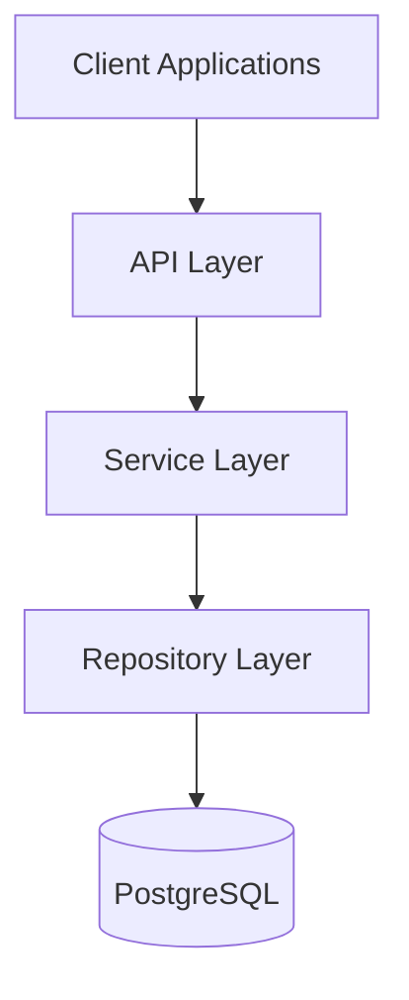

Each layer has a strictly defined responsibility.

The API layer handles HTTP requests and responses. It performs request validation, dependency injection, authentication checks, and response serialization.

The service layer contains business logic. This is where archive scanning, metadata processing, artwork handling, permission evaluation, authentication workflows, and administrative operations are implemented.

The repository layer provides a dedicated abstraction over database access. Repositories encapsulate database queries and persistence operations so that services remain independent of SQLAlchemy implementation details.

The database layer stores all persistent system state including archive records, metadata entities, users, roles, permissions, collections, audit logs, and job history.

This separation significantly improves maintainability because modifications to one layer typically do not require changes to the others.

---

# Request Lifecycle

Every request follows a predictable processing pipeline.

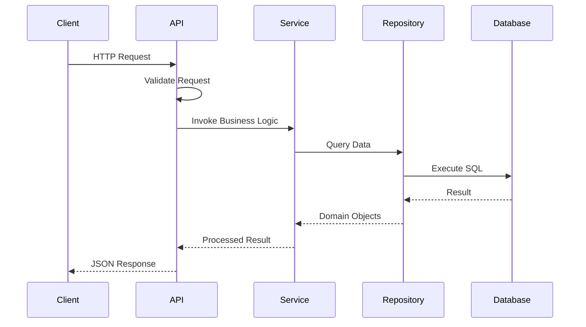

This flow ensures that HTTP concerns remain isolated from business concerns.

Validation is performed using Pydantic schemas before business logic is executed. Services never directly process raw request payloads. Instead, they operate on validated objects that satisfy the expected contract.

Likewise, repositories never interact with HTTP requests or response objects. Their responsibility is limited strictly to data persistence and retrieval.

The result is a clean architectural boundary between transport logic, business logic, and storage logic.

---

# Package Structure

The backend source tree is organized by responsibility rather than by feature.

```text
backend/
│
├── alembic/
├── app/
│   ├── api/
│   ├── core/
│   ├── db/
│   ├── models/
│   ├── providers/
│   ├── repositories/
│   ├── schemas/
│   ├── services/
│   ├── tasks/
│   └── utils/
│
├── tests/
│
├── main.py
├── docker-compose.yml
├── Dockerfile
├── alembic.ini
├── requirements.txt
└── seed_rbac.py
```

Each package fulfills a specific architectural role.

The `api` package contains FastAPI routers and endpoint definitions.

The `core` package contains application-wide infrastructure such as configuration loading, authentication utilities, logging configuration, and security helpers.

The `db` package contains database initialization and session management.

The `models` package contains SQLAlchemy ORM entities that define the persistent database schema.

The `repositories` package contains data-access abstractions that encapsulate database queries.

The `schemas` package contains Pydantic request and response models that define API contracts.

The `services` package contains business logic implementations.

The `tasks` package contains asynchronous background job definitions executed through Celery.

The `utils` package contains shared utilities, enums, helper functions, and supporting infrastructure.

The `providers` package contains integrations with external metadata providers and enrichment sources. Provider-specific logic is isolated from the rest of the system so that additional metadata sources can be integrated without affecting API or business-layer code.

This organization keeps responsibilities clearly separated and makes navigation easier as the project grows.

---

# Service Layer

The Service Layer contains the core business logic of the Ludexis backend.

While API routers define endpoints and repositories handle persistence, services are responsible for implementing system behavior and enforcing business rules.

The service layer acts as the central orchestration point of the application.

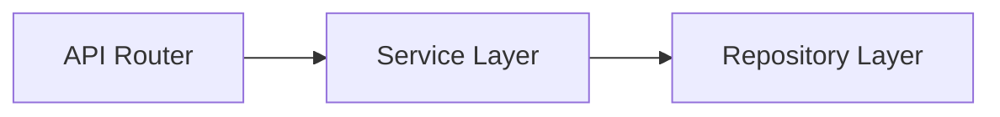

This separation prevents business logic from becoming scattered across API endpoints and database queries.

As the platform grows, the service layer becomes the primary location for implementing new functionality without affecting the transport or persistence layers.

---

## Service Responsibilities

Services are responsible for:

- Business rule enforcement
- Workflow orchestration
- Validation beyond schema validation
- Authorization decisions
- Metadata processing
- Scan coordination
- Job lifecycle management
- Audit logging
- External provider integration

Services are intentionally independent of HTTP request handling.

A service should not know whether it was called by:

- FastAPI
- A Celery worker
- A CLI utility
- A future desktop application
- A future GraphQL API

This keeps the business logic reusable across multiple interfaces.

---

## Service Architecture

A typical service operation follows this flow:

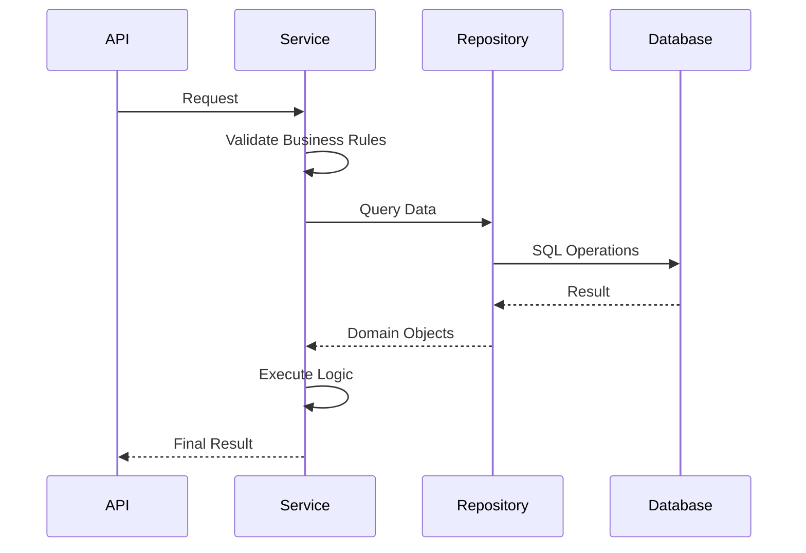

Services act as coordinators between repositories and higher-level workflows.

---

# Major Services

Several dedicated services exist within the system.

Each service owns a specific business domain.

---

## Auth Service

The Authentication Service manages:

- User authentication
- Password verification
- Access token generation
- Refresh token generation
- Refresh token rotation
- Logout handling

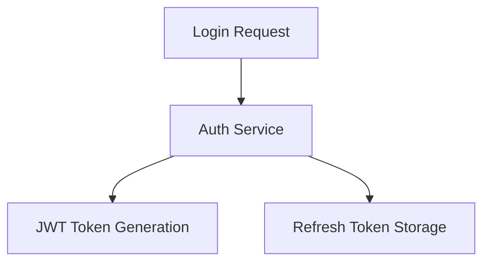

Authentication rules remain centralized inside this service rather than being distributed across API endpoints.

---

## User Service

The User Service manages:

- User creation
- User updates
- User deletion
- Role assignment
- Permission management
- Account lifecycle operations

This service serves as the primary entry point for user administration functionality.

---

## Library Service

The Library Service manages:

- Library registration
- Library updates
- Library deletion
- Library validation
- Library enable/disable operations

Libraries represent storage locations that may be scanned for archive content.

This service ensures consistency between stored paths and scanning workflows.

---

## Archive Entry Service

The Archive Entry Service manages:

- Archive record creation
- Archive updates
- Metadata assignment
- Artwork assignment
- Metadata overrides
- Verification status management

This service represents the central domain service within the platform.

Most metadata operations ultimately interact with archive entries.

---

## Metadata Service

The Metadata Service manages:

- Metadata searching
- Metadata matching
- Metadata retrieval
- Provider integration
- Metadata refresh operations

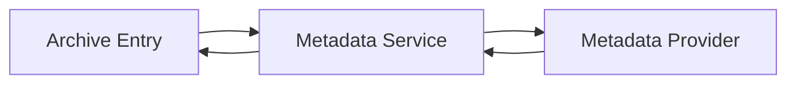

By isolating metadata acquisition behind a dedicated service, future providers can be added without modifying API endpoints.

---

## Artwork Service

The Artwork Service manages:

- Cover artwork
- Banner artwork
- Logo artwork
- Artwork replacement
- Artwork deletion
- Storage path management

This service abstracts storage concerns away from archive records.

Future migration to object storage systems can occur without affecting API contracts.

---

## Scan Service

The Scan Service coordinates archive discovery.

Responsibilities include:

- Full library scans
- Incremental scans
- Duplicate detection
- File hashing
- Archive record creation
- Scan job scheduling

Scanning operations can be computationally expensive and are therefore delegated to asynchronous workers.

---

## Job Service

The Job Service manages:

- Job creation
- Job status tracking
- Job cancellation
- Progress reporting
- Retry management

The service acts as the interface between FastAPI and Celery.

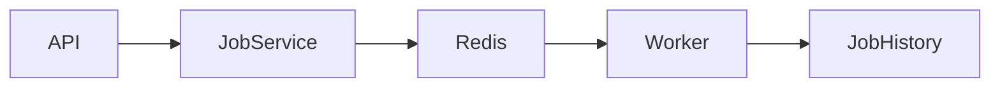

This abstraction prevents API code from becoming tightly coupled to Celery internals.

---

## Audit Log Service

The Audit Log Service records significant system actions.

Examples include:

- User login
- User logout
- User creation
- User deletion
- Metadata modifications
- Permission changes
- Administrative actions

Maintaining a dedicated audit service ensures consistent logging across the platform.

---

# Repository Layer

The Repository Layer provides a dedicated abstraction over database access.

Repositories encapsulate SQLAlchemy queries and persistence logic.

This prevents service classes from directly interacting with ORM implementation details.

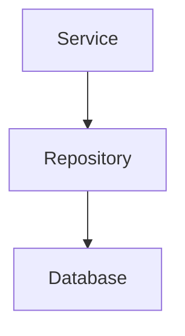

Repositories serve as translators between business logic and persistent storage.

---

## Repository Responsibilities

Repositories are responsible for:

- Query execution
- Record retrieval
- Record creation
- Record updates
- Record deletion
- Transaction participation

Repositories are not responsible for:

- Authorization
- Business rules
- HTTP concerns
- Logging policies
- Metadata decisions

Those responsibilities remain within services.

---

## Repository Benefits

This architecture provides several advantages.

### Reduced Coupling

Business logic remains independent of database implementation details.

### Improved Testability

Repositories can be mocked during service testing.

### Query Reuse

Frequently used queries can be centralized.

### Future Flexibility

The persistence layer can evolve without major service changes.

---

# Dependency Injection

FastAPI's dependency injection system is heavily used throughout the backend.

Dependencies provide:

- Database sessions
- Current user resolution
- Permission enforcement
- Configuration access

A typical request flow looks like:

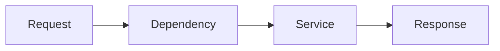

Dependency injection reduces boilerplate and centralizes infrastructure concerns.

---

# Transaction Management

Database transactions are managed through SQLAlchemy sessions.

Each request receives an isolated database session.

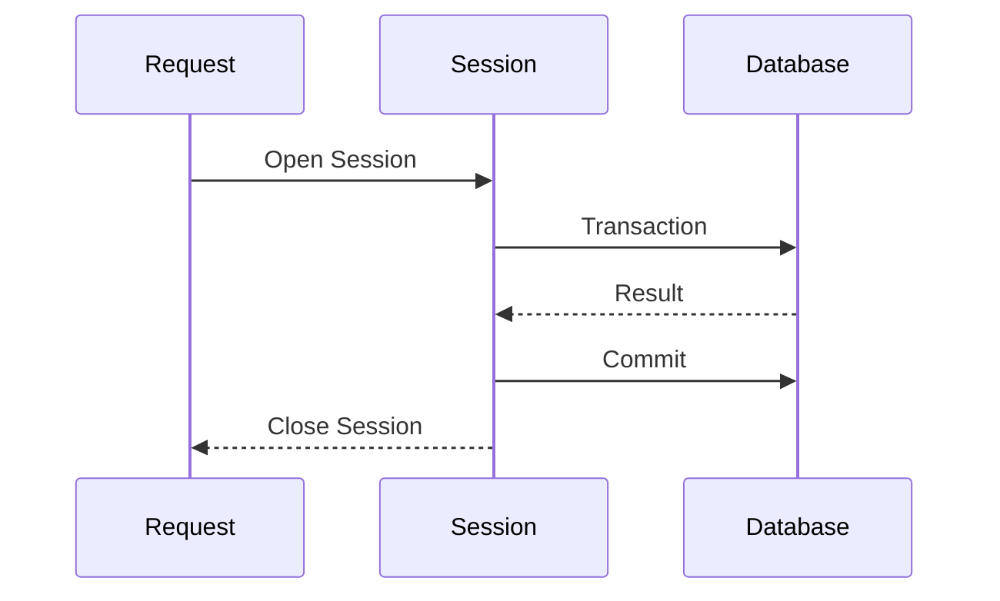

This model ensures:

- Transaction isolation
- Automatic cleanup
- Consistent commit behavior
- Reduced connection leakage

Database consistency remains protected even when exceptions occur during request processing.

## 3. Metadata Provider Architecture

### Overview

Ludexis separates metadata acquisition from metadata persistence through a provider-based architecture. External services such as IGDB, Steam, GOG, and manual metadata sources are abstracted behind a common provider interface. This allows metadata enrichment logic to remain independent of any specific external API implementation.

The objective of the subsystem is to transform a scanned archive entry into a fully enriched catalog record containing descriptive information, release metadata, artwork, genres, developers, publishers, and verification information.

The architecture is designed around three principles:

1. Provider abstraction
2. Automated metadata matching
3. Conflict-aware metadata consolidation

This design allows additional providers to be introduced in the future without requiring modifications to business logic or database models.

---

### Metadata Pipeline

The complete metadata workflow begins after a scanner creates an ArchiveEntry record.

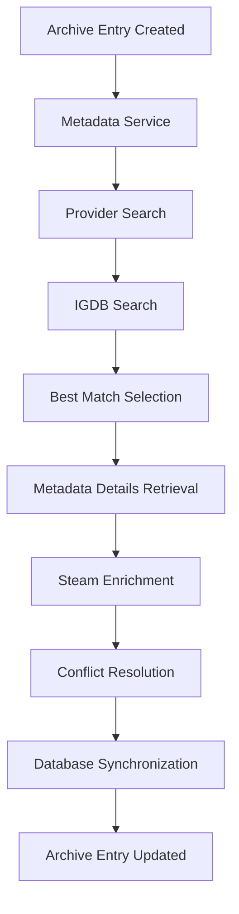

The Metadata Service acts as the orchestration layer and coordinates every stage of enrichment.

---

### Provider Abstraction Layer

All metadata providers implement a common interface defined by the MetadataProvider abstract base class.

```python
class MetadataProvider(ABC):
    search(...)
    get_details(...)
    download_artwork(...)
```

Every provider must support:

- Metadata search operations
- Metadata retrieval
- Artwork acquisition

This contract guarantees that all providers can be used interchangeably by the Metadata Service.

---

### Provider Hierarchy

The current provider ecosystem consists of four implementations.

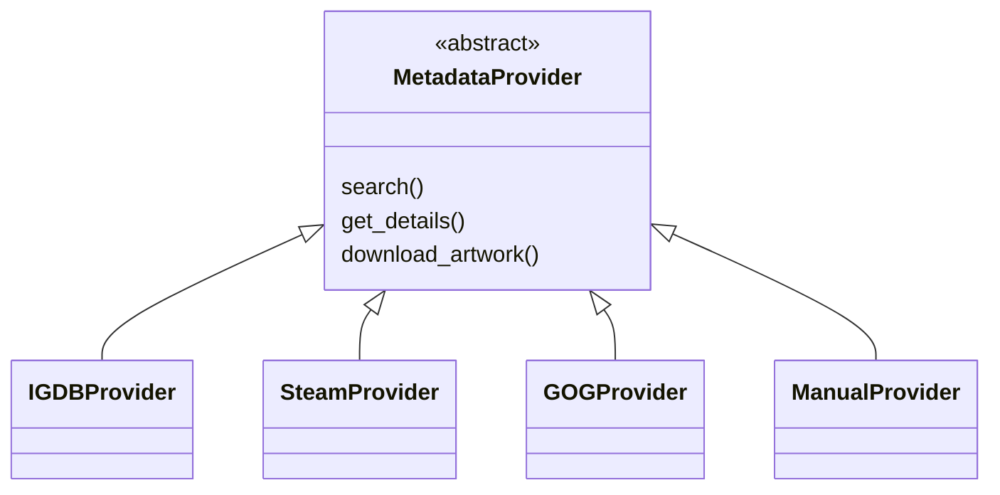

---

### IGDB Provider

The IGDB provider serves as the primary metadata source used by Ludexis.

It is responsible for performing title searches, retrieving detailed metadata records, obtaining canonical game information, and providing the primary source of descriptive content. Most automated metadata workflows begin with IGDB because it offers broad coverage and structured game metadata.

Within the current implementation, automatic matching is performed primarily through IGDB search results.

---

### Steam Provider

The Steam provider functions as a secondary enrichment source.

After a successful IGDB match is identified, Steam metadata may be retrieved and merged with the primary dataset. Steam is primarily used to supplement genres, developer information, publisher information, artwork, and additional descriptive content that may be missing from the primary provider.

The final metadata record is generated through a conflict resolution process that combines data from both providers.

---

### GOG Provider

The GOG provider implements the same abstraction interface and can participate in the metadata acquisition pipeline.

Although the current implementation does not actively merge GOG data into the final metadata record, the provider exists as part of the extensible provider architecture and may be incorporated into future enrichment workflows.

---

### Manual Provider

The Manual Provider acts as a fallback mechanism when automated matching is unsuccessful.

This provider allows metadata to be supplied directly by administrators or users without relying on external services. The existence of the manual provider ensures that archive entries can always be cataloged even when automated enrichment fails.

---

### Provider Registration

Metadata providers are registered within the Metadata Service during initialization.

```python
self.providers = [
    IGDBProvider(),
    SteamProvider(),
    GOGProvider(),
    ManualProvider(),
]
```

Providers are sorted according to priority values and stored within an internal provider map that allows fast lookup and retrieval.

This mechanism ensures that provider ordering and search precedence remain configurable while keeping business logic independent of individual provider implementations.

## 4. Metadata Matching and Conflict Resolution

### Overview

One of the primary objectives of Ludexis is to automatically identify scanned archives and enrich them with accurate metadata. Because external metadata providers may return multiple candidates, incomplete records, or conflicting information, Ludexis implements a dedicated matching and conflict resolution subsystem.

The subsystem is responsible for:

- Identifying the most likely metadata match for an archive entry.
- Determining metadata confidence levels.
- Merging information from multiple providers.
- Preserving manually edited metadata.
- Tracking metadata verification status.
- Supporting future metadata refresh operations.

The metadata workflow is intentionally separated from the scanning workflow to ensure that archive discovery and metadata enrichment can evolve independently.

---

### Automatic Matching Workflow

When metadata enrichment is requested for an archive entry, the Metadata Service initiates an automated matching process.

The current implementation uses IGDB as the primary matching source.

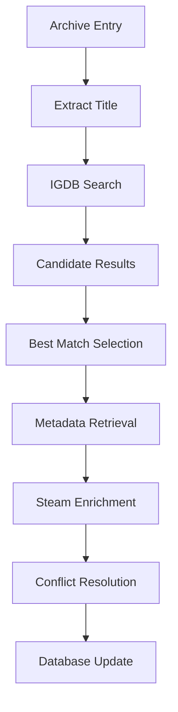

The objective of the matching stage is not simply to locate metadata, but to determine the most probable metadata record associated with the archive.

---

### Metadata Confidence Levels

Metadata matching is inherently probabilistic. Multiple titles may have similar names, regional variants may exist, and archive filenames often contain additional information such as version numbers, release groups, or platform identifiers.

To handle this uncertainty, Ludexis classifies metadata quality using dedicated status values.

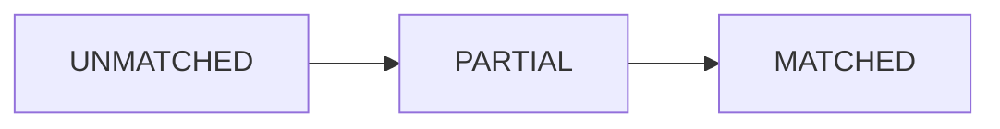

#### UNMATCHED

No reliable metadata candidate could be identified.

Archive entries in this state remain searchable and manageable but contain little or no external metadata.

#### PARTIAL

A potential metadata match exists, but confidence is insufficient for a fully verified assignment.

Additional manual verification may be required.

#### MATCHED

A sufficiently reliable metadata record has been identified and successfully applied to the archive entry.

The archive is considered enriched and ready for normal catalog operations.

---

### Matching Service

The Matching Service provides utility functions used during archive identification.

Its responsibilities include:

- Title normalization.
- Similarity comparisons.
- Candidate ranking.
- Match score evaluation.
- Duplicate detection support.

By isolating matching logic into a dedicated service, Ludexis avoids embedding comparison algorithms directly within provider implementations.

This separation improves maintainability and allows matching algorithms to evolve independently from metadata providers.

---

### Metadata Enrichment Process

Once a successful match has been identified, detailed metadata retrieval begins.

The Metadata Service gathers information from one or more providers and constructs a normalized metadata representation.

Typical metadata fields include:

- Title
- Description
- Release date
- Genres
- Developers
- Publishers
- Artwork
- External identifiers

Because different providers often expose overlapping information, a consolidation stage is required before persistence.

---

### Conflict Resolution Architecture

Metadata from different providers may disagree.

Examples include:

- Different release dates.
- Alternative descriptions.
- Inconsistent genre classifications.
- Missing publisher information.
- Conflicting artwork assets.

To address these situations, Ludexis implements a dedicated Metadata Conflict Resolver.

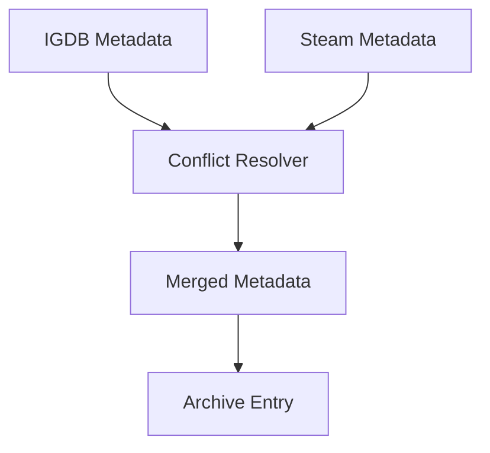

The resolver evaluates all available metadata sources and produces a consolidated representation suitable for database storage.

This design prevents provider-specific logic from leaking into the Metadata Service and centralizes merge behavior within a single subsystem.

---

### Metadata Source Tracking

Every archive entry stores information about the source responsible for its metadata.

This information serves multiple purposes:

- Auditability.
- Refresh operations.
- Troubleshooting.
- Provider comparison.
- Future synchronization.

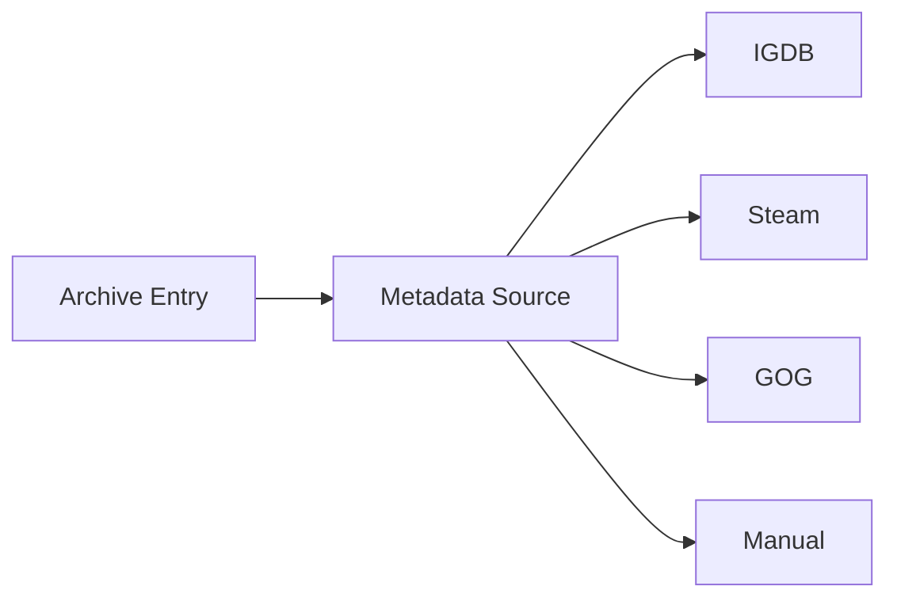

Tracking metadata provenance allows administrators to understand how metadata was acquired and whether it should be refreshed in the future.

---

### Manual Metadata Override

Automated enrichment is valuable, but user-provided information must always take precedence.

For this reason, archive entries support manual metadata overrides.

When manual override mode is enabled:

- User modifications become authoritative.
- Automated refresh operations cannot overwrite protected fields.
- External provider updates are ignored for overridden values.

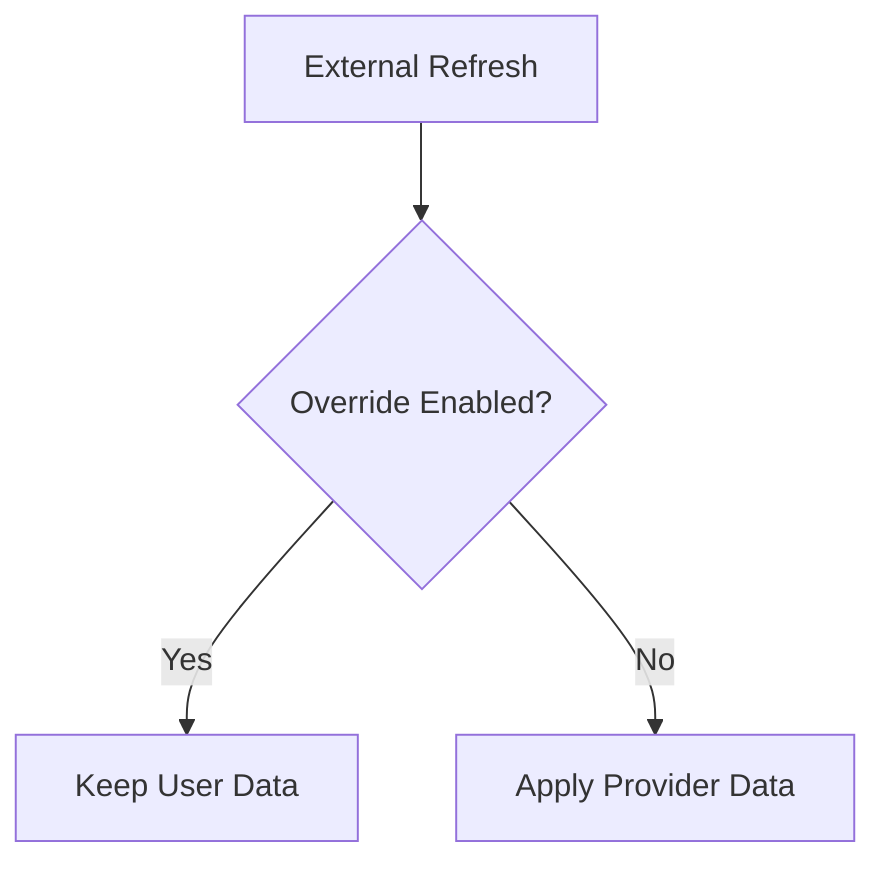

This mechanism ensures that user-curated metadata is preserved even when external providers change their records.

---

### Metadata Refresh Workflow

Metadata may become outdated over time as external providers update their databases.

Ludexis therefore supports metadata refresh operations.

The refresh process follows the same matching and enrichment pipeline used during initial metadata acquisition.

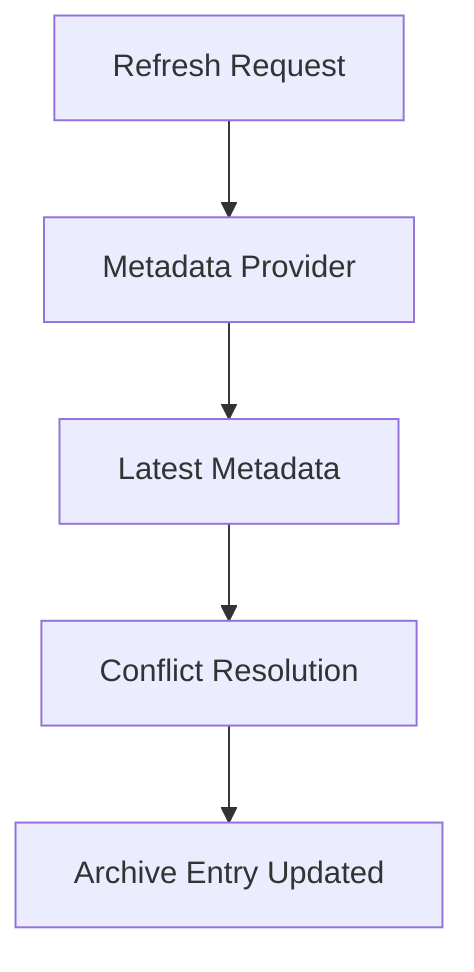

Refresh operations maintain long-term metadata accuracy while respecting manual overrides and verification states.

---

### Design Rationale

The metadata subsystem is intentionally separated into providers, matching services, enrichment services, and conflict resolution components.

This architecture provides several benefits:

- External APIs remain isolated from business logic.
- Providers can be replaced without changing database models.
- Matching algorithms can evolve independently.
- Conflict handling remains centralized.
- Manual metadata remains protected.
- Additional providers can be introduced with minimal code changes.

This design allows Ludexis to scale from a small self-hosted archive into a larger metadata platform while preserving maintainability and consistency.

## 5. Scan Pipeline Architecture

### Overview

The Scan Pipeline is responsible for transforming a physical archive stored on disk into a searchable and manageable Archive Entry within the Ludexis catalog.

The scanner subsystem serves as the bridge between the storage layer and the metadata layer. Its primary objective is to discover archives, extract filesystem information, identify new content, avoid duplicate records, and initiate metadata enrichment workflows.

The scanning process is intentionally designed as a multi-stage pipeline rather than a single operation. This approach improves maintainability, enables future parallelization, and provides clear visibility into the lifecycle of archive ingestion.

---

### Scan Workflow

The complete scan process begins when a user initiates either a full library scan or an incremental scan.

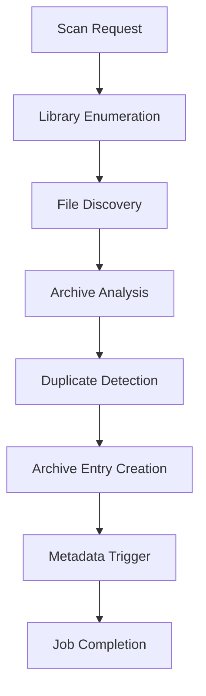

Each stage is isolated and can evolve independently without affecting the overall pipeline architecture.

---

### Library Enumeration

Scanning begins with library discovery.

A Library represents a root storage location that contains archives managed by Ludexis.

Examples include:

- Game collections
- Preservation archives
- ROM repositories
- Personal backup libraries
- Software collections

Each configured library is stored within the Libraries table and contains:

- Unique identifier
- Display name
- Filesystem path
- Enable/disable status

During scan execution, only enabled libraries participate in the discovery process.

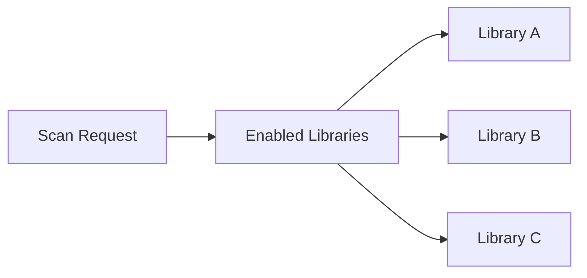

This design allows administrators to temporarily exclude storage locations without deleting configuration data.

---

### File Discovery

After a library is selected, the Scanner Service recursively traverses the filesystem.

The discovery stage identifies archive candidates and collects basic filesystem information.

Typical information gathered includes:

- Absolute file path
- Filename
- File size
- Last modification timestamp
- Storage location

```mermaid
flowchart TD

    A[Library Root]

    --> B[Folder]

    B --> C[Archive File]

    B --> D[Archive File]

    B --> E[Subfolder]

    E --> F[Archive File]
```

The scanner operates independently of metadata providers at this stage and focuses solely on filesystem inspection.

---

### Archive Analysis

Once a file has been discovered, Ludexis extracts archive-level information.

This information forms the initial Archive Entry record and provides the foundation for future metadata enrichment.

Typical archive attributes include:

- Title candidate
- File path
- File size
- Archive type
- Modification timestamp
- Storage device information

The objective of this stage is to establish a stable representation of the physical archive before any external metadata is introduced.

---

### Duplicate Detection

A critical responsibility of the scanning subsystem is preventing duplicate records.

Before creating a new Archive Entry, the scanner checks whether the archive already exists within the catalog.

```mermaid
flowchart TD

    A[Discovered Archive]

    --> B{Already Exists?}

    B -->|Yes| C[Skip Creation]

    B -->|No| D[Create Entry]
```

Duplicate detection prevents:

- Multiple records referencing the same archive
- Metadata duplication
- Search result pollution
- Collection inconsistencies

This stage is particularly important for incremental scans where previously indexed archives may still be present.

---

### Archive Entry Creation

If no existing entry is found, the scanner creates a new Archive Entry.

At creation time the entry primarily contains filesystem information rather than external metadata.

```mermaid
flowchart TD

    A[Scanner]

    --> B[Archive Entry]

    B --> C[Path]

    B --> D[Size]

    B --> E[Timestamp]

    B --> F[Library Association]
```

The archive immediately becomes searchable within Ludexis even before metadata enrichment is completed.

This separation allows archive management and metadata processing to occur independently.

---

### Library Association

Every archive entry maintains a relationship with its originating library.

```mermaid
erDiagram

    LIBRARIES ||--o{ ARCHIVE_ENTRIES : contains
```

This relationship provides several advantages:

- Multi-library support
- Storage segregation
- Scan scoping
- Library-specific management
- Future storage analytics

Because library ownership is explicitly recorded, administrators can easily determine where an archive physically resides.

---

### Metadata Triggering

Archive discovery and metadata enrichment are intentionally separated.

After a new archive entry is created, the scanner may initiate metadata enrichment workflows.

```mermaid
flowchart TD

    A[Archive Entry Created]

    --> B[Metadata Service]

    --> C[Provider Search]

    --> D[Metadata Match]
```

This separation improves fault tolerance because metadata failures cannot prevent archive indexing.

An archive remains available within the catalog even if metadata retrieval fails.

---

### Full Scan Operations

A Full Scan traverses every enabled library and evaluates every archive encountered.

```mermaid
flowchart TD

    A[Full Scan]

    --> B[Library 1]

    --> C[Library 2]

    --> D[Library 3]

    B --> E[Archive Discovery]

    C --> E

    D --> E
```

Full scans are primarily used during:

- Initial deployment
- Large migrations
- Library restructuring
- Recovery operations

Although more expensive than incremental scans, they guarantee complete filesystem coverage.

---

### Incremental Scan Operations

Incremental scans focus on identifying newly added or modified content.

```mermaid
flowchart TD

    A[Incremental Scan]

    --> B[Changed Archives]

    --> C[New Entries]

    --> D[Metadata Updates]
```

Because only a subset of archives must be evaluated, incremental scans complete significantly faster than full scans.

Incremental scanning forms the foundation of routine library maintenance.

---

### Integration with Background Jobs

Scanning operations are executed as managed jobs rather than blocking API requests.

When a scan is initiated:

1. A Job History record is created.
2. The scan task is scheduled.
3. Progress information is tracked.
4. Results are persisted.
5. Completion status is recorded.

```mermaid
flowchart TD

    A[User Request]

    --> B[API Endpoint]

    --> C[Job Creation]

    --> D[Scanner Task]

    --> E[Progress Tracking]

    --> F[Completion]
```

This architecture ensures that large libraries can be processed without affecting API responsiveness.

---

### Design Rationale

The scanner subsystem is deliberately separated from metadata enrichment, search functionality, and collection management.

This architecture provides several benefits:

- Filesystem operations remain isolated.
- Metadata failures cannot block archive ingestion.
- Incremental scanning remains efficient.
- Background execution scales to larger libraries.
- Duplicate detection remains centralized.
- Library ownership is preserved.

By treating archive discovery as an independent pipeline, Ludexis maintains a clean separation between storage management and metadata management while remaining extensible for future scanning enhancements.

## 6. Background Job Architecture

### Overview

Ludexis performs several operations that may require significant processing time. Activities such as full library scans, metadata enrichment, artwork processing, and large-scale refresh operations can take several seconds or even minutes depending on library size and external provider response times.

Executing these operations directly within API request handlers would significantly degrade responsiveness and negatively impact the user experience.

To address this challenge, Ludexis implements a dedicated background job architecture based on Celery, Redis, and persistent job tracking within PostgreSQL.

The objective of the subsystem is to provide:

- Asynchronous task execution
- Progress monitoring
- Job lifecycle tracking
- Cancellation support
- Fault isolation
- Scalable workload processing

---

### Architectural Overview

The background processing subsystem separates user interaction from long-running execution.

```mermaid
flowchart LR

    A[Client]

    --> B[FastAPI]

    --> C[Job Creation]

    --> D[Redis Queue]

    --> E[Celery Worker]

    --> F[Service Layer]

    --> G[PostgreSQL]
```

The API layer is responsible for accepting requests and creating jobs. Actual execution occurs within dedicated worker processes.

This separation ensures that user requests return immediately while processing continues in the background.

---

### Core Components

The background processing architecture consists of four major components.

#### FastAPI API Layer

Responsible for:

- Receiving job requests
- Creating Job History records
- Returning job identifiers
- Exposing monitoring endpoints

#### Redis

Acts as the message broker between API processes and Celery workers.

Redis stores queued task messages until workers are available to process them.

#### Celery Workers

Execute long-running operations asynchronously.

Workers consume messages from Redis and invoke the appropriate service layer logic.

#### Job History Repository

Provides persistent tracking of job execution state.

Job records remain available even after task completion and allow historical analysis of system activity.

---

### Job Lifecycle

Every asynchronous operation follows a well-defined lifecycle.

```mermaid
stateDiagram-v2

    [*] --> PENDING

    PENDING --> RUNNING

    RUNNING --> COMPLETED

    RUNNING --> FAILED

    RUNNING --> CANCELLED

    COMPLETED --> [*]

    FAILED --> [*]

    CANCELLED --> [*]
```

This lifecycle provides a consistent execution model for all background operations.

---

### Job Creation Workflow

When a user initiates an operation requiring background execution, the API creates a Job History record.

```mermaid
flowchart TD

    A[User Request]

    --> B[API Endpoint]

    --> C[Create Job Record]

    --> D[Generate Task]

    --> E[Queue Task]

    --> F[Return Job ID]
```

The client immediately receives a job identifier that can later be used to monitor progress.

This prevents HTTP requests from remaining open while long-running work is performed.

---

### Job History Tracking

Ludexis maintains a dedicated Job History model for persistent execution tracking.

Typical information stored includes:

- Job identifier
- Job type
- Current status
- Progress percentage
- Result information
- User association
- Start timestamp
- Completion timestamp

```mermaid
flowchart TD

    A[Job History]

    --> B[Status]

    --> C[Progress]

    --> D[Result]

    --> E[User]

    --> F[Timestamps]
```

Persistent tracking enables administrative visibility into system activity and provides valuable diagnostic information.

---

### Progress Monitoring

Long-running operations periodically update their progress information.

```mermaid
flowchart LR

    A[Worker]

    --> B[Update Progress]

    --> C[Job History]

    --> D[Monitoring API]

    --> E[Client]
```

This mechanism allows users to observe execution state without requiring direct communication with worker processes.

Progress reporting is especially valuable during large library scans where execution may continue for extended periods.

---

### Job Monitoring Service

The Job Monitor Service acts as the abstraction layer between execution infrastructure and monitoring endpoints.

Its responsibilities include:

- Retrieving job status
- Exposing progress information
- Aggregating execution metrics
- Supporting administrative monitoring views

The service prevents monitoring logic from becoming coupled directly to Celery implementation details.

---

### Failure Handling

Background execution inevitably encounters failures.

Examples include:

- Filesystem access issues
- Network interruptions
- Provider API failures
- Database errors
- Invalid metadata responses

Ludexis records failures directly within Job History.

```mermaid
flowchart TD

    A[Worker Exception]

    --> B[Capture Error]

    --> C[Update Job Status]

    --> D[Store Failure Details]

    --> E[Return Failure State]
```

This approach ensures that failures remain visible and diagnosable even after worker execution has terminated.

---

### Job Cancellation

Certain operations may be cancelled before completion.

The cancellation workflow updates the corresponding Job History record and prevents further processing where possible.

```mermaid
flowchart TD

    A[Cancel Request]

    --> B[Job Service]

    --> C[Update Status]

    --> D[Cancel Execution]
```

Cancellation support improves operational flexibility when large jobs are no longer required.

---

### Scan Job Execution

Library scans represent the most common background workload within Ludexis.

```mermaid
flowchart TD

    A[Start Scan]

    --> B[Create Job]

    --> C[Queue Task]

    --> D[Scanner Service]

    --> E[Archive Discovery]

    --> F[Database Update]

    --> G[Job Complete]
```

Separating scans from request processing ensures that large storage libraries do not impact API responsiveness.

---

### Metadata Processing Jobs

Metadata enrichment may also be executed through the job subsystem.

```mermaid
flowchart TD

    A[Metadata Request]

    --> B[Queue Task]

    --> C[Metadata Service]

    --> D[Provider Access]

    --> E[Conflict Resolution]

    --> F[Database Update]
```

Background execution prevents external provider latency from affecting the user experience.

---

### Redis Integration

Redis serves exclusively as a messaging layer.

```mermaid
flowchart LR

    A[FastAPI]

    --> B[Redis]

    --> C[Celery Worker]
```

Redis does not function as a source of truth for job status.

Persistent execution state is stored within PostgreSQL through Job History records.

This design prevents job visibility from being lost during service restarts.

---

### Scalability Considerations

The architecture supports horizontal scaling by introducing additional Celery worker processes.

```mermaid
flowchart LR

    A[Redis Queue]

    --> B[Worker 1]

    --> C[Worker 2]

    --> D[Worker 3]

    --> E[Worker N]
```

Because workers operate independently, processing capacity can grow without requiring modifications to API services.

This design is particularly important for future deployments involving larger archive collections.

---

### Design Rationale

The background job architecture provides a clean separation between user-facing operations and computationally expensive workloads.

Key benefits include:

- Non-blocking API requests
- Improved user experience
- Persistent execution tracking
- Scalable processing capacity
- Centralized monitoring
- Fault isolation
- Future support for distributed workers

By treating long-running operations as managed jobs rather than direct API actions, Ludexis maintains responsiveness while remaining capable of processing large archive collections efficiently.

## 7. API Layer Architecture

### Overview

The API Layer serves as the primary entry point into the Ludexis backend. All client interactions, whether originating from the web frontend, external automation tools, future mobile applications, or administrative integrations, pass through the API subsystem.

The API layer is implemented using FastAPI and follows a router-based architecture. Endpoints are grouped according to business domains, allowing functionality to remain organized and maintainable as the platform grows.

The primary responsibilities of the API layer include:

- Request validation
- Authentication
- Authorization
- Dependency injection
- Service orchestration
- Response serialization
- Error handling

Business logic is intentionally excluded from API handlers and delegated to dedicated service classes.

---

### Architectural Position

The API layer occupies the outermost boundary of the backend.

```mermaid
flowchart LR

    A[Client]

    --> B[API Router]

    --> C[Service Layer]

    --> D[Repository Layer]

    --> E[Database]
```

This separation ensures that API handlers remain lightweight and focused on request processing rather than business operations.

---

### Router Organization

Endpoints are grouped into domain-specific routers.

```mermaid
flowchart TD

    API[API Router]

    API --> AUTH[Auth Router]
    API --> USERS[Users Router]
    API --> ROLES[Roles Router]
    API --> PERMS[Permissions Router]

    API --> LIBRARIES[Libraries Router]
    API --> ARCHIVES[Archive Entries Router]
    API --> COLLECTIONS[Collections Router]

    API --> TAGS[Tags Router]
    API --> DEVELOPERS[Developers Router]
    API --> PUBLISHERS[Publishers Router]
    API --> FRANCHISES[Franchises Router]

    API --> METADATA[Metadata Router]
    API --> SEARCH[Search Router]

    API --> SCAN[Scan Router]
    API --> JOBS[Jobs Router]
    API --> MONITOR[Job Monitor Router]

    API --> ADMIN[Admin Router]
    API --> HEALTH[Health Router]
```

Each router represents a bounded functional area within the system.

This structure minimizes coupling between unrelated features and simplifies future development.

---

### Request Lifecycle

Every incoming request follows a predictable execution flow.

```mermaid
flowchart TD

    A[HTTP Request]

    --> B[FastAPI Router]

    --> C[Authentication]

    --> D[Authorization]

    --> E[Schema Validation]

    --> F[Service Layer]

    --> G[Repository Layer]

    --> H[Database]

    --> I[Response Model]

    --> J[HTTP Response]
```

The lifecycle ensures that invalid, unauthenticated, or unauthorized requests are rejected before reaching business logic.

---

### Request Validation

FastAPI leverages Pydantic schemas to validate incoming requests automatically.

Every endpoint declares explicit request and response models.

Example responsibilities include:

- Type validation
- Required field enforcement
- Data normalization
- Documentation generation

Validation occurs before service execution, preventing malformed requests from reaching business logic.

---

### Response Serialization

All API responses are serialized through Pydantic response models.

```mermaid
flowchart LR

    A[Database Model]

    --> B[Pydantic Schema]

    --> C[JSON Response]
```

Benefits include:

- Consistent API contracts
- Type safety
- Automatic OpenAPI documentation
- Prevention of accidental field exposure

This approach ensures that database implementation details remain isolated from API consumers.

---

### Dependency Injection

The API layer relies heavily on FastAPI's dependency injection system.

Dependencies provide:

- Database sessions
- Current user information
- Permission validation
- Authentication context

```mermaid
flowchart TD

    A[Endpoint]

    --> B[get_db]

    --> C[get_current_user]

    --> D[Permission Check]

    --> E[Business Logic]
```

Dependency injection reduces duplication and centralizes cross-cutting concerns.

---

### Error Handling

Errors are converted into structured HTTP responses using FastAPI exception handling mechanisms.

Common response categories include:

| Status Code | Meaning                |
| ----------- | ---------------------- |
| 200         | Success                |
| 201         | Resource Created       |
| 204         | No Content             |
| 400         | Invalid Request        |
| 401         | Authentication Failure |
| 403         | Authorization Failure  |
| 404         | Resource Not Found     |
| 409         | Conflict               |
| 500         | Internal Server Error  |

This standardized response model improves consistency across all endpoints.

---

### OpenAPI Integration

FastAPI automatically generates OpenAPI specifications from endpoint definitions.

```mermaid
flowchart LR

    A[Router Definitions]

    --> B[Pydantic Schemas]

    --> C[OpenAPI Specification]

    --> D[Swagger UI]

    --> E[ReDoc]
```

This provides:

- Interactive API documentation
- Request testing
- Schema exploration
- Integration support

Because documentation is generated directly from source code, it remains synchronized with implementation changes.

---

### Health and Monitoring Endpoints

Dedicated monitoring endpoints expose platform health information.

Current monitoring areas include:

- API health
- Database connectivity
- Redis connectivity
- Background job visibility

```mermaid
flowchart TD

    A[Health Request]

    --> B[Health Router]

    --> C[Database Check]

    --> D[Redis Check]

    --> E[Status Response]
```

These endpoints simplify deployment validation and operational monitoring.

---

### Administrative Endpoints

Administrative functionality is isolated into dedicated routers protected by RBAC controls.

Typical responsibilities include:

- System statistics
- Audit log access
- User administration
- Role management
- Permission management

Separating administrative APIs from standard user APIs improves security and maintainability.

---

### Design Rationale

The API layer follows a thin-controller architecture.

Endpoints are intentionally responsible for:

- Receiving requests
- Validating data
- Enforcing access control
- Invoking services
- Returning responses

All business logic resides within dedicated service classes.

This separation provides:

- Cleaner code organization
- Improved testability
- Easier maintenance
- Better scalability
- Reduced duplication

By keeping routers lightweight and delegating behavior to the service layer, Ludexis maintains a clear separation between transport concerns and business logic.

## 8. Security Architecture

### Overview

Ludexis implements a multi-layered security architecture designed to protect archive data, administrative functions, metadata operations, and background processing workflows.

The security model is based on four primary components:

- JWT-based authentication
- Refresh token management
- Role-Based Access Control (RBAC)
- Audit logging

Together, these systems provide identity verification, permission enforcement, session management, and operational accountability.

The architecture is designed to separate authentication from authorization while maintaining centralized control over permission evaluation.

---

### Security Layers

The complete security model consists of multiple independent layers.

```mermaid
flowchart TD

    A[Client Request]

    --> B[Authentication]

    --> C[Token Validation]

    --> D[Current User Resolution]

    --> E[Permission Check]

    --> F[Business Logic]

    --> G[Audit Logging]
```

Each layer performs a specific responsibility before a request is allowed to access protected resources.

---

### Authentication Architecture

Ludexis uses JWT (JSON Web Token) authentication for stateless identity verification.

Successful authentication generates two tokens:

- Access Token
- Refresh Token

```mermaid
flowchart TD

    A[Username & Password]

    --> B[Authentication Service]

    --> C[Access Token]

    --> D[Refresh Token]
```

The access token is used for normal API requests while the refresh token is used to obtain new access tokens without requiring another login.

---

### Access Tokens

Access tokens represent authenticated user identity.

Each token contains:

- User identifier
- Token type
- Expiration timestamp
- JWT identifier

```mermaid
flowchart TD

    TOKEN[Access Token]

    --> A[User ID]

    --> B[Token Type]

    --> C[Expiration]

    --> D[JWT Identifier]
```

Access tokens are intentionally short-lived to reduce risk if a token is compromised.

Because authentication information is embedded directly within the token, API requests can be validated without maintaining server-side session state.

---

### Refresh Tokens

Refresh tokens provide controlled session continuity.

Rather than forcing users to repeatedly authenticate, Ludexis issues refresh tokens that can be exchanged for new access tokens.

```mermaid
flowchart TD

    A[Login]

    --> B[Refresh Token]

    --> C[Stored In Database]

    --> D[Refresh Endpoint]

    --> E[New Access Token]
```

Unlike access tokens, refresh tokens are tracked within PostgreSQL and can be revoked.

This design provides stronger session control while preserving stateless API authentication.

---

### Refresh Token Lifecycle

The refresh workflow follows a controlled lifecycle.

```mermaid
stateDiagram-v2

    [*] --> ISSUED

    ISSUED --> ACTIVE

    ACTIVE --> REFRESHED

    ACTIVE --> REVOKED

    REFRESHED --> REVOKED

    REVOKED --> [*]
```

Revocation ensures that terminated sessions cannot continue generating valid access tokens.

---

### Current User Resolution

Protected endpoints rely on a dependency that resolves the currently authenticated user.

```mermaid
flowchart TD

    A[JWT Token]

    --> B[Verify Signature]

    --> C[Extract User ID]

    --> D[Load User]

    --> E[Current User]
```

This mechanism centralizes authentication logic and prevents duplication across API endpoints.

Endpoints receive an already validated user object rather than handling token parsing themselves.

---

### Role-Based Access Control

Authentication determines identity.

Authorization determines capability.

Ludexis implements Role-Based Access Control (RBAC) to enforce permissions throughout the platform.

```mermaid
flowchart LR

    USER[User]

    --> ROLE[Role]

    --> PERMISSION[Permission]

    --> ACTION[Protected Operation]
```

This architecture allows permissions to be assigned indirectly through roles rather than individually for every user.

---

### RBAC Data Model

The authorization model is implemented using many-to-many relationships.

```mermaid
erDiagram

    USERS ||--o{ USER_ROLES : assigned

    ROLES ||--o{ USER_ROLES : contains

    ROLES ||--o{ ROLE_PERMISSIONS : grants

    PERMISSIONS ||--o{ ROLE_PERMISSIONS : assigned
```

This structure provides flexibility while avoiding permission duplication.

---

### Permission Evaluation

When a protected endpoint is accessed, permissions are evaluated before business logic executes.

```mermaid
flowchart TD

    A[Authenticated User]

    --> B[Load Roles]

    --> C[Load Permissions]

    --> D{Permission Exists?}

    D -->|Yes| E[Allow Access]

    D -->|No| F[Return 403]
```

Permission checks are enforced through FastAPI dependencies, ensuring that authorization remains centralized and consistent.

---

### Administrative Access

Administrative functionality is protected through dedicated permission requirements.

Examples include:

- User management
- Role administration
- Permission management
- Audit log access
- System monitoring
- Scan management

Administrative APIs remain inaccessible unless the required permissions are present.

---

### Audit Logging

Security-related operations generate audit records.

Audit logs provide traceability for:

- Login events
- Logout events
- Failed authentication attempts
- User management actions
- Permission changes
- Administrative operations

```mermaid
flowchart TD

    A[Protected Action]

    --> B[Audit Service]

    --> C[Audit Log Entry]

    --> D[Database]
```

Audit logging creates a permanent record of security-relevant activity and supports future compliance and forensic requirements.

---

### Security Event Tracking

Each audit record typically contains:

- Action performed
- User responsible
- Target entity
- Entity identifier
- Timestamp
- Additional details

```mermaid
flowchart TD

    LOG[Audit Record]

    --> A[User]

    --> B[Action]

    --> C[Entity]

    --> D[Timestamp]

    --> E[Details]
```

This information provides visibility into system behavior and administrative activity.

---

### Password Security

User passwords are never stored in plaintext.

Passwords are processed through a secure hashing algorithm before persistence.

```mermaid
flowchart LR

    A[Password]

    --> B[Hash Function]

    --> C[Stored Hash]
```

During authentication, submitted credentials are verified against the stored hash rather than comparing plaintext values.

This approach protects user credentials even if database contents are exposed.

---

### Security Boundaries

The security architecture establishes clear trust boundaries throughout the system.

```mermaid
flowchart TD

    INTERNET[External Client]

    --> API[API Layer]

    --> AUTH[Authentication]

    --> RBAC[Authorization]

    --> SERVICES[Business Services]

    --> DATABASE[PostgreSQL]
```

Every request must successfully traverse these layers before protected resources become accessible.

---

### Design Rationale

The security architecture separates authentication, authorization, and auditing into independent subsystems.

This design provides several benefits:

- Stateless API authentication
- Centralized permission enforcement
- Flexible role management
- Session revocation support
- Comprehensive activity tracking
- Improved maintainability
- Easier future security enhancements

By combining JWT authentication, refresh token management, RBAC authorization, and audit logging, Ludexis establishes a secure foundation for both normal users and administrative operators.

## 9. Testing Architecture

### Overview

Ludexis implements a dedicated testing architecture designed to validate functionality without affecting production data or operational services.

The testing environment is isolated from the primary application database and uses a separate PostgreSQL instance configuration to ensure repeatable and deterministic test execution.

The testing subsystem is built around:

- Pytest
- FastAPI TestClient
- Dedicated CI database
- Dependency overrides
- Automated GitHub Actions execution

This architecture allows application behavior to be validated consistently across local development environments and continuous integration pipelines.

---

### Testing Objectives

The primary goals of the testing architecture are:

- Verify API behavior
- Validate authentication flows
- Verify authorization controls
- Test database operations
- Prevent regressions
- Support automated CI execution

Tests are designed to validate system behavior rather than individual implementation details.

This approach reduces maintenance burden while increasing confidence during refactoring.

---

### Testing Environment Separation

Production and testing environments operate against separate databases.

```mermaid
flowchart LR

    A[Production Application]

    --> B[(ludexis)]

    C[Test Suite]

    --> D[(ludexis_ci)]
```

The testing database exists solely for automated validation and can be recreated at any time without affecting application data.

This separation eliminates the risk of accidental modification of production records during test execution.

---

### Dedicated CI Database

Ludexis maintains a dedicated PostgreSQL database for automated testing.

```text
Production Database: ludexis
Testing Database: ludexis_ci
```

The testing database is used for:

- Local pytest execution
- Continuous integration pipelines
- Schema validation
- Authentication testing
- Authorization testing

Using an isolated database ensures that test data remains independent from operational data.

---

### Test Database Configuration

The testing environment uses a dedicated SQLAlchemy engine and session factory.

```mermaid
flowchart TD

    A[Test Runner]

    --> B[Test Engine]

    --> C[Testing Session]

    --> D[(ludexis_ci)]
```

All test execution occurs through this isolated connection layer.

Production database connections are never used during automated testing.

---

### Dependency Override Strategy

FastAPI dependency overrides are used to redirect database access during testing.

```mermaid
flowchart TD

    A[API Endpoint]

    --> B[get_db]

    --> C[Override]

    --> D[Testing Session]

    --> E[(ludexis_ci)]
```

This mechanism allows the application to execute normally while transparently replacing production database sessions with testing sessions.

As a result, the majority of application code remains unchanged during test execution.

---

### Test Data Initialization

Before tests execute, the testing environment is initialized with a known baseline state.

The initialization process performs the following actions:

1. Drops existing test tables.
2. Recreates the database schema.
3. Creates permissions.
4. Creates administrative roles.
5. Creates default test users.
6. Establishes role assignments.

```mermaid
flowchart TD

    A[Test Startup]

    --> B[Drop Schema]

    --> C[Create Schema]

    --> D[Seed Permissions]

    --> E[Seed Roles]

    --> F[Seed Users]

    --> G[Run Tests]
```

This guarantees a predictable environment for every test run.

---

### Authentication Testing

Authentication workflows are validated using real API requests.

Current authentication tests verify:

- Successful login
- Invalid password handling
- Current user retrieval
- Access token validation
- Refresh token rotation
- Logout behavior
- Token revocation

```mermaid
flowchart TD

    A[Test Login]

    --> B[Authentication API]

    --> C[JWT Issued]

    --> D[Protected Endpoint]

    --> E[Success]
```

These tests validate the complete authentication pipeline rather than isolated helper functions.

---

### Authorization Testing

Role-Based Access Control is verified through dedicated permission tests.

The objective is to ensure that protected resources remain inaccessible to unauthorized users.

```mermaid
flowchart TD

    A[Test User]

    --> B[Protected Endpoint]

    --> C{Permission Present?}

    C -->|No| D[403 Forbidden]

    C -->|Yes| E[Access Granted]
```

Authorization testing confirms that RBAC enforcement remains functional throughout future development.

---

### API Testing

API endpoints are tested using FastAPI TestClient.

```mermaid
flowchart LR

    A[Test Case]

    --> B[TestClient]

    --> C[FastAPI Application]

    --> D[Response Validation]
```

This approach allows endpoints to be exercised without deploying a running server.

Benefits include:

- Faster execution
- Easier debugging
- Consistent environments
- Reduced infrastructure requirements

---

### Scanner Testing

Scanner tests verify archive discovery behavior.

Typical validation areas include:

- Empty library handling
- Single archive detection
- Duplicate prevention
- Incremental scan behavior

```mermaid
flowchart TD

    A[Test Filesystem]

    --> B[Scanner Service]

    --> C[Archive Discovery]

    --> D[Assertions]
```

These tests ensure that archive ingestion remains stable as scanning logic evolves.

---

### Metadata Testing

Metadata services are validated through dedicated test cases.

Areas under test include:

- Metadata search
- Automatic matching
- Metadata retrieval
- Provider integration behavior

```mermaid
flowchart TD

    A[Test Request]

    --> B[Metadata Service]

    --> C[Provider Logic]

    --> D[Result Validation]
```

This ensures that metadata enrichment functionality remains reliable.

---

### Continuous Integration Pipeline

All tests are executed automatically through GitHub Actions.

```mermaid
flowchart TD

    A[Push]

    --> B[GitHub Actions]

    --> C[PostgreSQL Service]

    --> D[Alembic Migration]

    --> E[Pytest]

    --> F[Pass or Fail]
```

The CI pipeline provides immediate feedback whenever code changes are introduced.

This prevents regressions from being merged into the main branch.

---

### Migration Validation

The CI pipeline validates database migrations before executing tests.

```mermaid
flowchart TD

    A[Start CI]

    --> B[Alembic Upgrade]

    --> C[Schema Creation]

    --> D[Test Execution]
```

Migration validation ensures that schema changes remain compatible with automated deployments.

---

### Test Categories

The current test suite includes multiple categories.

| Category       | Purpose                       |
| -------------- | ----------------------------- |
| Authentication | Login and token flows         |
| Authorization  | RBAC and permissions          |
| Health Checks  | Service availability          |
| Jobs           | Background task management    |
| Metadata       | Provider and enrichment logic |
| Scanner        | Archive discovery             |
| Smoke Tests    | Basic application startup     |
| CI Validation  | Test database verification    |

This structure provides broad coverage across the major platform subsystems.

---

### Design Rationale

The testing architecture emphasizes isolation, reproducibility, and automation.

Key benefits include:

- Production-safe execution
- Independent test environments
- Deterministic results
- Automated validation
- CI integration
- Simplified debugging
- Reduced regression risk

By maintaining a dedicated testing database, dependency override infrastructure, and automated CI pipeline, Ludexis ensures that new features can be introduced with confidence while preserving platform stability.

## 10. Design Decisions and Future Evolution

### Overview

Ludexis was designed as a long-term self-hosted archive management platform rather than a simple metadata catalog.

Several architectural decisions were intentionally made to prioritize maintainability, scalability, modularity, and future extensibility over short-term implementation convenience.

This section documents the reasoning behind major technical choices and outlines the expected evolution of the backend architecture.

---

### Why FastAPI?

FastAPI was selected as the backend framework due to its combination of performance, developer productivity, and strong typing support.

Key advantages include:

- Native async support
- Automatic OpenAPI generation
- Dependency injection system
- Pydantic integration
- Excellent testing support
- Strong Python ecosystem compatibility

The framework allows rapid development while maintaining a high degree of structure and type safety.

Additionally, the generated OpenAPI documentation significantly reduces API maintenance overhead.

---

### Why PostgreSQL?

PostgreSQL serves as the primary system of record for Ludexis.

The platform manages highly relational data, including:

- Archive entries
- Libraries
- Collections
- Metadata providers
- Tags
- Genres
- Developers
- Publishers
- User accounts
- Roles
- Permissions
- Audit logs
- Job history

These relationships are naturally represented within a relational database.

PostgreSQL provides:

- Strong consistency guarantees
- Transaction support
- Foreign key enforcement
- Advanced indexing capabilities
- Mature tooling
- Proven long-term stability

For the expected workload profile of Ludexis, PostgreSQL represents the most suitable storage platform.

---

### Why SQLAlchemy?

SQLAlchemy was selected as the persistence layer due to its flexibility and maturity.

Benefits include:

- ORM abstraction
- Explicit relationship modeling
- Database portability
- Transaction management
- Migration compatibility
- Strong ecosystem support

The ORM allows application code to remain largely independent from raw SQL while still providing direct access to lower-level database functionality when required.

---

### Why Alembic?

Schema evolution is managed through Alembic migrations.

Using migrations provides several advantages:

- Version-controlled schema changes
- Repeatable deployments
- Upgrade automation
- Rollback support
- Environment consistency

Without migrations, schema management would become increasingly difficult as the project grows.

Alembic ensures that development, testing, and production environments remain synchronized.

---

### Why the Repository Pattern?

The repository layer exists to isolate persistence concerns from business logic.

Without repositories, service classes would become tightly coupled to SQLAlchemy queries.

The repository pattern provides:

- Separation of concerns
- Improved testability
- Reduced duplication
- Easier maintenance
- Clear ownership of database access logic

Repositories act as the single location responsible for retrieving and persisting data.

---

### Why the Service Layer?

Business logic represents the most complex portion of the platform.

Examples include:

- Metadata matching
- Authentication workflows
- Scan orchestration
- Artwork management
- Conflict resolution
- Permission evaluation

Embedding this logic directly inside API endpoints would create significant maintenance challenges.

The service layer provides:

- Encapsulation of business rules
- Reusability
- Testability
- Reduced controller complexity

This approach results in a cleaner and more maintainable codebase.

---

### Why Celery?

Several operations within Ludexis can require significant execution time.

Examples include:

- Full library scans
- Metadata refresh operations
- Bulk artwork processing
- Future batch import workflows

Executing these tasks synchronously would degrade API responsiveness.

Celery provides:

- Asynchronous execution
- Retry mechanisms
- Task monitoring
- Queue-based workload distribution
- Horizontal scalability

This architecture allows expensive workloads to execute independently of user-facing requests.

---

### Why Redis?

Redis serves as the message broker for Celery.

Its responsibilities include:

- Queue management
- Task dispatch
- Worker communication

Redis was selected because it offers:

- Extremely low latency
- Minimal operational complexity
- Strong Celery integration
- Wide industry adoption

Redis is intentionally not used as a primary datastore within Ludexis.

Persistent application state remains within PostgreSQL.

---

### Why Provider Abstraction?

Metadata enrichment relies on external services.

Examples include:

- IGDB
- Steam
- GOG
- Manual metadata sources

Directly coupling metadata services to a specific provider would create long-term maintenance risks.

Instead, Ludexis uses a provider abstraction layer.

```mermaid
flowchart LR

    MetadataService

    --> MetadataProvider

    MetadataProvider

    --> IGDB

    MetadataProvider

    --> Steam

    MetadataProvider

    --> GOG

    MetadataProvider

    --> Manual
```

This architecture allows new metadata providers to be introduced with minimal impact on existing application logic.

---

### Why Role-Based Access Control?

As the platform evolved, simple administrator checks became insufficient.

Different operational responsibilities require different permissions.

Examples include:

- User administration
- Metadata management
- Collection management
- Scan execution
- Audit log access

RBAC provides:

- Fine-grained authorization
- Improved security
- Flexible administration
- Reduced permission duplication

The architecture can support future expansion without requiring significant redesign.

---

### Why Audit Logging?

Administrative actions should be traceable.

Audit logging provides accountability by recording:

- Who performed an action
- What action occurred
- When it occurred
- Which entity was affected

This information becomes increasingly important as multiple users interact with the system.

Audit logging also provides a foundation for future compliance and security features.

---

### Current Architectural Strengths

The current backend architecture provides several notable advantages.

These include:

- Strong separation of concerns
- Clear layer boundaries
- Extensible metadata architecture
- Scalable background processing
- Flexible RBAC implementation
- Comprehensive testing infrastructure
- Containerized deployment support
- Automated CI validation

These characteristics make the platform suitable for long-term maintenance and continued expansion.

---

### Known Limitations

While the architecture is robust, several limitations currently exist.

Examples include:

- Single-node deployment assumptions
- Limited caching strategy
- Basic monitoring capabilities
- No distributed worker orchestration
- No dedicated object storage abstraction
- Limited analytics infrastructure

These limitations are acceptable for the current project scope but may require future enhancement as the platform grows.

---

### Future Evolution

The backend architecture has been designed to support future expansion without requiring fundamental redesign.

Potential future enhancements include:

#### Enhanced Metadata Providers

Additional metadata sources may be integrated through the existing provider abstraction layer.

Examples include:

- MobyGames
- RAWG
- PCGamingWiki
- LaunchBox metadata sources

#### Advanced Search

Future search improvements may include:

- Full-text indexing
- Fuzzy matching
- Search ranking
- Semantic search

#### Distributed Workers

The Celery architecture already supports horizontal scaling through additional worker nodes.

This capability becomes valuable when processing larger archive collections.

#### Storage Abstraction

Future releases may support:

- Local storage
- NAS storage
- S3-compatible object storage
- Cloud archival storage

without requiring significant changes to application logic.

#### Observability Improvements

Potential future monitoring enhancements include:

- Prometheus metrics
- Grafana dashboards
- Structured tracing
- Centralized log aggregation

#### Frontend Expansion

The backend API has been designed to support:

- React web clients
- Desktop applications
- Mobile applications
- Third-party integrations

through the same API surface.

---

### Architectural Philosophy

The Ludexis backend follows several guiding principles:

1. Separate concerns aggressively.
2. Keep business logic independent of transport layers.
3. Prefer explicit relationships over implicit behavior.
4. Design for maintainability before optimization.
5. Treat integrations as replaceable components.
6. Ensure that infrastructure can evolve independently of application logic.
7. Favor clarity and extensibility over premature complexity.

These principles influence every major subsystem within the platform.

---

### Conclusion

The Ludexis backend architecture provides a modular and maintainable foundation for archive management, metadata enrichment, background processing, user administration, and future platform growth.

Through the use of FastAPI, PostgreSQL, SQLAlchemy, Alembic, Celery, Redis, RBAC, and provider abstractions, the platform achieves a balance between simplicity and extensibility.

The architecture is intentionally designed to support future expansion while preserving clean separation between infrastructure, business logic, and external integrations.

As the platform evolves, new capabilities can be introduced incrementally without requiring major architectural restructuring, ensuring that Ludexis remains maintainable, scalable, and adaptable over the long term.
