# Ludexis Deployment Guide

## Introduction

Ludexis is a self-hosted game archive management platform designed to organize, catalog, enrich, and preserve digital game collections. The system combines metadata management, archive discovery, artwork storage, user administration, role-based access control, and asynchronous background processing into a single deployable platform.

The deployment architecture follows a service-oriented approach in which each major subsystem operates independently while communicating through well-defined interfaces. This architecture improves maintainability, fault isolation, scalability, and long-term operational reliability.

The primary deployment target for Ludexis is Docker Compose. Containerization allows the entire application stack to be deployed consistently across development systems, homelab servers, virtual private servers, and dedicated production infrastructure without requiring manual dependency installation.

This document describes the deployment architecture, infrastructure design decisions, runtime configuration, persistent storage strategy, upgrade procedures, backup methods, and production recommendations for operating Ludexis in a self-hosted environment.

---

# Deployment Philosophy

The deployment model used by Ludexis is based on several engineering principles.

### Service Isolation

Application responsibilities are separated into distinct services rather than being combined into a single process. This separation reduces coupling between subsystems and simplifies maintenance activities. Individual services can be restarted, upgraded, or debugged without affecting unrelated components.

### Persistent Data Ownership

No critical data is stored inside ephemeral application containers. Databases, caches, and artwork repositories are attached through persistent volumes to ensure data survives upgrades, rebuilds, and container replacement operations.

### Infrastructure Reproducibility

Every deployment is defined through version-controlled configuration files. The same deployment procedure can therefore be reproduced consistently across environments while minimizing configuration drift.

### Environment-Based Configuration

All deployment-specific configuration is supplied through environment variables. Runtime secrets and infrastructure configuration remain separate from application source code, allowing deployments to be customized without modifying application logic.

### Self-Hosted First Design

Ludexis is intentionally designed for self-hosted environments. All core functionality remains available without external cloud dependencies. Third-party services are used only for metadata acquisition and enrichment.

---

# System Overview

At runtime, Ludexis consists of four primary services:

| Service         | Responsibility                                                |
| --------------- | ------------------------------------------------------------- |
| FastAPI Backend | API layer, authentication, authorization, metadata operations |
| PostgreSQL      | Primary data persistence                                      |
| Redis           | Message broker and caching layer                              |
| Celery Worker   | Asynchronous task execution                                   |

In addition, persistent storage is provided for artwork assets and uploaded media resources.

The resulting architecture separates request handling from long-running operations, ensuring that user interactions remain responsive even during expensive background tasks such as library scans or metadata synchronization.

---

# High-Level Architecture

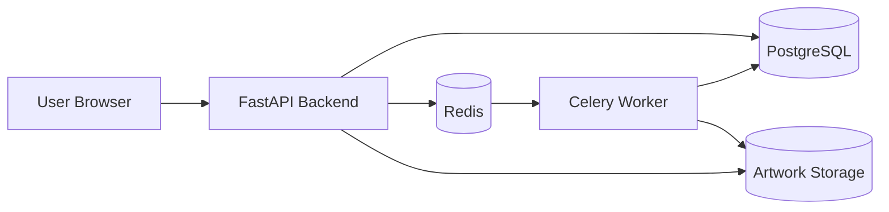

The FastAPI backend serves as the primary entry point for all client interactions. Requests involving authentication, archive management, metadata operations, collections, libraries, user management, and administrative functionality are processed through this layer.

PostgreSQL serves as the system-of-record database and stores all persistent entities within the platform.

Redis functions as both a cache and a message broker. Background tasks are queued through Redis and executed independently by Celery workers.

Artwork assets are stored separately from database records to improve storage efficiency and avoid unnecessary database growth.

---

# Container Topology

The recommended deployment uses four containers and three persistent volumes.

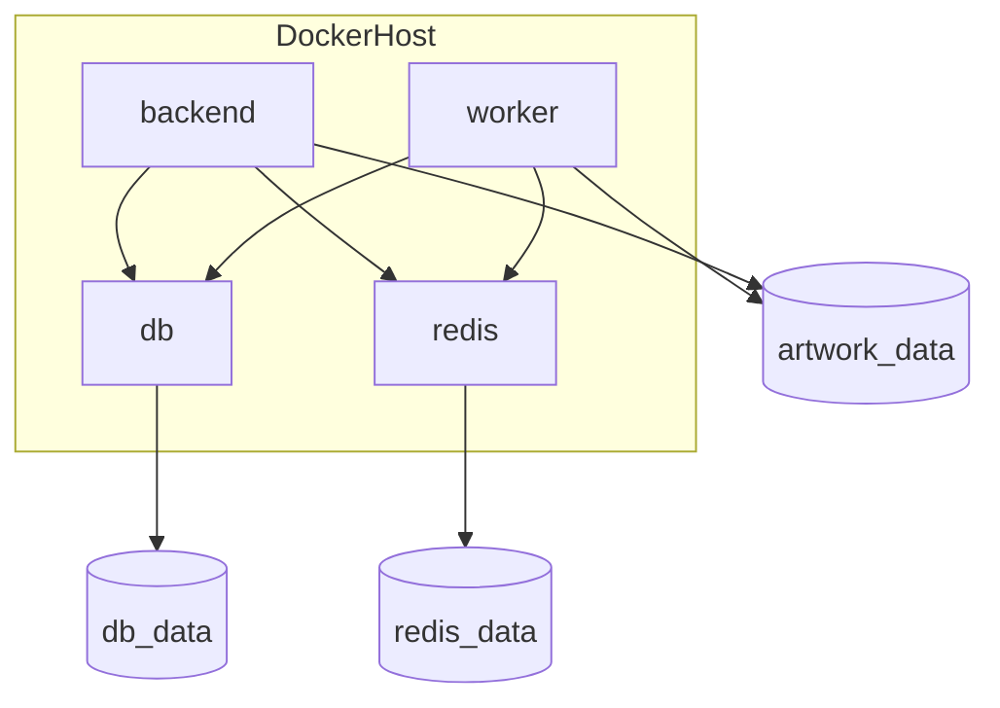

Each container performs a single well-defined responsibility.

The backend container exposes the REST API and serves as the primary application runtime.

The worker container processes asynchronous jobs such as scans, metadata synchronization tasks, and future automation workloads.

The PostgreSQL container stores all application records while Redis provides task queue infrastructure.

Persistent volumes ensure application state remains intact even when containers are recreated.

---

# Network Communication Model

Communication between services occurs exclusively through the Docker network created by Docker Compose.

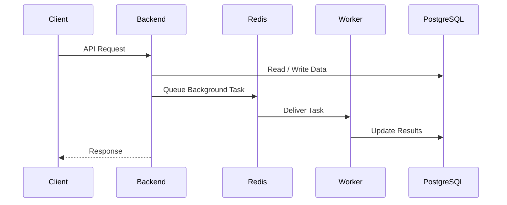

This architecture allows expensive processing tasks to execute independently from user-facing requests.

The user receives an immediate response while asynchronous processing continues in the background.

---

# Environment Configuration

Ludexis uses environment variables for runtime configuration.

A deployment environment file should be created prior to startup.

Example:

```bash
cp .env.example .env
```

The following variables are required for normal operation.

| Variable              | Purpose                      |
| --------------------- | ---------------------------- |
| DATABASE_URL          | PostgreSQL connection string |
| REDIS_URL             | Redis connection string      |
| CELERY_BROKER_URL     | Celery broker configuration  |
| CELERY_RESULT_BACKEND | Celery result backend        |
| JWT_SECRET_KEY        | JWT signing secret           |
| TWITCH_CLIENT_ID      | Twitch API client identifier |
| TWITCH_CLIENT_SECRET  | Twitch API secret            |
| ARTWORK_STORAGE_PATH  | Artwork storage directory    |

Example configuration:

```env
DATABASE_URL=postgresql+psycopg://ludexis:ludexis@db:5432/ludexis

REDIS_URL=redis://redis:6379/0

CELERY_BROKER_URL=redis://redis:6379/0

CELERY_RESULT_BACKEND=redis://redis:6379/0

JWT_SECRET_KEY=<generate-random-secret>

TWITCH_CLIENT_ID=<client-id>

TWITCH_CLIENT_SECRET=<client-secret>

ARTWORK_STORAGE_PATH=/artwork
```

The JWT secret is a security-critical value and should always be generated uniquely for every deployment. Reusing secrets across environments is strongly discouraged.

Third-party API credentials should likewise be treated as sensitive deployment secrets and never committed to source control.

---

# Runtime Data Flow

The typical archive processing workflow is shown below.

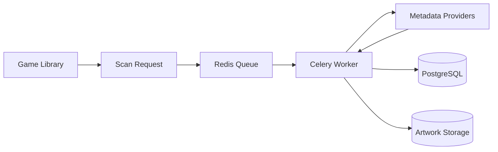

A library scan begins when a user initiates a scan operation through the API.

The request is converted into a background task and submitted to Redis. A Celery worker retrieves the task, performs filesystem discovery, queries metadata providers, downloads artwork assets when available, and stores the resulting information within PostgreSQL and artwork storage volumes.

This workflow ensures large libraries can be processed without blocking API responsiveness.

---

# Initial Deployment Procedure

## Host Requirements

Ludexis is intentionally lightweight and can operate on modest hardware. The minimum requirements depend primarily on the size of the archive being managed and the frequency of metadata synchronization operations.

### Recommended Minimum Specification

| Resource       | Recommendation  |
| -------------- | --------------- |
| CPU            | 2 vCPU          |
| Memory         | 4 GB RAM        |
| Storage        | 20 GB Available |
| Docker         | 24+             |
| Docker Compose | v2+             |

### Recommended Production Specification

| Resource | Recommendation                |
| -------- | ----------------------------- |
| CPU      | 4+ vCPU                       |
| Memory   | 8+ GB RAM                     |
| Storage  | SSD-backed persistent storage |
| Network  | Stable broadband connection   |

For large libraries containing thousands of archive entries, additional storage and memory may be beneficial, particularly during bulk metadata synchronization operations.

---

# Repository Preparation

Clone the repository onto the target host.

```bash
git clone <repository-url>
cd Ludexis
```

The repository is structured as follows.

```text
Ludexis/
├── backend/
├── frontend/
├── docs/
├── artwork/
├── README.md
└── docker-compose.yml
```

The backend contains the FastAPI application, database migrations, Celery worker implementation, and API definitions. The frontend contains the user interface layer. The documentation directory contains operational and architectural documentation.

---

# Environment Initialization

Prior to deployment, create a deployment-specific environment file.

```bash
cp backend/.env.example backend/.env
```

Update all environment variables to match the target deployment environment.

Particular attention should be given to:

- Database credentials
- Redis configuration
- JWT signing secret
- Twitch API credentials
- Artwork storage paths

For production deployments, a cryptographically secure JWT secret should be generated and stored securely.

Example:

```bash
openssl rand -base64 64
```

The resulting value should be used as the `JWT_SECRET_KEY`.

---

# Container Build Process

Ludexis uses Docker images built directly from source.

The backend image is generated using the supplied Dockerfile and includes:

- Python runtime
- FastAPI application
- Alembic migration tooling
- Celery worker dependencies
- PostgreSQL client libraries

Build all services:

```bash
docker compose build
```

A successful build confirms:

- Python dependencies resolve correctly
- Application code compiles successfully
- Docker configuration is valid

---

# Starting the Platform

After the environment has been configured and images have been built, the platform can be started.

```bash
docker compose up -d
```

Docker Compose creates:

- Internal service network
- Persistent volumes
- Database container
- Redis container
- Backend container
- Worker container

Verify startup status:

```bash
docker compose ps
```

Expected output should show all containers in a healthy state.

---

# Service Startup Sequence

The startup dependency chain is illustrated below.

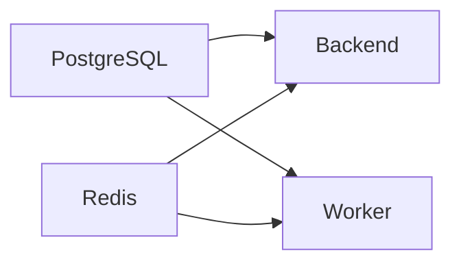

The database and Redis services must become available before the backend and worker containers can operate correctly.

Health checks are therefore used to validate service readiness prior to accepting traffic.

---

# Health Verification

Once all containers have started successfully, verify system health.

### Backend Health

```bash
curl http://localhost:8000/healthz
```

Expected response:

```json
{
  "status": "ok"
}
```

This endpoint is intended for container orchestration systems and load balancers.

---

### API Health

```bash
curl http://localhost:8000/api/health
```

Expected response:

```json
{
  "status": "healthy"
}
```

This endpoint validates application-layer functionality.

The `/healthz` endpoint is intended primarily for container orchestration and liveness checks, while `/api/health` provides application-level health verification.

---

### Database Health

```bash
curl http://localhost:8000/api/health/db
```

The endpoint verifies PostgreSQL connectivity and query execution.

---

### Redis Health

```bash
curl http://localhost:8000/api/health/redis
```

The endpoint verifies Redis availability and broker connectivity.

---

# Database Migration Strategy

Ludexis uses Alembic for database schema versioning.

All schema changes are represented as migrations and tracked within the `alembic_version` table.

The migration chain ensures every deployment can move between schema versions in a predictable and reproducible manner.

All Alembic commands in this document assume the current working directory is:

`backend/`

where alembic.ini and the alembic migration directory are located.

Apply the latest schema:

```bash
alembic upgrade head
```

Verify current revision:

```bash
alembic current
```

Display migration history:

```bash
alembic history
```

The migration system is designed to support automated deployment pipelines and should always be executed before starting a newly upgraded application version.

---

# Persistent Storage Design

Ludexis separates application state into multiple storage domains.

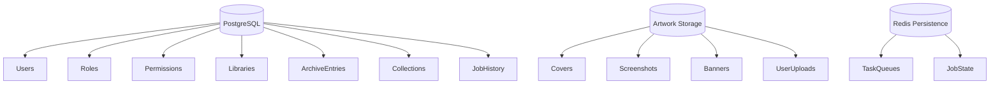

This separation improves backup flexibility and simplifies future migration strategies.

---

# Docker Volumes

Three primary persistent volumes are used.

## db_data

Stores PostgreSQL data files.

Contents include:

- User accounts
- Permissions
- Roles
- Libraries
- Archive entries
- Collections
- Metadata
- Audit logs
- Job history

This volume represents the authoritative source of application state.

---

## redis_data

Stores Redis persistence data.

Although Redis primarily functions as a transient broker, persistence allows recovery of queued tasks after host restarts.
Redis persistence may improve recovery of queued tasks after unexpected shutdowns, although task durability ultimately depends on Celery configuration and worker state.

---

## artwork_data

Stores binary assets.

Contents include:

- Box art
- Cover images
- Screenshots
- Downloaded artwork
- User-uploaded assets

Artwork is intentionally stored outside PostgreSQL to reduce database size and improve backup efficiency.

---

# Log Management

Container logs provide the primary operational visibility mechanism.

Backend logs:

```bash
docker compose logs -f backend
```

Worker logs:

```bash
docker compose logs -f worker
```

Database logs:

```bash
docker compose logs -f db
```

Redis logs:

```bash
docker compose logs -f redis
```

When troubleshooting deployment issues, backend and worker logs should typically be examined first.

---

# Updating an Existing Deployment

Application updates should follow a controlled process.

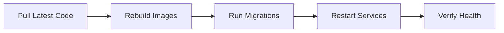

Update procedure:

```bash
git pull

docker compose build

docker compose up -d

docker compose exec backend alembic upgrade head
```

After deployment, all health endpoints should be verified before returning the system to normal operation.

---

# Routine Operational Maintenance

The following tasks are recommended periodically.

### Weekly

- Verify container health
- Review logs
- Check available storage

### Monthly

- Perform database backup
- Verify backup integrity
- Review artwork storage growth
- Verify metadata synchronization functionality

### Before Every Release

- Verify CI pipeline success
- Verify migrations apply cleanly
- Verify health checks pass
- Verify backup completion
- Verify Docker images build successfully

Following these practices significantly reduces the likelihood of operational failures and simplifies recovery when issues occur.

---

# Backup and Recovery Strategy

Reliable backups are critical because Ludexis maintains both structured metadata and binary artwork assets. A complete backup strategy must therefore address multiple storage domains rather than focusing solely on the database.

The platform stores operational state across PostgreSQL, Redis, and artwork storage. While Redis data can generally be regenerated, PostgreSQL and artwork storage should be considered mission-critical.

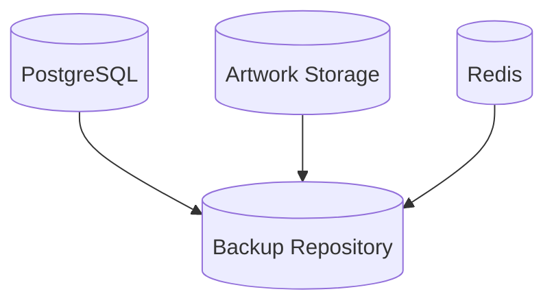

A complete recovery operation requires restoration of all persistent components.

## Database Backup

PostgreSQL contains user accounts, roles and permissions, libraries, archive entries, collections, metadata, job history, and audit logs.

A logical backup can be created using `pg_dump`.

```bash
docker exec backend-db-1 \
    pg_dump -U ludexis ludexis \
    > ludexis_backup.sql
```

Compressed backups are recommended for large deployments.

```bash
docker exec backend-db-1 \
    pg_dump -U ludexis ludexis \
    | gzip > ludexis_backup.sql.gz
```

Database backups should be performed regularly and stored outside the deployment host.

## Artwork Backup

Artwork storage contains all downloaded and user-uploaded images.

Typical contents include:

- Cover art
- Box art
- Banners
- Screenshots
- User artwork overrides

Because these files are stored separately from PostgreSQL, database backups alone are insufficient.

Backup example:

```bash
docker run --rm \
  -v backend_artwork_data:/source \
  -v $(pwd):/backup \
  alpine \
  tar czf /backup/artwork_backup.tar.gz -C /source .
```

Artwork backups should be synchronized with database backups to maintain consistency.

## Recovery Procedure

A complete recovery consists of:

1. Restoring PostgreSQL
2. Restoring artwork assets
3. Recreating containers
4. Applying migrations
5. Verifying health endpoints

Recovery workflow:

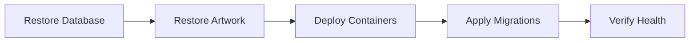

Successful recovery should always be validated using health checks and API verification.

---

# Production Hardening

A development deployment prioritizes convenience. A production deployment prioritizes security, reliability, and recoverability.

The following recommendations are strongly encouraged before exposing Ludexis to external users.

## Secret Management

Secrets should never be committed to Git repositories.

Sensitive values include:

- JWT_SECRET_KEY
- TWITCH_CLIENT_SECRET
- Database credentials
- Redis credentials

Environment files should be excluded through `.gitignore`.

Example:

```gitignore
.env
.env.docker
.env.production
```

A unique cryptographically secure JWT secret should be generated for every deployment.

Production deployments should avoid using default PostgreSQL credentials such as:

POSTGRES_USER=ludexis
POSTGRES_PASSWORD=ludexis

Strong unique credentials should be generated for every deployment.

## Network Isolation

Only services that require external access should expose ports.

Recommended exposure:

| Service    | External Access |
| ---------- | --------------- |
| Backend    | Yes             |
| PostgreSQL | No              |
| Redis      | No              |
| Worker     | No              |

The backend should communicate with PostgreSQL and Redis through Docker networking rather than public ports.

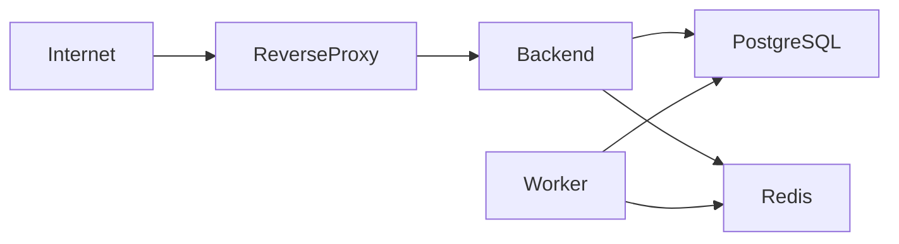

## Principle of Least Privilege

Administrative accounts should be limited to trusted operators.

Regular users should only receive permissions required for their responsibilities.

RBAC enforcement is a core security feature of Ludexis and should not be bypassed.

## Audit Logging

Administrative actions should always be recorded.

Ludexis maintains audit records for operations such as:

- Authentication events
- User management
- Role changes
- Metadata modifications
- Administrative actions

Audit data provides accountability and assists incident investigation.

---

# Reverse Proxy Deployment

Production deployments should place a reverse proxy in front of the backend service.

Benefits include:

- TLS termination
- Request logging
- Compression
- Rate limiting
- Security headers
- Virtual host routing

Common reverse proxy solutions include:

- Nginx
- Traefik
- Caddy

Recommended architecture:

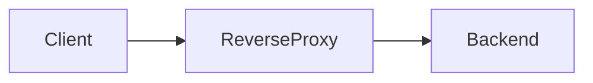

The backend itself should generally remain inaccessible from the public internet.

---

# HTTPS and TLS

All production deployments should use HTTPS.

TLS provides:

- Confidentiality
- Integrity
- Authentication

Without TLS, authentication credentials and tokens may be exposed in transit.

A common deployment approach is:

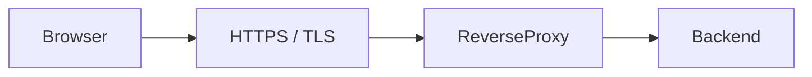

Certificates may be obtained through providers such as Let's Encrypt.

Automatic renewal should be configured whenever possible.

---

# Monitoring and Observability

Operational visibility becomes increasingly important as deployment size grows.

Monitoring should cover:

- Application health
- Database health
- Redis health
- Container resource utilization
- Background job execution

Recommended monitoring stack:

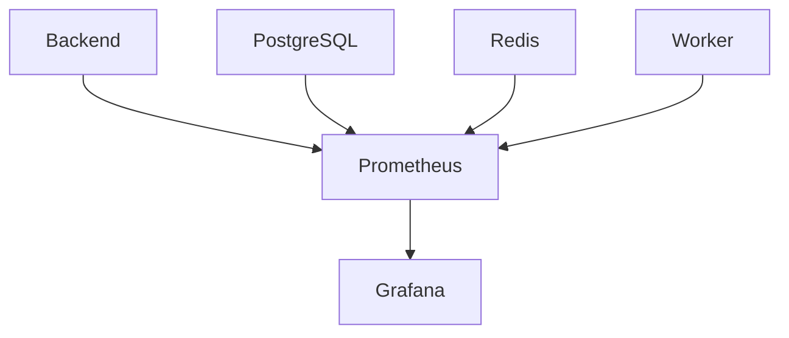

Although not required for smaller deployments, monitoring significantly improves operational awareness.
Monitoring infrastructure is not included in the default Ludexis deployment and must be deployed separately if required.

---

# Troubleshooting Guide

## Backend Fails to Start

Check backend logs.

```bash
docker compose logs -f backend
```

Common causes include missing environment variables, invalid database credentials, failed migrations, and missing dependencies.

## Database Connection Failures

Verify PostgreSQL status.

```bash
docker compose ps
```

Verify database health endpoint.

```bash
curl http://localhost:8000/api/health/db
```

Common causes include a stopped database container, incorrect connection strings, and Docker network issues.

## Redis Connection Failures

Verify Redis status.

```bash
curl http://localhost:8000/api/health/redis
```

Common causes include Redis unavailability, invalid Redis URLs, and networking issues.

## Artwork Not Appearing

Verify artwork volume configuration.

```bash
docker volume inspect artwork_data
```

Verify configured path.

```bash
echo $ARTWORK_STORAGE_PATH
```

Common causes include missing volume mounts, incorrect paths, and filesystem permission issues.

## Background Jobs Not Processing

Verify worker status.

```bash
docker compose logs -f worker
```

Verify Redis connectivity.

```bash
docker compose logs -f redis
```

Common causes include stopped worker containers, unavailable Redis instances, and task queue configuration errors.

---

## Continuous Integration

Ludexis includes a GitHub Actions workflow that:

- Creates an isolated PostgreSQL test database
- Applies Alembic migrations
- Executes the complete automated test suite
- Validates API functionality

All pull requests and production releases should pass CI validation before deployment.

---

# Release Checklist

Every release should pass the following validation steps.

## Development Validation

- [ ] Unit tests pass
- [ ] Integration tests pass
- [ ] CI pipeline passes
- [ ] API documentation updated
- [ ] Migration chain validated

## Deployment Validation

- [ ] Containers build successfully
- [ ] Database migrations apply cleanly
- [ ] Health endpoints return success
- [ ] Worker starts correctly
- [ ] Redis connectivity verified
- [ ] Artwork storage mounted correctly

## Security Validation

- [ ] JWT secret rotated if required
- [ ] Secrets removed from repository
- [ ] HTTPS enabled
- [ ] RBAC verified
- [ ] Audit logging functional

## Backup Validation

- [ ] Database backup completed
- [ ] Artwork backup completed
- [ ] Recovery procedure verified

---

# Conclusion

Ludexis is designed as a self-hosted archival platform that combines structured metadata management, automated scanning, artwork management, role-based access control, and background processing within a modular containerized architecture.

Through the use of FastAPI, PostgreSQL, Redis, Celery, Docker, and Alembic, the platform provides a maintainable foundation that can scale from small personal archives to larger multi-user deployments. Proper deployment, backup, monitoring, and operational practices ensure long-term reliability and maintainability while preserving the flexibility expected from a self-hosted solution.
