# Data Model

## Introduction

The Ludexis database serves as the authoritative source of truth for all persistent application state. Every subsystem within the platform ultimately interacts with PostgreSQL either directly or indirectly through repositories and services.

The schema has been designed to support the long-term management of large game archive collections while maintaining flexibility for future expansion. Rather than storing only basic file information, the database captures relationships between archive entries, metadata providers, artwork assets, franchises, collections, users, permissions, and background processing jobs.

The design follows a relational approach that prioritizes normalization, referential integrity, and clear ownership of data. Relationships are represented explicitly through foreign keys and association tables rather than denormalized structures. This approach simplifies maintenance, improves query consistency, and supports future reporting and analytics requirements.

At a high level, the schema can be divided into four major domains:

- Identity and Access Management
- Library and Archive Management
- Metadata and Content Enrichment
- Background Processing and Auditing

Each domain is discussed in detail throughout this document.

---

## Database Philosophy

Several principles guided the design of the Ludexis schema.

### Relational First

Ludexis relies on PostgreSQL's relational capabilities rather than attempting to emulate document-oriented storage patterns. Core entities are normalized and connected through explicit relationships.

This allows:

- Strong referential integrity
- Consistent query behavior
- Easier migrations
- Reduced data duplication
- Better long-term maintainability

### Archive Entry as the Core Entity

The entire platform revolves around the Archive Entry entity.

Every scanned game archive ultimately becomes an archive entry record. Metadata, artwork, ratings, screenshots, notes, franchises, collections, and relationships all attach to this central object.

This design provides a consistent model regardless of archive format or metadata source.

### Metadata Independence

Metadata providers are intentionally separated from archive entries.

An archive entry stores both:

- Local metadata
- External metadata references

This separation allows metadata providers to change without impacting existing archive records.

### Explicit Many-to-Many Relationships

Many relationships within Ludexis are naturally many-to-many.

Examples include:

- Archive entries and genres
- Archive entries and tags
- Archive entries and developers
- Archive entries and publishers
- Archive entries and collections

These relationships are implemented using dedicated association tables to preserve normalization and improve query flexibility.

### Soft Deletion

Several primary entities support soft deletion through a `deleted_at` timestamp.

This approach allows:

- Recovery of accidentally deleted records
- Historical auditing
- Safer synchronization operations

Soft deletion avoids immediate data loss while maintaining operational flexibility.

---

## High-Level Entity Relationship Diagram

The following diagram illustrates the major relationships within the Ludexis schema.

```mermaid
erDiagram

    USERS ||--o{ USER_ROLES : assigned
    ROLES ||--o{ USER_ROLES : contains

    ROLES ||--o{ ROLE_PERMISSIONS : grants
    PERMISSIONS ||--o{ ROLE_PERMISSIONS : assigned

    USERS ||--o{ REFRESH_TOKENS : owns

    LIBRARIES ||--o{ ARCHIVE_ENTRIES : contains

    FRANCHISES ||--o{ ARCHIVE_ENTRIES : groups

    METADATA_SOURCES ||--o{ ARCHIVE_ENTRIES : enriches

    ARCHIVE_ENTRIES ||--o{ SCREENSHOTS : has
    ARCHIVE_ENTRIES ||--o{ NOTES : has
    ARCHIVE_ENTRIES ||--o{ RATINGS : has

    ARCHIVE_ENTRIES ||--o{ ARCHIVE_ENTRY_GENRES : classified
    GENRES ||--o{ ARCHIVE_ENTRY_GENRES : contains

    ARCHIVE_ENTRIES ||--o{ ARCHIVE_ENTRY_TAGS : tagged
    TAGS ||--o{ ARCHIVE_ENTRY_TAGS : contains

    ARCHIVE_ENTRIES ||--o{ ARCHIVE_ENTRY_DEVELOPERS : developed_by
    DEVELOPERS ||--o{ ARCHIVE_ENTRY_DEVELOPERS : contributes

    ARCHIVE_ENTRIES ||--o{ ARCHIVE_ENTRY_PUBLISHERS : published_by
    PUBLISHERS ||--o{ ARCHIVE_ENTRY_PUBLISHERS : contributes

    COLLECTIONS ||--o{ COLLECTION_ENTRIES : contains
    ARCHIVE_ENTRIES ||--o{ COLLECTION_ENTRIES : included

    ARCHIVE_ENTRIES ||--o{ ARCHIVE_ENTRY_RELATIONS : related
    ARCHIVE_ENTRIES ||--o{ ARCHIVE_ENTRY_RELATIONS : target

    JOB_HISTORY }o--|| USERS : initiated_by

    AUDIT_LOGS }o--|| USERS : generated_by
```

This diagram intentionally focuses on major relationships rather than individual columns. Detailed entity descriptions are provided in subsequent sections.


---

## Schema Overview

The schema currently contains several categories of entities.

### Identity and Access Management

These tables control authentication, authorization, and user administration.

| Table            | Purpose                        |
| ---------------- | ------------------------------ |
| users            | User accounts                  |
| roles            | Security roles                 |
| permissions      | Individual permissions         |
| user_roles       | User-role assignments          |
| role_permissions | Role-permission assignments    |
| refresh_tokens   | Refresh token tracking         |
| audit_logs       | Security and activity auditing |

---

### Library Management

These tables represent the primary archive catalog.

| Table           | Purpose                                |
| --------------- | -------------------------------------- |
| libraries       | Scan locations and library definitions |
| archive_entries | Core archive records                   |

---

### Metadata Domain

These tables enrich archive entries with descriptive information.

| Table            | Purpose                    |
| ---------------- | -------------------------- |
| developers       | Game developers            |
| publishers       | Game publishers            |
| genres           | Genre classifications      |
| tags             | User and system tags       |
| franchises       | Franchise relationships    |
| metadata_sources | Metadata provider registry |
| screenshots      | Screenshot assets          |
| ratings          | Ratings and scoring        |
| notes            | User notes                 |

---

### Collection Management

These tables support user-defined organization.

| Table              | Purpose                       |
| ------------------ | ----------------------------- |
| collections        | User collections              |
| collection_entries | Collection membership mapping |

---

### Relationship Tables

These tables implement many-to-many relationships.

| Table                    | Purpose                          |
| ------------------------ | -------------------------------- |
| archive_entry_developers | Developer mappings               |
| archive_entry_publishers | Publisher mappings               |
| archive_entry_genres     | Genre mappings                   |
| archive_entry_tags       | Tag mappings                     |
| archive_entry_relations  | Archive-to-archive relationships |
| franchise_entries        | Franchise mappings               |

---

### Background Processing

These tables support asynchronous workloads.

| Table       | Purpose                 |
| ----------- | ----------------------- |
| job_history | Background job tracking |

---

The following sections describe each domain in detail, beginning with Identity and Access Management.

---

# Identity and Access Management

The Identity and Access Management (IAM) subsystem is responsible for authentication, authorization, session management, and security auditing throughout the Ludexis platform.

The design follows a Role-Based Access Control (RBAC) model in which permissions are assigned to roles and roles are assigned to users. This approach significantly reduces administrative complexity while maintaining fine-grained control over access to platform functionality.

Authentication is performed using JWT access tokens and refresh tokens, while authorization decisions are enforced through permission checks integrated throughout the API layer.

The IAM domain consists of seven primary tables:

- users
- roles
- permissions
- user_roles
- role_permissions
- refresh_tokens
- audit_logs

Together, these tables provide the foundation for secure platform operation.

---

## Identity and Access Relationship Diagram

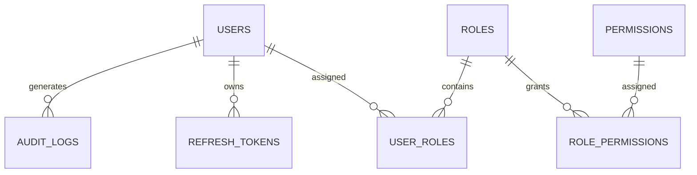

This structure separates authentication concerns from authorization concerns while preserving flexibility for future expansion.

---

## Users

The `users` table represents authenticated accounts within the system.

Every action performed through the API is ultimately associated with a user record. User accounts serve as the primary identity object used throughout the platform.

### Responsibilities

The users table is responsible for:

- Authentication identity
- Account status management
- Role assignment
- Audit ownership
- Refresh token ownership
- Administrative privilege tracking

### Key Attributes

| Field           | Purpose                          |
| --------------- | -------------------------------- |
| id              | Unique user identifier           |
| username        | Login username                   |
| email           | Contact and identification email |
| hashed_password | Secure password hash             |
| is_active       | Account enabled state            |
| is_superuser    | Administrative override flag     |
| created_at      | Creation timestamp               |
| updated_at      | Modification timestamp           |

Passwords are never stored in plaintext. Instead, the system stores cryptographic password hashes generated through the configured password hashing provider.

### Design Considerations

Users intentionally contain very little authorization logic.

Permissions are not stored directly on user records. Instead, authorization decisions are delegated to assigned roles.

This separation simplifies permission management and reduces duplication across the system.

---

## Roles

The `roles` table defines collections of permissions.

Roles act as reusable authorization profiles that can be assigned to one or more users.

Examples include:

- Administrator
- Moderator
- Librarian
- Metadata Editor
- Read-Only User

The exact set of roles may evolve over time, but the underlying authorization model remains unchanged.

### Responsibilities

Roles are responsible for:

- Grouping permissions
- Simplifying administration
- Reducing permission duplication
- Supporting future organizational structures

### Key Attributes

| Field       | Purpose                  |
| ----------- | ------------------------ |
| id          | Unique role identifier   |
| name        | Human-readable role name |
| description | Role description         |
| created_at  | Creation timestamp       |
| updated_at  | Modification timestamp   |

A role itself grants no privileges until permissions are assigned through the role_permissions mapping table.

---

## Permissions

The `permissions` table defines individual actions that may be granted within the platform.

Permissions represent the smallest unit of authorization.

Examples include:

- RUN_SCANS
- MANAGE_USERS
- MANAGE_ROLES
- VIEW_AUDIT_LOGS
- EDIT_METADATA
- MANAGE_COLLECTIONS
- ACCESS_ADMIN

Permissions are intentionally granular so that future roles can be assembled without requiring schema changes.

### Responsibilities

Permissions are responsible for:

- Fine-grained authorization
- Feature access control
- Administrative segregation
- Future extensibility

### Key Attributes

| Field       | Purpose                      |
| ----------- | ---------------------------- |
| id          | Unique permission identifier |
| name        | Permission name              |
| description | Human-readable description   |

Permissions do not directly belong to users. They become effective only through role assignment.

---

## User Roles

The `user_roles` table implements the many-to-many relationship between users and roles.

A single user may belong to multiple roles and a single role may be assigned to multiple users.

### Relationship Model

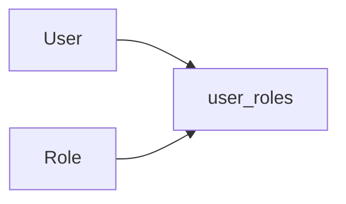

This design provides significant flexibility and prevents duplication of authorization information.

### Responsibilities

The table is responsible for:

- User-role assignment
- Multi-role support
- Authorization inheritance

Without this mapping table, roles would need to be duplicated or constrained to one role per user.

---

## Role Permissions

The `role_permissions` table implements the many-to-many relationship between roles and permissions.

This table forms the core of the RBAC system.

### Relationship Model

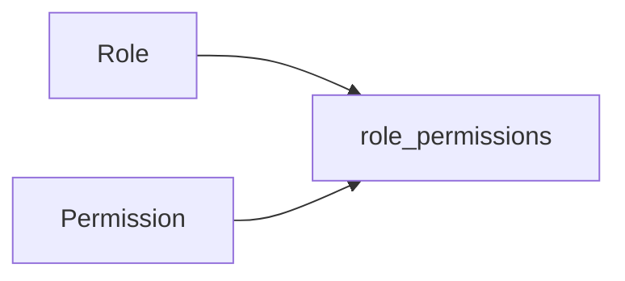

When a user authenticates, effective permissions are derived from the union of permissions granted by all assigned roles.

### Responsibilities

The table is responsible for:

- Permission assignment
- Authorization inheritance
- Role customization
- Future security expansion

This approach allows administrators to modify permissions without modifying user records.

---

## Refresh Tokens

The `refresh_tokens` table supports long-lived authenticated sessions.

Although access tokens are stateless JWTs, refresh tokens are tracked within the database to support token revocation and session management.

### Responsibilities

Refresh token records provide:

- Session persistence
- Token revocation
- Logout support
- Refresh token rotation
- Security auditing

### Relationship Model

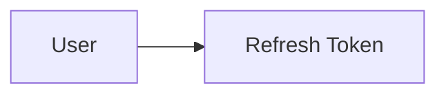

### Key Attributes

| Field      | Purpose                 |
| ---------- | ----------------------- |
| id         | Unique token identifier |
| user_id    | Owning user             |
| token      | Stored refresh token    |
| expires_at | Expiration timestamp    |
| revoked    | Revocation state        |
| created_at | Creation timestamp      |

### Refresh Token Rotation

Ludexis implements refresh token rotation.

Whenever a refresh token is exchanged:

1. Existing token is revoked.
2. New refresh token is issued.
3. New access token is issued.
4. Previous refresh token becomes unusable.

This significantly reduces the impact of token leakage.

---

## Audit Logs

The `audit_logs` table provides security visibility and operational traceability.

Rather than relying solely on application logs, important security and administrative actions are persisted within the database.

### Responsibilities

Audit logs record:

- Login success
- Login failure
- Logout events
- User creation
- User deletion
- Role changes
- Permission changes
- Metadata modifications
- Administrative operations
- Token refresh events

### Relationship Model

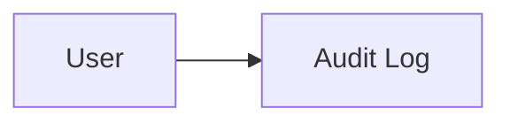

### Key Attributes

| Field      | Purpose                 |
| ---------- | ----------------------- |
| id         | Unique audit identifier |
| user_id    | Initiating user         |
| action     | Performed action        |
| entity     | Target entity           |
| entity_id  | Target identifier       |
| details    | Additional context      |
| created_at | Event timestamp         |

Audit records provide an immutable historical record of significant system activity and are critical for troubleshooting, accountability, and security investigations.

---

## Authorization Flow

The following diagram illustrates how authorization decisions are evaluated within the system.

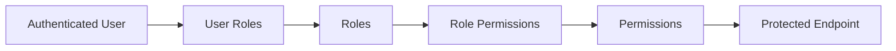

Whenever a protected endpoint is accessed, the system resolves the user's effective permissions through their assigned roles and determines whether the requested operation is permitted.

This model provides both flexibility and strong security guarantees while remaining easy to maintain as the platform grows.

---

# Library Management Domain

The Library Management domain forms the operational core of Ludexis.

Its responsibility is to represent physical game archives stored on disk and provide the foundation upon which metadata enrichment, artwork management, collections, search, and library scanning are built.

Every game archive discovered by the scanning subsystem eventually becomes an Archive Entry record linked to a Library.

This domain consists of two primary entities:

- libraries
- archive_entries

While the Libraries table represents physical storage locations, the Archive Entries table represents individual game archives and serves as the central entity for the entire platform.

---

## Library Management Relationship Diagram

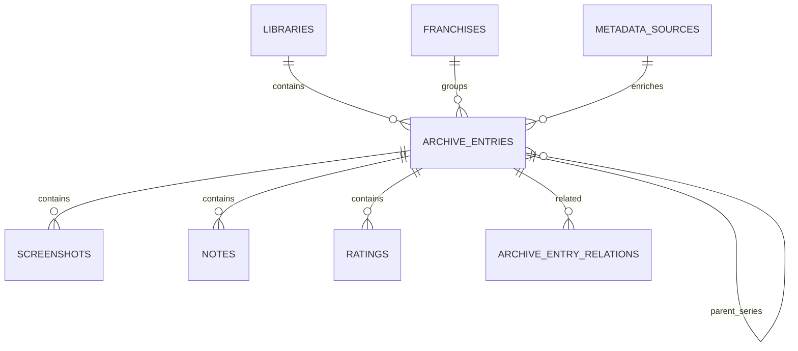

The Archive Entry entity acts as the hub connecting almost every other subsystem within Ludexis.

---

## Libraries

The `libraries` table represents configured storage locations that Ludexis scans and manages.

A library defines a root path that contains one or more game archives.

Examples include:

```text
D:\Games

E:\ROMs

\\NAS\GameArchives

/media/games
```

Each library serves as an organizational boundary for archive discovery and scanning operations.

### Responsibilities

Libraries are responsible for:

- Defining scan targets
- Organizing archive entries
- Providing storage segmentation
- Supporting multi-library environments
- Controlling scan scope

### Key Attributes

| Field      | Purpose                     |
| ---------- | --------------------------- |
| id         | Unique library identifier   |
| name       | Human-readable library name |
| path       | Filesystem path             |
| enabled    | Scan eligibility            |
| created_at | Creation timestamp          |
| updated_at | Modification timestamp      |
| deleted_at | Soft deletion timestamp     |

### Design Considerations

The library abstraction allows a single Ludexis deployment to manage multiple independent archive collections.

For example:

```text
PC Games Library

Retro ROM Library

Homebrew Library

Indie Archive Collection
```

Each library can be scanned independently while still sharing the same metadata ecosystem.

### Soft Deletion

Libraries support soft deletion.

When a library is deleted, records are not immediately removed from the database. Instead, a deletion timestamp is recorded.

This approach prevents accidental loss of metadata and simplifies recovery operations.

---

## Archive Entries

The `archive_entries` table is the most important entity within the entire Ludexis platform.

Every discovered game archive eventually becomes an archive entry.

Metadata enrichment, artwork storage, franchise grouping, collections, ratings, notes, screenshots, and search functionality all operate around archive entries.

Conceptually, an archive entry represents a single game archive regardless of its physical format.

Examples include:

```text
Half-Life.zip

Doom.iso

Quake.rar

SystemShock2.7z
```

The archive entry acts as a bridge between:

- Filesystem information
- Metadata providers
- User-generated content
- Organizational structures

---

## Archive Entry Categories

Archive entries contain information from several distinct categories.

### File System Information

This category represents information obtained directly from storage devices.

Examples include:

| Field          | Purpose                           |
| -------------- | --------------------------------- |
| file_path      | Archive location                  |
| file_size      | Archive size                      |
| modified_time  | Filesystem modification timestamp |
| file_hash      | Unique content hash               |
| storage_device | Storage device identifier         |
| archive_type   | Archive format                    |

These fields are primarily maintained by scanning operations.

---

### Game Metadata

This category represents descriptive information about the game itself.

Examples include:

| Field        | Purpose          |
| ------------ | ---------------- |
| title        | Game title       |
| description  | Game description |
| version      | Release version  |
| engine       | Game engine      |
| release_date | Release date     |

This information may originate from:

- Local metadata
- Manual editing
- External providers

---

### Artwork References

Archive entries maintain references to associated artwork.

Examples include:

| Field       | Purpose        |
| ----------- | -------------- |
| cover_path  | Cover artwork  |
| banner_path | Banner artwork |
| logo_path   | Logo artwork   |

Artwork files themselves are stored separately from the database.

The database stores only references and metadata.

---

### Metadata Tracking

Metadata synchronization requires additional state tracking.

Examples include:

| Field                 | Purpose                   |
| --------------------- | ------------------------- |
| metadata_status       | Metadata matching state   |
| metadata_source       | Provider name             |
| metadata_source_code  | Provider identifier       |
| metadata_override     | Manual override flag      |
| last_metadata_refresh | Last synchronization time |

These fields enable controlled metadata enrichment while preserving user modifications.

---

### Verification Tracking

Verification fields track metadata confidence and review status.

Examples include:

| Field               | Purpose                |
| ------------------- | ---------------------- |
| verification_status | Verification state     |
| last_verified       | Verification timestamp |

This information supports future workflows involving manual metadata validation.

---

## Archive Entry Lifecycle

The lifecycle of an archive entry begins with library scanning.

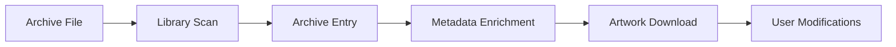

Throughout its lifecycle an archive entry gradually accumulates metadata, artwork, user-generated information, and relationships.

---

## Library Relationship

Each archive entry belongs to at most one library.

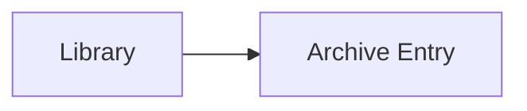

This relationship provides the connection between the database representation and the physical storage location from which the archive originated.

---

## Franchise Relationship

Archive entries may optionally belong to a franchise.

Examples include:

```text
Halo

Half-Life

The Elder Scrolls

Fallout
```

The franchise relationship enables grouping and navigation across related games.

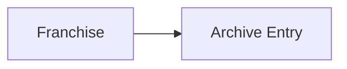

Franchises are discussed in greater detail within the Metadata Domain.

---

## Metadata Source Relationship

Metadata providers are intentionally separated from archive entries.

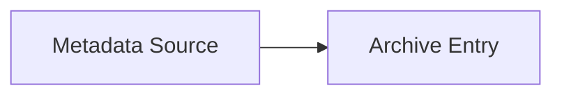

This abstraction allows:

- Provider replacement
- Multiple provider support
- Future metadata federation
- Easier migration between providers

Archive entries remain valid even if external providers become unavailable.

---

## Parent Series Relationship

Ludexis supports self-referencing archive relationships through the `parent_series_id` field.

This enables hierarchical structures such as:

```text
Half-Life Series
├── Half-Life
├── Half-Life Opposing Force
├── Half-Life Blue Shift
└── Half-Life 2
```

Relationship structure:

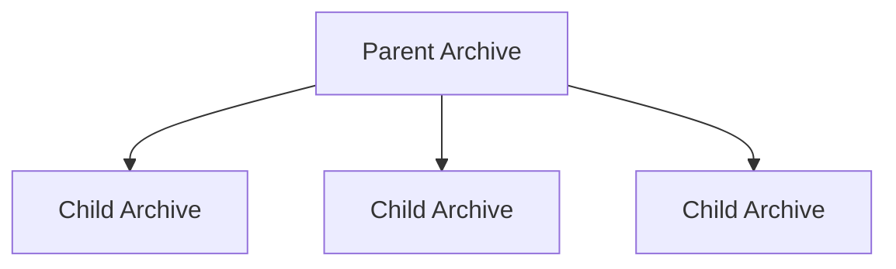

This self-referencing relationship enables future series navigation and franchise visualization features.

---

## Archive Relationships

Archive entries may also maintain arbitrary relationships with other archive entries through the `archive_entry_relations` table.

Examples include:

- Sequel
- Prequel
- Expansion
- Remaster
- Related release
- Alternate edition

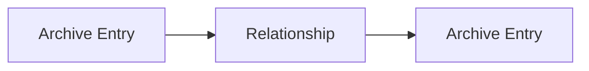

This mechanism provides significantly greater flexibility than a simple parent-child hierarchy.

---

## Design Principles

Several principles shaped the Archive Entry model.

### Single Source of Truth

Every discovered archive is represented by exactly one archive entry record.

### Metadata Independence

Metadata providers remain separate from archive ownership.

### Relationship Richness

Archive entries support complex relationships without requiring schema modifications.

### Extensibility

Additional metadata systems can be attached to archive entries through foreign keys and association tables.

### Auditability

Metadata state and verification state are explicitly tracked to support future administrative workflows.

---

The Archive Entry model serves as the foundation for all higher-level functionality within Ludexis. The next section explores the Metadata Domain, which enriches archive entries with genres, developers, publishers, tags, franchises, screenshots, notes, ratings, and external metadata information.

---

# Metadata Domain

The Metadata Domain is responsible for enriching archive entries with descriptive, organizational, and user-generated information.

While the Library Management Domain focuses on discovering and tracking archive files, the Metadata Domain provides the contextual information required to transform those files into a useful catalog.

Without metadata, archive entries would be little more than filenames and storage locations. Through metadata enrichment, Ludexis is able to provide meaningful search capabilities, franchise grouping, genre classification, developer attribution, artwork presentation, ratings, notes, and future recommendation functionality.

The Metadata Domain consists of the following primary entities:

- developers
- publishers
- genres
- tags
- franchises
- metadata_sources
- screenshots
- ratings
- notes

It also includes several relationship tables that connect these entities to archive entries.

---

## Metadata Domain Relationship Diagram

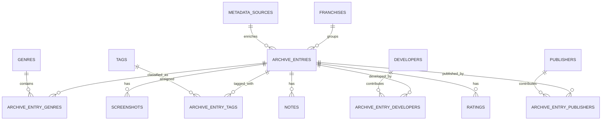

This domain represents the majority of the information users interact with while browsing their library.

---

## Developers

The `developers` table stores information about game development studios and creators.

Examples include:

```text
Valve

id Software

Bethesda Game Studios

CD Projekt Red

Rockstar North
```

### Responsibilities

Developer records provide:

- Attribution
- Searchability
- Filtering
- Metadata enrichment
- Future analytics

### Key Attributes

| Field       | Purpose                     |
| ----------- | --------------------------- |
| id          | Unique developer identifier |
| name        | Developer name              |
| description | Optional description        |
| created_at  | Creation timestamp          |
| updated_at  | Modification timestamp      |
| deleted_at  | Soft deletion timestamp     |

### Relationship Model

A game may have multiple developers and a developer may contribute to multiple games.

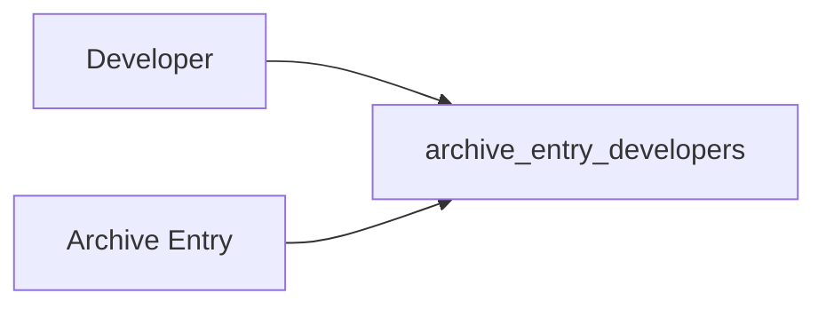

---

## Publishers

The `publishers` table stores publishing organizations associated with archive entries.

Examples include:

```text
Electronic Arts

Ubisoft

Bethesda Softworks

Activision

Sega
```

Publishers are intentionally separated from developers because many games are developed and published by different organizations.

### Responsibilities

Publisher records support:

- Attribution
- Search
- Filtering
- Metadata normalization

### Relationship Model

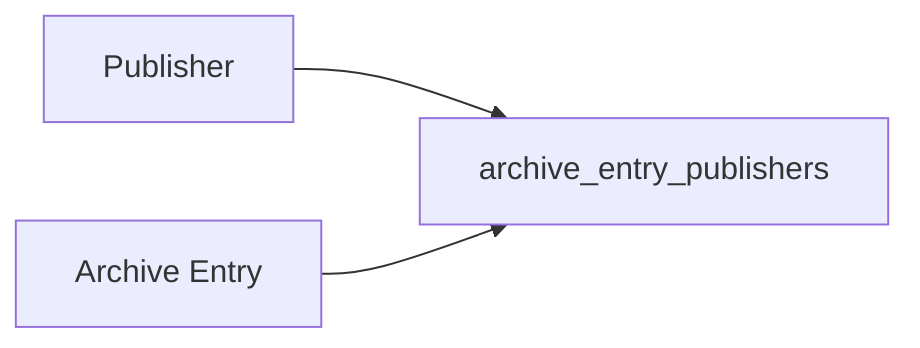

This structure supports many-to-many publisher relationships.

---

## Genres

The `genres` table provides broad gameplay classification.

Examples include:

```text
RPG

FPS

Strategy

Simulation

Adventure

Racing
```

Genres are intended to remain relatively stable over time and represent high-level categorization.

### Responsibilities

Genres support:

- Search filtering
- Library organization
- Metadata enrichment
- Future recommendation systems

### Relationship Model

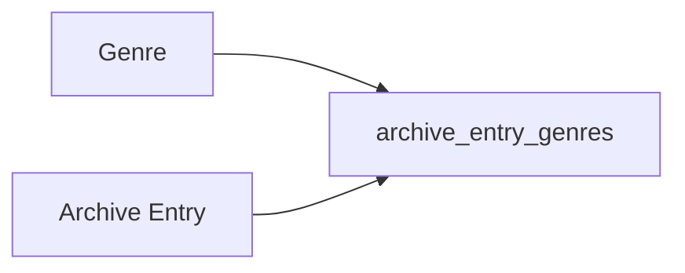

A single archive entry may belong to multiple genres.

---

## Tags

The `tags` table provides flexible classification beyond traditional genres.

Unlike genres, tags are intentionally granular and may represent virtually any useful characteristic.

Examples include:

```text
Open World

Co-op

Single Player

Multiplayer

Cyberpunk

Pixel Art

VR

Early Access
```

### Responsibilities

Tags provide:

- Fine-grained filtering
- User organization
- Metadata enrichment
- Future search enhancements

### Relationship Model

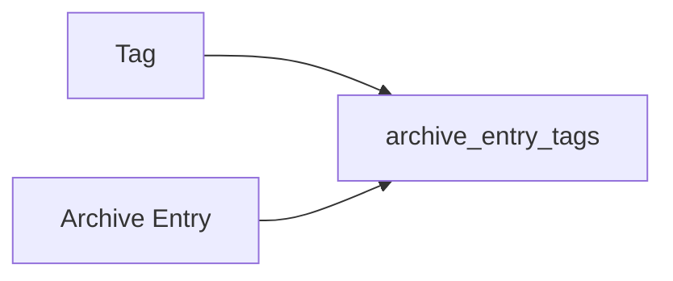

The tagging system is significantly more flexible than genre classification.

---

## Franchises

The `franchises` table groups related games under a common series.

Examples include:

```text
Half-Life

Halo

Fallout

The Elder Scrolls

Mass Effect
```

Franchises allow users to navigate related titles and understand relationships between games.

### Responsibilities

Franchises support:

- Series organization
- Metadata grouping
- Future timeline visualization
- Franchise browsing

### Relationship Model


Unlike genres and tags, franchises use a direct foreign key relationship rather than an association table.

---

## Metadata Sources

The `metadata_sources` table tracks external providers used to enrich archive entries.

Examples include:

```text
IGDB

TheGamesDB

Custom Provider
```

The purpose of this table is to maintain a clear separation between local archive data and externally sourced metadata.

### Responsibilities

Metadata sources provide:

- Provider identification
- Source attribution
- Synchronization tracking
- Future multi-provider support

### Relationship Model

```mermaid
flowchart LR

    Source["Metadata Source"]

    Archive["Archive Entry"]

    Source --> Archive
```

This abstraction allows metadata providers to evolve independently of archive records.

---

## Screenshots

The `screenshots` table stores screenshot references associated with archive entries.

Screenshots provide visual context and improve browsing experiences.

### Responsibilities

Screenshot records support:

- Gallery views
- Metadata enrichment
- Future artwork synchronization

### Relationship Model

```mermaid
flowchart LR

    Archive["Archive Entry"]

    Screenshot["Screenshot"]

    Archive --> Screenshot
```

An archive entry may contain multiple screenshots.

### Design Consideration

Actual image files remain outside the database. The database stores only references and metadata.

This approach avoids excessive database growth while preserving efficient retrieval.

---

## Ratings

The `ratings` table stores evaluation information associated with archive entries.

Ratings may originate from:

- External metadata providers
- Community sources
- Future user-generated systems

### Responsibilities

Ratings provide:

- Quality indicators
- Sorting support
- Metadata enrichment
- Future recommendation inputs

### Relationship Model

```mermaid
flowchart LR

    Archive["Archive Entry"]

    Rating["Rating"]

    Archive --> Rating
```

Multiple ratings may exist for a single archive entry if different rating providers are supported.

---

## Notes

The `notes` table stores user-generated notes attached to archive entries.

Notes allow users to preserve information that may not exist within external metadata providers.

Examples include:

```text
Runs best with compatibility mode enabled.

Requires unofficial patch.

Contains restored content mod.

Verified working on Windows 11.
```

### Responsibilities

Notes provide:

- User annotations
- Preservation information
- Operational guidance
- Personal organization

### Relationship Model

```mermaid
flowchart LR

    Archive["Archive Entry"]

    Note["Note"]

    Archive --> Note
```

Notes represent purely local information and are never overwritten by metadata synchronization processes.

---

## Metadata Enrichment Flow

The following diagram illustrates how metadata enters the system.

```mermaid
flowchart LR

    Archive["Archive Entry"]

    Provider["Metadata Provider"]

    Developers["Developers"]

    Publishers["Publishers"]

    Genres["Genres"]

    Tags["Tags"]

    Franchise["Franchise"]

    Screenshots["Screenshots"]

    Ratings["Ratings"]

    Archive --> Provider

    Provider --> Developers

    Provider --> Publishers

    Provider --> Genres

    Provider --> Tags

    Provider --> Franchise

    Provider --> Screenshots

    Provider --> Ratings
```

The archive entry acts as the aggregation point for all enrichment data.

---

## Design Principles

Several principles guided the Metadata Domain.

### Metadata Independence

Archive entries remain valid even when external providers are unavailable.

### Normalized Relationships

Metadata entities are stored once and referenced through relationships rather than duplicated.

### Flexible Classification

Genres provide structured categorization while tags provide flexible classification.

### Provider Agnosticism

Metadata providers are abstracted to allow future expansion without schema redesign.

### User Ownership

User-generated content such as notes remains separate from externally sourced metadata and is never automatically overwritten.

---

The Metadata Domain transforms archive entries from simple file records into richly described catalog objects. Combined with the Library Management Domain, it provides the foundation for search, organization, browsing, and future discovery features throughout the Ludexis platform.

---

# Collection and Processing Domain

While archive entries and metadata form the core catalog, additional systems are required to organize content, track background operations, and preserve long-term data integrity.

The Collection and Processing Domain provides these capabilities through:

- Collections
- Collection Entries
- Job History

Together, these entities enable user-defined organization and asynchronous processing throughout the platform.

---

## Collection Management

Collections allow users to organize archive entries into custom groups independent of franchises, genres, tags, or other metadata relationships.

Where metadata relationships describe objective characteristics of a game, collections represent subjective user organization.

Examples include:

```text
Favorite Games

Completed Games

To Play

Multiplayer Collection

Retro Collection

2025 Replay List
```

Collections provide a flexible organizational layer that adapts to user preferences.

---

## Collection Relationship Diagram

```mermaid
erDiagram

    COLLECTIONS ||--o{ COLLECTION_ENTRIES : contains

    ARCHIVE_ENTRIES ||--o{ COLLECTION_ENTRIES : assigned
```

This design supports many-to-many relationships between collections and archive entries.

---

## Collections

The `collections` table represents user-defined groups of archive entries.

### Responsibilities

Collections provide:

- User organization
- Library segmentation
- Personalized categorization
- Future sharing functionality
- Future smart collection support

### Key Attributes

| Field       | Purpose                      |
| ----------- | ---------------------------- |
| id          | Unique collection identifier |
| name        | Collection name              |
| description | Collection description       |
| created_at  | Creation timestamp           |
| updated_at  | Modification timestamp       |
| deleted_at  | Soft deletion timestamp      |

Collections are intentionally lightweight and primarily act as containers for archive entries.

---

## Collection Entries

The `collection_entries` table implements the many-to-many relationship between collections and archive entries.

### Relationship Model

```mermaid
flowchart LR

    Collection["Collection"]

    Mapping["collection_entries"]

    Archive["Archive Entry"]

    Collection --> Mapping

    Archive --> Mapping
```

This structure allows:

- One archive in many collections
- One collection containing many archives
- Efficient querying
- Flexible organization

### Examples

A single archive entry could simultaneously belong to:

```text
Favorites

Completed Games

Valve Collection

Best FPS Games
```

without requiring duplication of archive records.

---

# Background Processing Domain

Many Ludexis operations are too expensive to execute directly within an HTTP request lifecycle.

Examples include:

- Full library scans
- Incremental scans
- Metadata synchronization
- Artwork processing
- Future maintenance tasks

The Background Processing Domain provides visibility into these operations through the `job_history` table.

---

## Job History

The `job_history` table records execution details for asynchronous operations.

Every long-running task is represented by a job record.

This allows administrators and users to monitor system activity without directly interacting with Celery or Redis.

### Responsibilities

Job history provides:

- Execution tracking
- Progress monitoring
- Error visibility
- Retry management
- Historical auditing

### Key Attributes

| Field        | Purpose                  |
| ------------ | ------------------------ |
| id           | Unique job identifier    |
| job_type     | Job category             |
| status       | Current execution status |
| progress     | Completion percentage    |
| details      | Additional information   |
| result       | Result summary           |
| task_id      | Celery task identifier   |
| user_id      | Initiating user          |
| started_at   | Start timestamp          |
| completed_at | Completion timestamp     |

---

## Job Lifecycle

Every job progresses through a series of states.

```mermaid
stateDiagram-v2

    [*] --> Pending

    Pending --> Running

    Running --> Completed

    Running --> Failed

    Running --> Cancelled

    Failed --> Retrying

    Retrying --> Running
```

This lifecycle allows the system to track both successful and failed operations while maintaining complete historical records.

---

## Background Processing Architecture

```mermaid
flowchart LR

    User["User"]

    API["FastAPI"]

    Redis["Redis"]

    Celery["Celery Worker"]

    JobHistory["Job History"]

    User --> API

    API --> JobHistory

    API --> Redis

    Redis --> Celery

    Celery --> JobHistory
```

The API initiates jobs while Celery performs execution.

Job History acts as the central tracking mechanism visible to administrators and users.

---

# Data Integrity Rules

Maintaining data integrity is critical for long-term archive management.

Several rules govern the schema.

---

## Referential Integrity

Foreign key constraints are used extensively throughout the schema.

These constraints ensure that relationships remain valid and prevent orphaned records.

Examples include:

- Archive entries must reference valid libraries.
- Ratings must reference valid archive entries.
- Refresh tokens must reference valid users.
- Collection memberships must reference valid collections and archive entries.

Referential integrity prevents inconsistent database states.

---

## Many-to-Many Mapping Tables

Many-to-many relationships are implemented through dedicated association tables.

Examples include:

```text
archive_entry_tags

archive_entry_genres

archive_entry_publishers

archive_entry_developers

collection_entries

user_roles

role_permissions
```

This approach avoids duplication and supports efficient querying.

---

## Cascading Behavior

Different relationships use different deletion strategies depending on business requirements.

Common behaviors include:

### CASCADE

Used when child records should be removed with their parent.

Examples:

- Screenshots
- Notes
- Ratings

### SET NULL

Used when a relationship may disappear without invalidating the archive entry.

Examples:

- Franchise references
- Metadata provider references
- Parent series references
- Library references

This approach preserves valuable archive information even when related records are removed.

---

# Soft Delete Strategy

Several major entities support soft deletion.

Rather than immediately removing records, a timestamp is stored within the `deleted_at` column.

Examples include:

- Libraries
- Collections
- Developers
- Publishers
- Genres
- Tags
- Franchises

---

## Soft Delete Lifecycle

```mermaid
flowchart LR

    Active["Active Record"]

    SoftDeleted["deleted_at Set"]

    Purged["Permanent Removal"]

    Active --> SoftDeleted

    SoftDeleted --> Purged
```

This strategy provides several advantages.

### Recovery

Accidentally deleted records may be restored.

### Auditability

Historical relationships remain visible.

### Synchronization Safety

External synchronization processes are less likely to cause accidental data loss.

### Future Archival Support

Soft deletion creates a foundation for future archival workflows.

---

# Future Schema Evolution

The current schema was intentionally designed to support future expansion.

Potential additions include:

### User Profiles

Additional user preferences and personalization settings.

### Smart Collections

Collections generated dynamically from search rules.

### Metadata Versioning

Historical tracking of metadata changes.

### Multiple Metadata Providers

Simultaneous enrichment from several external sources.

### Recommendation Systems

Machine-assisted discovery based on metadata relationships.

### Advanced Artwork Management

Additional artwork categories and provider synchronization.

### Public API Integrations

External access through API tokens and application credentials.

---

# Schema Summary

The Ludexis schema is built around a central Archive Entry model that represents discovered game archives and connects them to metadata, artwork, user-generated content, collections, permissions, and processing workflows.

The design emphasizes:

- Strong normalization
- Explicit relationships
- Referential integrity
- Metadata independence
- Security
- Extensibility
- Long-term maintainability

By separating library management, metadata enrichment, user management, and processing concerns into distinct domains, the schema provides a stable foundation capable of supporting future platform growth without requiring major structural redesign.
