# Processing Pipeline

## 1. Overview

### Purpose

The Ludexis processing pipeline is responsible for transforming raw archive files stored within user libraries into fully cataloged archive entries enriched with metadata, artwork, relationships, and searchable information.

Unlike traditional media managers that rely primarily on manual entry, Ludexis attempts to automate discovery, identification, enrichment, and organization while preserving user control over metadata quality and source selection.

The processing subsystem is designed around asynchronous execution, allowing expensive operations to occur independently of user-facing API requests.

The pipeline supports:

- Full library scans
- Incremental scans
- Metadata enrichment
- Artwork acquisition
- Background job execution
- Progress tracking
- Failure recovery

The overall objective is to transform a collection of archive files into a structured and searchable archive database with minimal manual intervention.

---

### High-Level Processing Flow

At a high level, every archive passes through a common processing lifecycle.

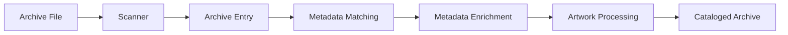

Each stage contributes additional information until the archive becomes a fully managed entity within the platform.

---

### Processing Philosophy

Several design principles guided development of the processing subsystem.

#### Separation of Discovery and Enrichment

File discovery and metadata enrichment are intentionally independent processes.

This separation ensures that archive detection remains fast and reliable even when external metadata providers experience outages or performance degradation.

#### Asynchronous Execution

Potentially expensive operations execute through the background job system rather than directly within API request handlers.

This prevents large scans from negatively affecting application responsiveness.

#### Incremental Processing

Whenever possible, the system processes only newly discovered or modified archives rather than reprocessing the entire library.

This significantly improves performance for large collections.

#### Provider Independence

Metadata acquisition is abstracted behind provider interfaces, allowing the enrichment pipeline to remain independent of specific external services.

---

## 2. Full Library Scan Pipeline

### Overview

A full library scan performs a complete traversal of one or more configured archive libraries.

The objective is to discover every archive present within the filesystem and synchronize that information with the database.

Full scans are typically performed:

- During initial library setup
- After large archive imports
- Following storage migrations
- When rebuilding the catalog

Because full scans can be resource-intensive, they execute through the background job architecture.

---

### Full Scan Workflow

The complete scan lifecycle is shown below.

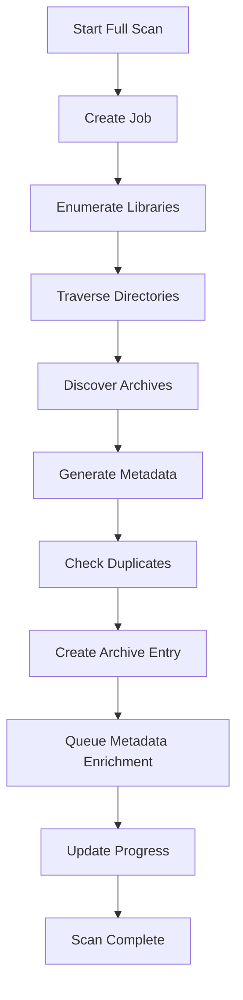

Each stage performs a specific responsibility within the discovery pipeline.

---

### Library Enumeration

The scanner begins by retrieving all enabled, non-deleted libraries from the database.

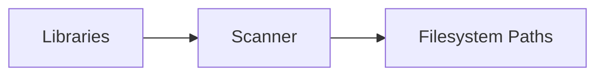

Each library has one root `path`, which becomes a traversal starting point. Multiple libraries allow several storage devices and archive collections to be managed side by side.

Scans start on demand (`/api/scan/full`, `/api/scan/incremental` or `/api/jobs/start`); there are no scheduled scans.

---

### Directory Traversal

The scanner walks each library path and classifies what it finds:

- Archive files (`.zip`, `.rar`, `.7z`, `.iso`, `.exe`) become one entry each.
- A directory containing any non-archive file (ignoring dotfiles, `desktop.ini` and `thumbs.db`) is an installed game folder. It becomes one entry and is not descended into, so its subfolders never appear as separate games.
- A directory holding only archives and subfolders is an organizing folder and is descended.
- Unreadable directories are logged and skipped.

Every item is discovered before processing starts, so progress is reported against a known total.

---

### Archive Discovery

When a valid archive is encountered, the scanner extracts basic filesystem information.

Recorded attributes:

- File path
- File size
- Last modified timestamp
- SHA-256 hash (archive files only; folders are not hashed)
- Owning library

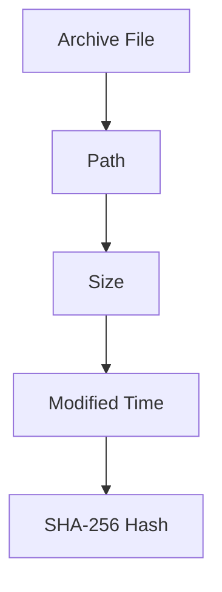

The scanner does not populate `storage_device`.

These values form the initial foundation of the archive record.

---

### Duplicate Detection

Before creating a new archive entry, the scanner checks whether the archive already exists.

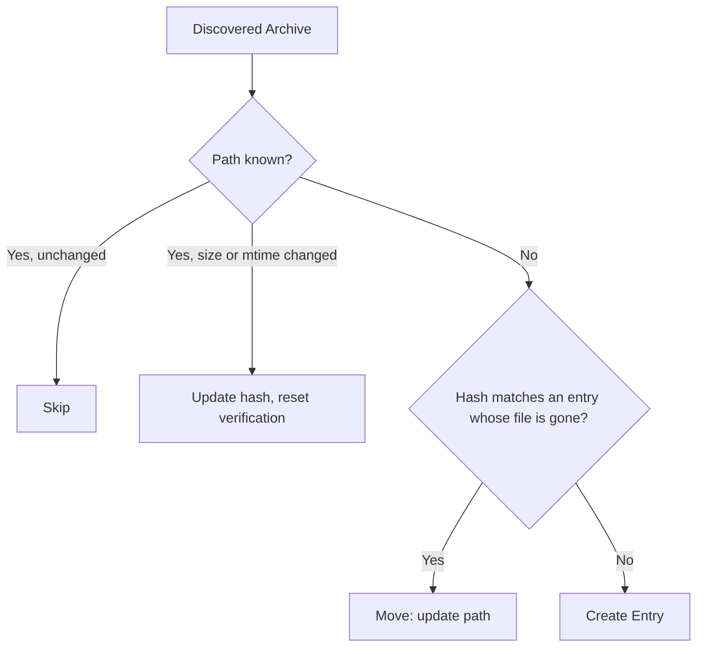

- An existing path whose size or modification time changed is re-hashed and its `verification_status` reset to UNKNOWN.
- A new path whose hash matches an entry whose old file no longer exists is treated as a move.
- If the old file still exists, the new file is a copy and gets its own entry; the DUPLICATE_DETECTION job groups identical hashes later.

Path checks prevent repeated scans from creating redundant records.

This capability is essential for maintaining database integrity during recurring scans.

---

### Archive Entry Creation

If the archive is not already present, an Archive Entry record is created.

Initially, the entry contains only filesystem-derived information, a title and version parsed from the file name (`app/utils/normalization.py` strips extensions, bracketed text, versions, platform and packaging tags, release groups and flags, and splits CamelCase), `metadata_status=UNMATCHED` and `verification_status=UNKNOWN`.

Metadata enrichment occurs later through a separate pipeline.

This separation improves reliability and reduces coupling between discovery and external metadata providers.

---

### Progress Tracking

Throughout execution, the scanner reports items processed out of items discovered, and the shared job runner (`app/tasks/job_runner.py`) writes the percentage to the job's `progress`. The final result records `created`, `updated`, `moved` and `errors` counts.

Each item is processed independently: an error on one file is rolled back, logged and counted, and the scan continues.

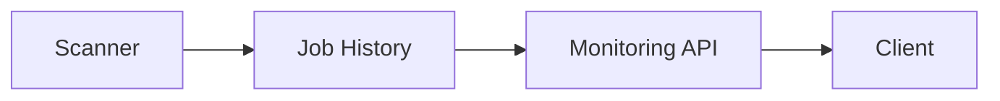

This enables real-time monitoring through the job subsystem.

---

### Scan Completion

When traversal completes successfully:

- Job status becomes SUCCESS
- Progress reaches 100%
- The summary is stored in the job's `result` and `details`

If the scan created entries, it queues a METADATA_REFRESH job ("Enrich N new entries") for exactly those entries and records its id as `enrichment_job_id` in the scan result.

---

## 3. Incremental Scan Pipeline

### Overview

Incremental scans are optimized versions of full scans.

Rather than processing every archive in every library, incremental scans focus exclusively on detecting changes since the previous scan.

This significantly reduces execution time for large collections.

Incremental scans are intended to become the primary scanning mechanism for day-to-day operation.

---

### Incremental Workflow

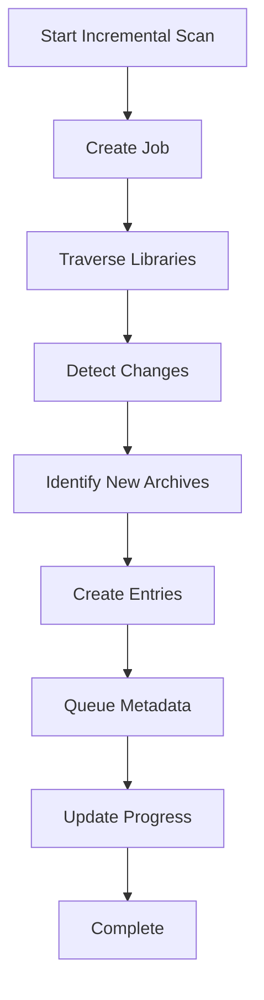

The overall workflow resembles a full scan but performs substantially less work.

---

### Change Detection

The scanner compares discovered filesystem information against existing database records.

Typical comparison criteria include:

- File path
- File size
- Modification timestamp

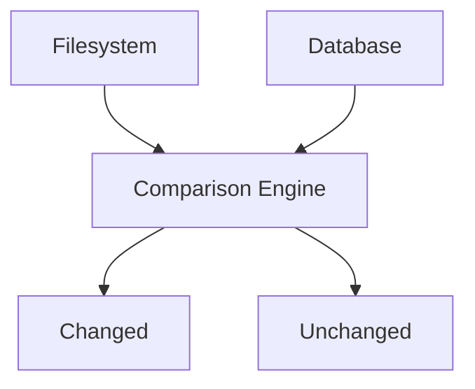

Only archives that differ from previously recorded information require additional processing.

---

### New Archive Discovery

New archives follow the same workflow as those discovered during a full scan.

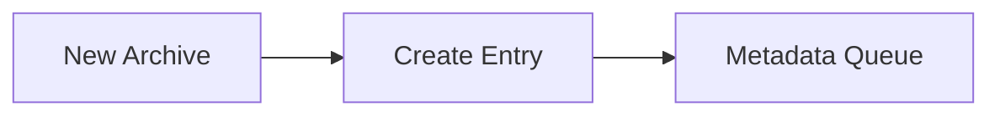

This ensures consistency between full and incremental processing modes.

---

### Existing Archive Handling

Archives whose size and modification time are unchanged are skipped. Changed archives are re-hashed and their verification status reset.

This dramatically reduces processing overhead and allows incremental scans to complete much faster than full scans.

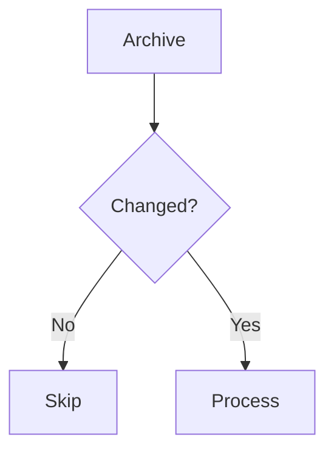

---

### Benefits of Incremental Scanning

Compared to full scans, incremental scans provide:

- Reduced disk activity
- Faster completion times
- Lower CPU utilization
- Lower metadata provider load
- Improved user experience

For large archive collections, incremental scanning becomes the preferred operational mode.

---

### Relationship to Metadata Enrichment

Archive discovery and metadata enrichment remain separate processes.

After new archives are discovered, metadata enrichment is triggered independently.

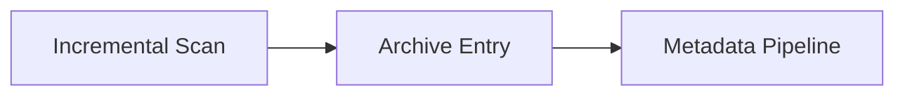

This architecture ensures that archive detection remains reliable regardless of external metadata provider availability.

## 4. Metadata Enrichment Pipeline

### Overview

The metadata enrichment pipeline is responsible for transforming a newly discovered archive entry into a fully described catalog record.

While the scanning subsystem focuses on filesystem discovery, the metadata subsystem focuses on content identification and enrichment.

The objective is to populate archive entries with meaningful information such as:

- Title
- Description
- Release date
- Genres
- Developers
- Publishers
- Franchise information
- Metadata provider references
- Verification status

This process significantly improves searchability and organization while reducing manual data entry.

---

### Metadata Pipeline Architecture

The enrichment workflow operates independently from archive discovery.

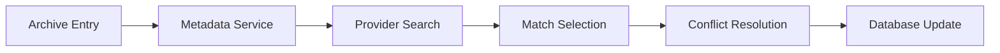

This separation ensures that archive discovery remains functional even when external providers become unavailable.

---

### Metadata Request Lifecycle

Metadata enrichment typically begins after a scan identifies a new archive.

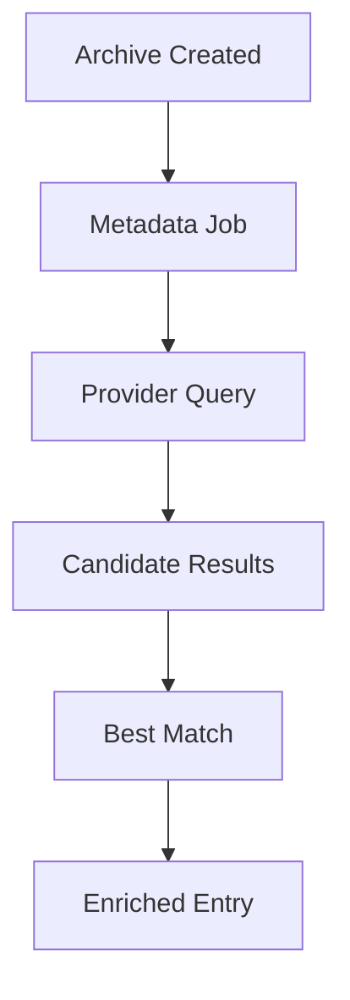

Enrichment runs automatically for the entries a scan created, nightly (03:00 by default) for entries that have a provider source (refresh) or were never attempted (match), and on demand through `/api/jobs/start` or the metadata endpoints. Entries with `metadata_override=true` are skipped. Entries that were attempted and stayed UNMATCHED are left for manual review rather than re-searched every night.

`EnrichmentService.enrich` (`app/services/enrichment.py`) processes each candidate independently: errors are rolled back and counted, and the job can be cancelled between entries.

---

### Provider Abstraction Layer

Metadata retrieval is performed through provider implementations rather than directly accessing external services.

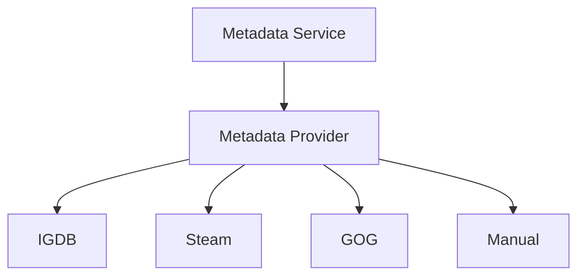

Auto-matching tries the providers in the `provider_order` setting (default VNDB, IGDB, Steam) and stops at the first confident match; a provider left out is disabled. A new version of an already matched game reuses its sibling's source instead of searching. GOG and Manual are stubs that return no results.

This architecture allows the enrichment pipeline to remain independent of any individual metadata source.

New providers can be introduced without modifying the enrichment workflow itself.

---

### Metadata Search

The first stage of enrichment involves searching external providers.

The search input is the entry title parsed from the file name. Entries that already have a provider source are refreshed from that source without a new title search.

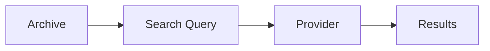

Search results may contain multiple possible matches.

Additional processing is required before a final candidate can be selected.

---

### Candidate Evaluation

Provider search results are evaluated and ranked.

`MetadataService.auto_match` scores each provider's candidates with `title_similarity`: 1.0 when the titles are identical ignoring case, spaces and punctuation, otherwise the average of character similarity and shared-word overlap. It stops at the first provider with a confident match and otherwise keeps the best candidate across providers.

| Score | Result |
| --- | --- |
| >= 0.85 | MATCHED |
| >= 0.70 | PARTIAL |
| < 0.70 | UNMATCHED, no provider source recorded |

`metadata_confidence` and `last_metadata_refresh` are always stored.

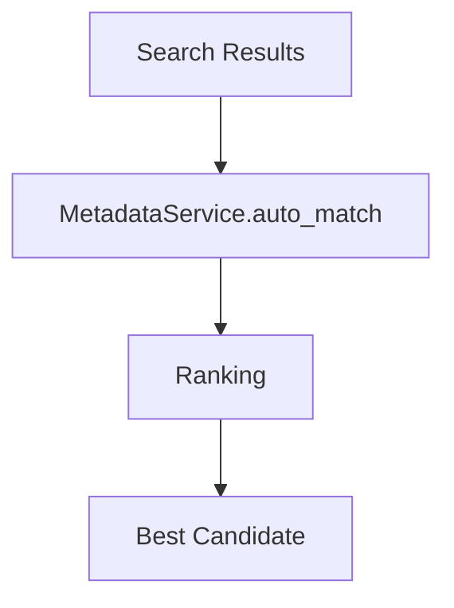

This stage reduces the likelihood of incorrect metadata assignments.

---

### Metadata Assignment

Once a candidate has been selected, information is transferred into the archive record.

Matched and partial entries receive:

- Description
- Release date
- Genres
- Developers
- Publishers
- Metadata source and provider id

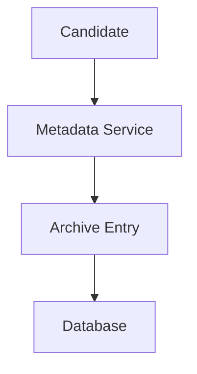

The archive now contains substantially richer information than was available through filesystem inspection alone.

---

### Metadata Source Tracking

Every enrichment operation records the originating metadata source.

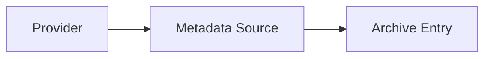

Tracking source information provides:

- Traceability
- Auditability
- Provider comparison
- Future refresh capability

This information becomes especially valuable when multiple providers support the same archive.

---

### Metadata Status

Metadata quality is represented by `metadata_status`, separate from the file's `verification_status`.

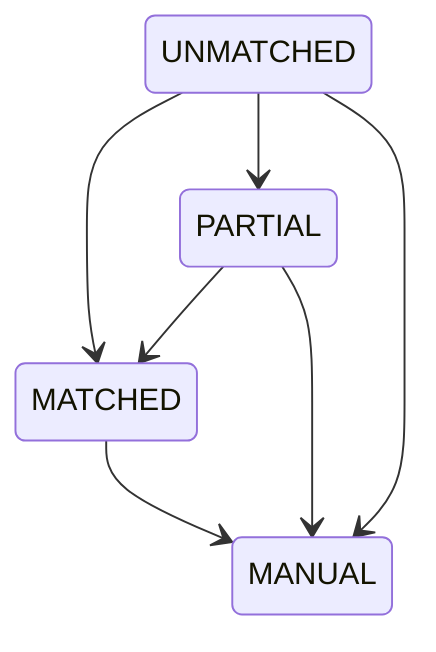

MANUAL is set by `PATCH /api/archive-entries/{id}/metadata`, which also sets `metadata_override` so automatic enrichment leaves the entry alone. `verification_status` (VERIFIED, MISSING, MOVED, CORRUPTED, UNKNOWN) describes the archive file and is set by scans and INTEGRITY_VERIFICATION.

---

### Metadata Refresh Workflow

Metadata may become outdated over time.

The refresh workflow allows existing archive entries to be re-enriched.

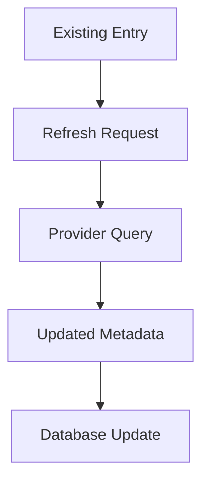

This capability ensures that catalog information can remain current as external providers evolve.

---

### Conflict Resolution

Multiple metadata sources may provide conflicting information.

Examples include:

- Different release dates
- Alternate descriptions
- Different genre classifications

`MetadataConflictResolver` merges the primary provider's details with a Steam record, but only when the Steam title is itself a confident match (>= 0.85).

```mermaid
flowchart TD

    A[Source A]
    --> C[Conflict Resolver]

    B[Source B]
    --> C

    C --> D[Final Value]
```

This prevents inconsistent information from entering the catalog.

---

### Design Goals

The metadata pipeline was designed to provide:

- Provider independence
- Automated enrichment
- Consistent matching
- Refresh capability
- Future extensibility

By separating discovery from enrichment, the platform maintains reliability while supporting increasingly sophisticated metadata workflows.

---

## 5. Artwork Management Pipeline

### Overview

Artwork is a critical component of archive presentation.

The artwork pipeline manages the acquisition, storage, assignment, and maintenance of visual assets associated with archive entries.

Supported artwork types include:

- Cover images
- Banners
- Logos
- Screenshots

The artwork subsystem operates independently from metadata retrieval while remaining closely integrated with metadata providers.

---

### Artwork Processing Architecture

```mermaid
flowchart LR

    A[Metadata Provider]
    --> B[Artwork Service]

    B --> C[Artwork Storage]

    C --> D[Archive Entry]
```

This architecture allows artwork processing to evolve independently from metadata enrichment logic.

---

### Artwork Acquisition Workflow

Artwork acquisition begins once metadata has been identified. After matching, enrichment calls `ArtworkService.fill_missing_artwork`, which downloads any missing cover, banner, logo and screenshots using the stored match, fetching provider details once per entry.

```mermaid
flowchart TD

    A[Metadata Match]
    --> B[Artwork Discovery]

    B --> C[Download Asset]

    C --> D[Validate Asset]

    D --> E[Store Asset]

    E --> F[Assign Asset]
```

The workflow ensures that only valid assets are persisted.

---

### Artwork Discovery

Metadata providers expose artwork URLs associated with a match:

- IGDB: cover, artworks and screenshots.
- Steam: header image (banner), capsule images (logo), the `library_600x900.jpg` portrait (cover, when the app has one) and store screenshots.

```mermaid
flowchart LR

    A[Provider]
    --> B[Artwork URLs]

    B --> C[Artwork Service]
```

These references become candidates for download and storage.

---

### Asset Validation

Before storage, artwork assets are validated.

Validation checks that the file exists and that PIL can open and verify it.

```mermaid
flowchart TD

    A[Downloaded Asset]
    --> B[Validation]

    B --> C[Valid Asset]

    C --> D[Storage]
```

Invalid assets are discarded to prevent database pollution.

---

### Artwork Storage

Validated assets are persisted within the artwork storage subsystem.

```mermaid
flowchart LR

    A[Asset]
    --> B[Storage Layer]

    B --> C[Filesystem]
```

The database stores references to artwork rather than image contents themselves.

This approach reduces database size while maintaining efficient access.

---

### Artwork Assignment

Stored assets are associated with archive entries.

```mermaid
flowchart TD

    A[Artwork]
    --> B[Archive Entry]

    B --> C[Cover]

    B --> D[Banner]

    B --> E[Logo]

    B --> F[Screenshots]
```

This relationship enables clients to retrieve visual assets efficiently.

---

### Screenshot Management

Screenshots differ slightly from primary artwork.

An archive may possess multiple screenshots simultaneously.

```mermaid
flowchart TD

    A[Archive Entry]

    A --> B[Screenshot 1]

    A --> C[Screenshot 2]

    A --> D[Screenshot N]
```

This one-to-many relationship provides richer visual representation within the catalog.

---

### Artwork Refresh

Artwork may be refreshed independently from metadata. The daily ARTWORK_REFRESH job (04:00 by default) validates every entry's cover, banner and logo and re-downloads missing or corrupt assets, plus screenshots when none exist, for provider-matched entries. Artwork validation never changes `verification_status`.

`POST /api/artwork/auto-download` still runs synchronously in the API process for all active entries.

```mermaid
flowchart TD

    A[Existing Artwork]
    --> B[Refresh Request]

    B --> C[Provider Query]

    C --> D[Replacement Asset]

    D --> E[Storage Update]
```

This capability allows improved artwork to be retrieved without modifying archive metadata.

---

### Failure Handling

Artwork acquisition may fail due to:

- Missing URLs
- Network errors
- Invalid images
- Provider outages

Failures are isolated from the metadata pipeline.

```mermaid
flowchart TD

    A[Artwork Failure]
    --> B[Log Error]

    B --> C[Continue Processing]
```

This ensures that archive enrichment can continue even when artwork retrieval is unsuccessful.

---

### Design Goals

The artwork subsystem was designed to provide:

- Independent asset management
- Multiple artwork types
- Provider flexibility
- Storage efficiency
- Refresh capability
- Fault tolerance

By separating artwork processing from metadata enrichment, Ludexis maintains a modular architecture that can evolve independently as artwork requirements become more sophisticated.

## 6. Background Job Architecture

### Overview

Ludexis executes long-running operations through a dedicated background processing subsystem built around Celery, Redis, and persistent job tracking within PostgreSQL.

Operations such as scanning large archive libraries, metadata enrichment, artwork processing, and future bulk-import workflows may require significant execution time and should not block API requests.

The background job architecture allows these operations to execute asynchronously while providing visibility into execution status and progress.

---

### Architectural Overview

The subsystem separates user-facing API operations from backend processing workloads.

```mermaid
flowchart LR

    A[User]
    --> B[API]

    B --> C[Job Service]

    C --> D[Redis]

    D --> E[Celery Worker]

    E --> F[Business Service]

    F --> G[PostgreSQL]
```

The API layer creates and tracks jobs while worker processes execute the actual workload.

---

### Core Components

The background processing architecture consists of four major components.

#### API Layer

Responsible for:

- Receiving job requests
- Creating job records
- Returning job identifiers
- Providing monitoring endpoints

#### Redis Broker

Responsible for:

- Queue management
- Task delivery
- Worker communication

Redis is the Celery broker and result backend. It is not the source of truth for job state; `job_history` in PostgreSQL is.

#### Celery Workers

Responsible for:

- Executing asynchronous tasks
- Updating progress
- Reporting failures
- Completing jobs

#### Job History

Responsible for:

- Persistent status tracking
- Progress reporting
- Historical execution records
- Failure diagnostics

---

### Job Submission Workflow

Every asynchronous operation begins with job creation.

```mermaid
flowchart TD

    A[Client Request]

    --> B[API Endpoint]

    --> C[Create Job History Record]

    --> D[Queue Celery Task]

    --> E[Return Job ID]
```

The client receives a job identifier immediately while processing continues in the background.

This prevents HTTP requests from remaining open for extended periods.

---

### Queueing Architecture

Redis serves as the communication layer between the API and worker infrastructure.

```mermaid
flowchart LR

    A[API]

    --> B[Redis Queue]

    B --> C[Worker]
```

Tasks remain in the queue until a worker becomes available.

This design allows processing capacity to scale independently from API capacity.

---

### Worker Execution

Workers continuously monitor Redis for new tasks.

```mermaid
flowchart TD

    A[Worker]

    --> B[Receive Task]

    B --> C[Execute Task]

    C --> D[Update Progress]

    D --> E[Complete Task]
```

Workers remain isolated from the API process and may execute on separate machines in future deployments.

---

### Service Invocation

Workers do not contain business logic themselves.

Instead, they invoke existing service-layer functionality.

```mermaid
flowchart TD

    A[Celery Task]

    --> B[Service Layer]

    B --> C[Repository Layer]

    C --> D[Database]
```

This approach prevents duplication and ensures that business rules remain centralized.

---

### Job Types

The system supports multiple categories of background work.

| Job type | Task | Work |
| --- | --- | --- |
| LIBRARY_SCAN | `scan_full_task` | Full scan of every enabled library |
| INCREMENTAL_SCAN | `scan_incremental_task` | Only new and changed files |
| METADATA_REFRESH | `refresh_metadata_task` | Match or refresh entries, then fill missing artwork |
| ARTWORK_REFRESH | `validate_artwork_task` | Validate and repair artwork for matched entries |
| INTEGRITY_VERIFICATION | `verify_integrity_task` | Re-hash archives: VERIFIED, MISSING or CORRUPTED |
| DUPLICATE_DETECTION | `detect_duplicates_task` | Group active entries by identical SHA-256 |

Celery beat (a separate process; a `beat` service in every Compose stack) runs a five-minute tick that starts the scheduled tasks stored in the database (library scan 02:00, metadata refresh 03:00, artwork validation 04:00, weekly integrity verification and duplicate detection; server local time, editable under Admin > Scheduled Tasks). A task whose job type is already PENDING or RUNNING is retried at the next tick. The nightly library scan skips libraries whose folder is offline, keeps their entries, and fully rescans a library once it is reachable again.

All job types follow the same execution model.

---

### Progress Tracking

Long-running operations periodically update their progress state.

```mermaid
flowchart LR

    A[Worker]

    --> B[Progress Update]

    B --> C[Job History]

    C --> D[Monitoring API]

    D --> E[Client]
```

Progress updates provide visibility into active operations without requiring direct communication with worker processes.

---

### Job Monitoring

Job monitoring endpoints expose execution state to clients.

Information includes:

- Current status
- Completion percentage
- Retry count
- Start time
- Completion time
- Result information
- Failure information

```mermaid
flowchart TD

    A[Job History]

    --> B[Job Service]

    B --> C[API]

    C --> D[Client]
```

`JobMonitorService` only wraps Celery `inspect()` (workers, active and reserved tasks, stats).

---

### Persistence Strategy

Execution state is stored in PostgreSQL rather than Redis.

```mermaid
flowchart LR

    A[Worker]
    --> B[PostgreSQL]

    C[Redis]
    -. Message Transport Only .-> A
```

This design ensures that job information survives service restarts and broker outages.

Historical execution information remains available even after task completion.

---

### Scalability Model

The architecture supports horizontal worker scaling.

```mermaid
flowchart LR

    A[Redis Queue]

    A --> B[Worker 1]

    A --> C[Worker 2]

    A --> D[Worker 3]

    A --> E[Worker N]
```

Additional workers can be introduced without modifying application code.

This allows processing capacity to grow as archive collections increase in size.

---

### Design Goals

The background processing architecture was designed to provide:

- Non-blocking API operations
- Persistent execution tracking
- Progress visibility
- Fault isolation
- Horizontal scalability
- Centralized business logic

These capabilities form the foundation for all asynchronous workflows within Ludexis.

---

## 7. Job Lifecycle

### Overview

Every background operation follows a standardized lifecycle represented by the Job History subsystem.

This lifecycle provides a consistent execution model regardless of task type.

The same states are used for:

- Scan jobs
- Metadata jobs
- Artwork jobs
- Future maintenance tasks

---

### Lifecycle States

A job progresses through a predefined sequence of states.

```mermaid
stateDiagram-v2

    [*] --> PENDING

    PENDING --> RUNNING

    RUNNING --> SUCCESS

    RUNNING --> FAILED

    RUNNING --> CANCELED

    FAILED --> RUNNING: Celery retry

    SUCCESS --> [*]

    FAILED --> [*]

    CANCELED --> [*]
```

`app/tasks/job_runner.py::run_job` performs these transitions for every task.

These states provide a complete representation of execution status.

---

### Pending State

A newly created job begins in the Pending state.

Characteristics include:

- Job exists
- Task has been queued
- Execution has not started

```mermaid
flowchart LR

    A[Job Created]

    --> B[Pending]

    B --> C[Redis Queue]
```

Jobs may remain pending briefly when workers are busy or unavailable.

---

### Running State

When a worker begins execution, the job transitions to Running.

```mermaid
flowchart LR

    A[Pending]

    --> B[Running]

    B --> C[Progress Updates]
```

During this stage:

- Business logic executes
- Progress information updates
- Intermediate results may be generated

The Running state typically occupies the majority of the job lifecycle.

---

### Success State

Successful execution results in the SUCCESS state.

```mermaid
flowchart LR

    A[Running]

    --> B[Success]
```

Characteristics include:

- Workload finished successfully
- Progress equals 100%
- Results recorded
- Completion timestamp assigned

Successful jobs remain available for historical inspection.

---

### Failed State

Unexpected errors transition a job into Failed.

```mermaid
flowchart TD

    A[Running]

    --> B[Exception]

    B --> C[Failed]
```

Typical causes include:

- Provider outages
- Network failures
- Database errors
- Filesystem errors
- Invalid input data

Failure information is stored for diagnostic purposes.

---

### Canceled State

`POST /api/jobs/{id}/cancel` marks a job CANCELED. Scan and enrichment loops check for cancellation between items and stop early.

```mermaid
flowchart LR

    A[Running]

    --> B[Cancel Request]

    B --> C[Canceled]
```

Cancellation provides operational flexibility when long-running jobs are no longer required.

---

### Progress Reporting

Progress is updated throughout execution.

```mermaid
flowchart TD

    0%

    --> 25%

    --> 50%

    --> 75%

    --> 100%
```

Scans and enrichment report progress as each item finishes. Progress is exposed through the jobs API and shown live on the admin jobs page.

---

### Status Transitions

Valid transitions are intentionally restricted.

```mermaid
flowchart TD

    Pending

    --> Running

    Running

    --> Success

    Running

    --> Failed

    Running

    --> Canceled
```

Restricting transitions simplifies monitoring and prevents inconsistent execution states.

---

### Historical Retention

Job records remain available after execution completes.

```mermaid
flowchart LR

    A[Success]
    --> D[Job History]

    B[Failed]
    --> D

    C[Canceled]
    --> D
```

Historical retention provides:

- Operational visibility
- Troubleshooting support
- Audit capability
- Performance analysis

This information becomes increasingly valuable as the platform grows.

---

### Lifecycle Design Goals

The job lifecycle was designed to provide:

- Consistent state management
- Progress visibility
- Reliable monitoring
- Failure traceability
- Historical analysis
- Future scalability

By standardizing execution states across all asynchronous workloads, Ludexis maintains a predictable and maintainable processing architecture.

## 8. Retry and Failure Recovery

### Overview

No distributed system can assume that every operation will always succeed.

External metadata providers may become unavailable, network connections may fail, storage devices may disconnect, and unexpected data conditions may occur during processing.

The Ludexis processing architecture is therefore designed with fault tolerance as a fundamental principle.

Rather than treating failures as catastrophic events, the platform attempts to isolate, record, and recover from failures whenever possible.

This approach ensures that individual processing errors do not compromise overall system stability.

---

### Failure Domains

Failures may occur within several independent subsystems.

```mermaid
flowchart TD

    A[Processing Pipeline]

    A --> B[Filesystem]

    A --> C[Database]

    A --> D[Metadata Providers]

    A --> E[Artwork Providers]

    A --> F[Background Workers]

    A --> G[Network Layer]
```

Because these components operate independently, failures can often be isolated without affecting unrelated functionality.

---

### Scan Failures

Filesystem operations represent one of the most common failure sources.

Potential issues include:

- Missing directories
- Permission restrictions
- Corrupted archives
- Disconnected storage devices
- Invalid file paths

```mermaid
flowchart TD

    A[Scanner]

    --> B[Filesystem Error]

    B --> C[Error Handler]

    C --> D[Job Update]

    D --> E[Continue Processing]
```

Whenever possible, individual file failures are recorded while the overall scan continues.

This prevents a single problematic archive from terminating an entire library scan.

---

### Metadata Provider Failures

Metadata providers operate outside of Ludexis and therefore cannot be guaranteed to remain available.

Potential issues include:

- API outages
- Authentication failures
- Rate limiting
- Service deprecation
- Invalid responses

```mermaid
flowchart TD

    A[Metadata Request]

    --> B[Provider Error]

    B --> C[Retry Logic]

    C --> D[Failure Record]
```

Provider failures are isolated from archive discovery operations.

An archive may still exist within the catalog even when metadata enrichment is temporarily unavailable.

---

### Artwork Failures

Artwork acquisition may fail independently of metadata retrieval.

Examples include:

- Missing artwork URLs
- Broken image links
- Invalid image formats
- Download interruptions

```mermaid
flowchart TD

    A[Artwork Download]

    --> B[Failure]

    B --> C[Log Event]

    C --> D[Continue Processing]
```

Artwork failures do not invalidate metadata assignments.

The archive remains usable even when visual assets cannot be retrieved.

---

### Worker Failures

Worker processes may terminate unexpectedly due to:

- Resource exhaustion
- Unhandled exceptions
- Process crashes
- Infrastructure failures

```mermaid
flowchart TD

    A[Worker]

    --> B[Unexpected Failure]

    B --> C[Task Interrupted]

    C --> D[Recovery Process]
```

Persistent job tracking ensures that incomplete execution can be identified and investigated. There is no automatic stale-job recovery yet: a job left RUNNING by a killed worker stays RUNNING.

---

### Retry Architecture

Certain failures may be transient rather than permanent.

Examples include:

- Temporary provider outages
- Network interruptions
- Timeout conditions

For these cases, Celery autoretry re-runs the same job row (FAILED back to RUNNING) up to `JOB_MAX_RETRIES` (5) times with exponential backoff capped at `JOB_RETRY_BACKOFF_MAX` (300 s). The attempt number is stored in `retry_count` and shown on the jobs page.

```mermaid
flowchart TD

    A[Task]

    --> B[Failure]

    B --> C[Retry]

    C --> D[Success]

    C --> E[Failure]
```

This approach reduces operational intervention while improving overall reliability.

---

### Failure Recording

Every significant processing failure should generate diagnostic information.

Typical information includes:

- Timestamp
- Job identifier
- Failure source
- Exception details
- Processing stage

```mermaid
flowchart LR

    A[Failure]

    --> B[Logging]

    B --> C[Job History]

    C --> D[Monitoring]
```

Detailed diagnostics greatly simplify troubleshooting and operational support.

---

### Recovery Philosophy

The platform follows several recovery principles:

1. Continue whenever safe.
2. Isolate failures to the smallest possible scope.
3. Record sufficient diagnostic information.
4. Avoid duplicate processing.
5. Preserve data integrity above processing speed.

These principles guide implementation throughout the processing subsystem.

---

## 9. End-to-End Processing Flow

### Overview

The complete Ludexis workflow combines scanning, metadata enrichment, artwork acquisition, and background processing into a unified pipeline.

The diagram below illustrates the full lifecycle of a newly discovered archive.

---

### Complete Processing Lifecycle

```mermaid
flowchart TD

    A[Archive File]

    --> B[Full or Incremental Scan]

    --> C[Archive Discovery]

    --> D[Archive Entry Created]

    --> E[Metadata Job Created]

    --> F[Metadata Provider Search]

    --> G[Match Selection]

    --> H[Metadata Assignment]

    --> I[Artwork Discovery]

    --> J[Artwork Download]

    --> K[Artwork Assignment]

    --> L[Cataloged Archive Entry]
```

This sequence represents the primary processing path for newly discovered content.

---

### Background Processing Integration

Most enrichment operations occur through asynchronous job execution.

```mermaid
flowchart LR

    A[API]

    --> B[Job Creation]

    B --> C[Redis]

    C --> D[Worker]

    D --> E[Service Layer]

    E --> F[Database]
```

The user interacts with the API while processing occurs independently within worker processes.

---

### Operational Visibility

Throughout processing, status information remains available through the monitoring subsystem.

```mermaid
flowchart TD

    A[Worker]

    --> B[Job History]

    B --> C[Monitoring API]

    C --> D[User Interface]
```

This architecture provides visibility into long-running operations without requiring direct worker communication.

---

### Processing Characteristics

The complete pipeline exhibits several important characteristics:

- Asynchronous execution
- Fault isolation
- Provider independence
- Incremental processing
- Persistent state tracking
- Horizontal scalability

These characteristics enable reliable operation even when managing large archive collections.

---

## 10. Future Pipeline Evolution

### Overview

The processing architecture has been intentionally designed to support future expansion without requiring major restructuring.

Several areas have been identified as natural evolution points.

---

### Advanced Metadata Matching

Future matching systems may incorporate additional techniques.

Examples include:

- Release year and platform signals in matching
- Machine learning assisted identification
- Multi-provider confidence scoring
- Cross-provider validation

```mermaid
flowchart LR

    A[Providers]

    --> B[Matching Engine]

    B --> C[Confidence Scoring]

    C --> D[Best Match]
```

These capabilities could improve enrichment accuracy for difficult archives.

---

### Enhanced Artwork Processing

Future artwork functionality may include:

- Image optimization
- Duplicate detection
- Automatic artwork ranking
- AI-assisted artwork selection

These enhancements would improve storage efficiency and visual quality.

---

### Distributed Processing

The existing Celery architecture already supports horizontal worker expansion.

Future deployments may distribute processing across multiple systems.

```mermaid
flowchart LR

    A[Redis]

    A --> B[Worker A]

    A --> C[Worker B]

    A --> D[Worker C]

    A --> E[Worker N]
```

This capability becomes increasingly valuable as archive collections grow.

---

### Event-Driven Processing

Future versions may introduce internal event streams.

```mermaid
flowchart TD

    A[Archive Created]

    --> B[Event]

    B --> C[Metadata Service]

    B --> D[Artwork Service]

    B --> E[Analytics Service]
```

Event-driven processing would further decouple subsystems while improving extensibility.

---

### Advanced Monitoring

Prometheus metrics (`/api/metrics`) and a Prometheus, Grafana and node-exporter stack in `backend/docker-compose.yml` already exist. Potential enhancements include:

- Distributed tracing
- Structured observability pipelines

These capabilities would improve operational insight and troubleshooting.

---

### Storage Evolution

Future storage support may include:

- NAS integrations
- S3-compatible object storage
- Cloud archival storage
- Hybrid storage models

The current architecture intentionally separates storage concerns from business logic to simplify future adoption.

---

## Conclusion

The Ludexis processing subsystem provides a structured workflow for transforming raw archive files into fully cataloged and enriched archive records.

Through the combination of scanning services, metadata providers, artwork management, asynchronous processing, persistent job tracking, and fault-tolerant execution strategies, the platform maintains both reliability and scalability.

The separation between discovery, enrichment, storage, and background processing ensures that individual subsystems can evolve independently while preserving overall system stability.

As Ludexis continues to expand, the processing architecture provides a strong foundation for introducing additional metadata sources, advanced matching techniques, distributed execution models, and increasingly sophisticated archive management capabilities.
